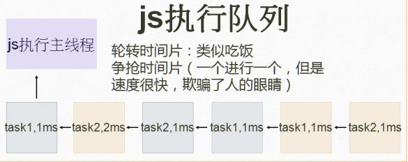
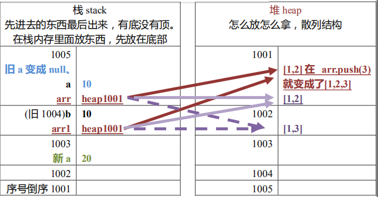

# 0. 前言

## web 发展史

- 1993年：Mosaic 问世，它是互联网历史上第一个普遍使用和能够显示图片的网页浏览器。
- 1994年4月：马克.安德森和 Silicon Graphics（简称为 SGI，中译为“视算科技”或“硅图”）公司的创始人吉姆·克拉克（Jim Clark）在美国加州设立了 `Mosaic Communication Corporation`。
- 1994年11月：Mosaic 公司成立后，由于伊利诺伊大学拥有 Mosaic 的商标权，且伊利诺伊大学已将技术转让给 Spy Glass 公司，开发团队必须彻底重新撰写浏览器程式码，且浏览器名称更改为 `Netscape Navigator`，公司名字于 1994年11月改名为 `Netscape Communication Corporation`，此后沿用至今，中译为“网景”。

微软的 `Internet Explorer` 及 `Mozilla Firefox` 等，其早期版本皆以 `Mosaic` 为基础而开发。
微软随后买下 Spy Glass 公司的技术开发出 `Internet Explorer` 浏览器，而 `Mozilla Firefox` 则是网景开放源代码后所衍生出的版本。

## js 历史

JavaScript 作为 `Netscape Navigator` 浏览器的一部分首次出现在 1996 年。它最初的设计目标是改善网页的用户体验。作者：Brendan Eich。
起初 JavaScript 被命名为 LiveScript，后因和 Sun 公司合作，因市场宣传需要，改名为 JavaScript。后来 Sun 公司被 Oracle 收购，JavaScript 版权归 Oracle 所有。


## 浏览器组成

- shell 部分：用户能操作部分(壳)。
- 内核部分：用户看不到的部分。
    - 渲染引擎（语法规则和渲染）
    - js 引擎
    - 其他模块（如异步）

## js 引擎

- 2001年：微软发布 IE6，首次实现对 js 引擎的优化。
- 2008年：Google发布最新浏览器 Chrome，它是采用优化后的 javascript 引擎，引擎代号 V8，因能把 js 代码直接转化为机械码来执行，进而以速度快而闻名。
- 而后 Firefox 也推出了具备强大功能的 js 引擎。Firefox3.5 的 TraceMonkey（对频繁执行的代码做了路径优化）。Firefox4.0 的 JeagerMonkey。


## JS 的独有特色

1. **对比编译型语言**

&nbsp; | 编译型语言 | 解释性语言
- | - | :-: 
怎么做 | 通篇翻译后，生成翻译完的文件，程序执行翻译后的文件。 | 看一行翻译一行，不生成特定文件。
代表语言 | C,C++ | JS,PHP，python 带尖角号
优点 | 快(常用于系统，游戏) | 可以跨平台
缺点 |移植性不好(不跨平台，window 和Linux 不能混用) | 稍微慢点

js 是解释性语言：(不需要编译成文件）跨平台。
java 先通过 javac，编译成.class 文件，通过 jvm（Java 虚拟机）进行解释执行。
.java → javac → 编译 → .class → jvm → 解释执行（java 可以跨平台）（java 是 oak 语言）


2. **单线程 + 异步加载机制**

`<link rel = ''>`是异步加载。
js 引擎是单线程，即同一时间只能做一件事。（同一时间做很多事叫多线程）
ECMA（欧洲计算机制造联合会）标注：为了取得技术优势，微软推出了 JScript，
CEnvi 推出 ScriptEase，与 JavaScript 同样可在浏览器上运行。为了统一规格 JavaScript
兼容于 ECMA 标准，因此也称为 ECMAScript。

3. **js 是轮转时间片**




## 主流浏览器及其内核

主流浏览器（必须有独立内核）市场份额大于 3% | 内核名称
- | :-: 
IE | trident
chrome | webkit/blink
firefox | gecko
opera | presto
safari |webkit


# 1. JS基础

## 1.1 如何引入 js?

1. **页面内书写**

`<script></script>`标签，写在 `<head>` 或者 `<body>` 里面都行。

2. **引入外部 js 文件**

`<script src="index.js"></script>`

3. **补充**

为符合 web 标准（w3c 标准中的一项）结构（html）、行为（js）、样式（css）相分离，通常会采用外部引入。


## 1.2 基础类型

js 是动态语言，动态语言基本上都是解释性语言，解释性语言基本上都是脚本语言。
js 是浮点型语言（带小数点）。

1. **原始值（栈数据）**

> 已经放进去的值不可改变，只会改房间编号为 null(硬盘原理)。

- Number 数字,例 var a = 123;
- String 字符串，例 var a = "语言";
- Boolean：仅两个值 false，true
- undefined 未定义，表示还没赋值,仅一个值 underfined
- null 代表空，占位用，用空值来覆盖。

2. **引用值（堆数据）**

- array：例 var arr = [1, 2, 3, 4, 5, false, "abc"];
- Object
- function
- data
- RegExp


js 由值决定类型。原始值和引用值唯一的不同是赋值形式不同。




```js
var arr = [1, 2]; 
var arr1 = arr; 
arr = [1, 3]; 
console.log(arr); //[1, 3]
console.log(arr1); //[1, 2]
```

## 1.3 运算符

1. **运算操作符**

- `+`

作用：数学运算；字符串链接：任何数据类型加字符串都等于字符串。

```js
//从左向右运算
var a = "a" + true + 1; //atrue1
var b = 1 + "a" + 1 + 1; //1a11
var c = 1 + 1 + "a" + 1 + 1; //2a11
var d = 1 + 1 + "a" + (1 + 2); //2a3
```

- `- * /`

```js
var a = 0 - 1; //-1 
var b = 2 * 1; // 2 
var c = 0 / 0; //NaN。应该得出一个数字类型的数，但是没法表达。就用 NaN (NaN 是 Not a Number 非数，不是数，但是是数字类型。
var d = 1 / 0; //Infinity (无穷)
var e = -1 / 0; //-Infinity
```

- %：摩尔，模，取余数

```js
var a = 5 % 1 //0
var b = 1 % 5; //1 
```

- ++：自身加一，再赋值给自身。

`a++;` 是 `a = a + 1;` 的简化形式。

```js
var a = 10;
console.log(++a); //11。先执行++，再执行本条语句 console.log(++a);
console.log(a); //11

var b = 1;
console.log(b++); //1。先执行语句 console.log(b); 再b++。所以打印的还是 b
console.log(b); //2。打印 b++ 后的值。

var c = 1;
var d = (c++) + 1;
console.log(d); //2。先执行 var d = c + 1; 再c++;
```

- --：自身减一，在赋值给自身

```js
var a = 1;
var b = a-- + --a;
console.log(b); //0。先执行--a; 此时 a 变成0，然后第一个 a 也变成 0，那么 b = 0-- + --a 

var a = 1;
var b = --a + --a;
console.log(b); //-1 
```

2. **比较运算符**

比较结果为 boolean 值。
字符串的比较，比的是 ASCII 码（七位二进制 0000000）

- `> <`

```js
var a = "40">"8";
document.write(a); //false。不是十和八比，是字符串10和8比，先用开头的一和八比，比不过就不看第二位了；一样的就拿零和八比
```

- ==

```js
var a = NaN == NaN; //false。NaN 不等于任何东西，包括它自己。
var a = undefined == underfined; //true
var a = infinity == infinity; //true
```

3. **逻辑运算符**

> 转换为布尔值会被认定为 false 的值：
> - undefined
> - null
> - NaN
> - "" （空串）
> - 0
> - false


- &&：与

```js
//用法1：多个表达式进行&&运算，遇假就停，无假返回最后一个表达式的值。
var a = 1 && 2 + 2; //4 
var a = 0 && 2 + 2; //0

//用法2(企业中用法)：当短路语句使用(如果。。那么。。)
//例1 
2 > 1 && console.log('成哥很帅');
//例2
var data = ...;
data && let a = data; //data && 执行一个语句用到 data;
```

- ||：或

```js
// 用法1：多个表达式进行||运算，遇真就停，无真返回最后一个表达式的值。
var num = 0 || false; //false
```

- ！：非

```js
// 先转成布尔值，再取反
var a = !123; 
console.log(a); //false
var a = !""; 
console.log(a); //true
```

- 补充：& (很少用)

转为二进制，上下一与。不同为 0，相同为 1。
```js
var num = 1 & 2;
console.log(num); //0
var num = 1 & 1;
console.log(num); //1 
var num = 1 & 3;
console.log(num); //1
```


## 1.4 三大语句

1. if 语句

2. for循环

3. while，do while 语句


## 1.5 类型转换


# 2. 函数

编程讲究高内聚，弱偶合。

## 2.1 定义方式

1. **函数声明**

函数就是另一个类型的变量。声明一个函数 test，如下

```js
function test() {
    函数体
}
```
函数名起名：开发规范要求，函数名和变量名如果由多个单词拼接，必须符合小驼峰原则（第一个单词首字母小写，后面的首字母大写）

```js
function theFistNameO(){} 
console.log(theFirstName); //function theFistName(){}。打印出来的是函数体
```

c语言和 c++，他们打印指针，会输出指针的地址，而js这种弱数据语言（解释性语言）永远不输出地址，而是输出地址指向房间。


2. **函数表达式**

表达式有两种定义方式。

- 命名函数表达式

```js
var test = function abc() {
    document.write("a");
}

console.log(test); //function abc() { document.write("a"); }
console.log(test.name); //abc
console.log(abc); //报错：abc is not defined。因为表达式会忽略name。上面这个函数的函数名 name 是 abc。
```


在上面例子中，`function abc() {document.write("a");}` 这一部分叫表达式。它会忽略 abc这个名字，会变成匿名函数表达式，所以不如直接写成匿名函数。

- 匿名函数表达式（常用，一般说的函数表达式就是匿名函数表达式）

```js
var test = function() {
    document.write("a");
}
console.log(test.name); //test
```


## 2.2 参数

1. **形参、实参**

形参可以比实参多，实参也可以比形参多。

```js
function sum(a,b){
    document.write(a);
}
sum(11, 2, 3); //11
```

```js
function sum(a, b, c,d) {
    document.write(a);
    document.write(d);
}
sum(11, 2, 3); //11,undefined
```


2. arguments（ 实参列表）

在每一个函数里面都有一个隐式属性arguments （ 实参列表）

```js
function sum(a) {
    console.log(arguments);
    console.log(a.length); //形参长度：形参名.length
    console.log(arguments.length); //实参长度
}
sum(11, 2, 3); //[11, 2, 3]，undefined, 3
```


```js

```


```js

```

```js

```