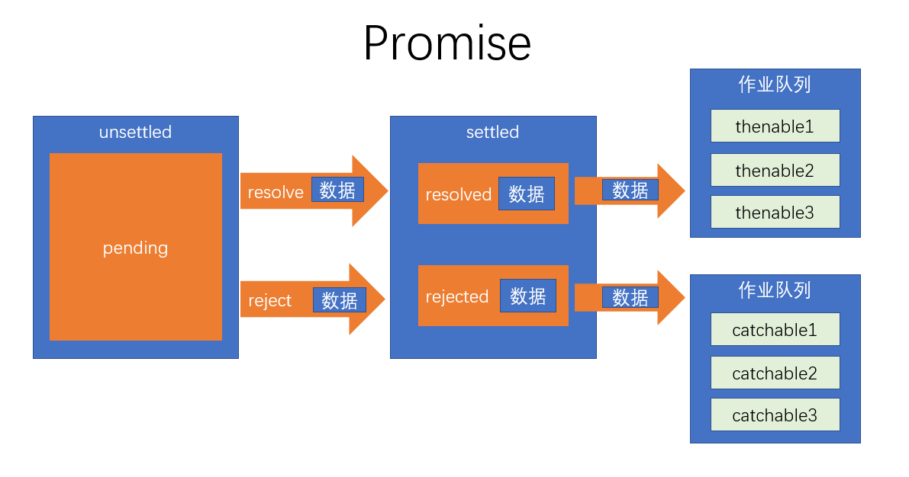

# 一、课程概述

1. **ECMAScript、JavaScript、NodeJs，它们的区别是什么？**
> ECMAScript：简称ES，是一个语言标准（循环、判断、变量、数组等数据类型）<br>JavaScript：运行在浏览器端的语言，该语言使用ES标准。 ES + web api = JavaScript<br>NodeJs：运行在服务器端的语言，该语言使用ES标准。 ES + node api = JavaScript
- 无论JavaScript，还是NodeJs，它们都是ES的超集（super set）

2. **ECMAScript有哪些关键的版本？**
> ES3.0： 1999<br>ES5.0:  2009<br>ES6.0:  2015, 从该版本开始，不再使用数字作为编号，而使用年份<br>ES7.0:  2016

3. **为什么ES6如此重要？**
> ES6解决JS无法开发大型应用的语言层面的问题。

4. **如何应对兼容性问题？**
> 之后的课程会介绍如何解决

5. **学习本课程需要的前置知识有哪些？**
- HTML+CSS、
- JavaScript（ES5）

# 二、变量声明

## 2.1 使用var声明变量
- 会导致的问题
    - 允许重复的变量声明：导致数据被覆盖
    - 变量提升：导致怪异的数据访问、闭包问题
    - 全局变量挂载到全局对象：导致全局对象被污染
    > 以前通过立即执行函数解决

- 解决方法：
    - 使用let声明的变量，不允许在当前作用域范围内重复声明；
    > 在块级作用域中用let定义的变量，在作用域外不能访问
    - 使用let不会有变量提升，因此，不能在定义let变量之前使用它
    - 使用let声明全局变量，此变量不会挂载到全局对象上


## 2.2 使用let声明变量
- ES6不仅引入let关键字用于解决变量声明的问题，同时引入了块级作用域的概念。原来只有全局作用域和函数作用域。
> 块级作用域：代码执行时遇到花括号，会创建一个块级作用域，花括号结束，销毁块级作用域

- let声明变量的补充:
    - 在底层实现上，let声明的变量实际上也会有提升，但提升后会将变量放入到“暂时性死区”。
    - 如果访问的变量位于暂时性死区，则会报错：“Cannot access 'a' before initialization”。
    - 当代码运行到该变量的声明语句时，会将其从暂时性死区中移除。

- 在循环中，用let声明的循环变量，会特殊处理：
    - 每次进入循环体，都会开启一个新的作用域，并且将循环变量绑定到该作用域。
    - 循环变量在循环结束后会销毁。


## 2.3 使用const声明常量
- const和let完全相同。唯一区别：用const声明的变量，必须在声明时赋值，而且不可以重新赋值。

- 实际上，在开发中，应该尽量使用const来声明变量，以保证变量的值不会随意篡改，原因如下：
    1. 根据经验，开发中的很多变量，都是不会更改，也不应该更改的。
    2. 后续的很多框架或者是第三方JS库，都要求数据不可变，使用常量可以一定程度上保证这一点。

- 注意的细节：
    1. 常量不可变，是指声明的常量的内存空间不可变，并不保证内存空间中的地址指向的其他空间不可变。
    2. 常量的命名：
        - 特殊的常量：该常量从字面意义上，一定是不可变的，比如圆周率、月地距地或其他一些绝不可能变化的配置。通常，**该常量的名称全部使用大写，多个单词之间用下划线分割**
        - 普通的常量：使用和之前一样的命名即可
    3. 在for循环中，循环变量不可以使用常量
        在for in 循环中，循环变量可以使用常量


# 三、字符串和正则

## 3.1 ES6中有更好的Unicode支持

早期，由于存储空间宝贵，`Unicode` 使用16位二进制来存储文字。我们将一个16位的二进制编码叫做一个码元（Code Unit）。
后来，由于技术的发展，`Unicode` 对文字编码进行了扩展，将某些文字扩展到了32位(占用两个码元)。并将某个文字对应的二进制数字叫做码点（Code Point）。

ES6为了解决这个困扰，为字符串提供了方法：`codePointAt` ，根据字符串码元的位置得到其码点。
同时，ES6为正则表达式添加了一个flag: `u` 。如果添加了该配置，则匹配时，使用码点匹配；原来的 `i/g/m` 是用码元匹配。


## 3.2 ES6中新增的字符串API

以下4个方法均为字符串的实例（原型）方法:
1. includes()：判断字符串中是否包含指定的子字符串
2. startsWith()：判断字符串中是否以指定的字符串开始
3. endsWith()：判断字符串中是否以指定的字符串结尾
4. repeat()：将字符串重复指定的次数，然后返回一个新字符串。


## 3.3 [扩展]正则中的粘连标记

- 标记名：`y`  (类似于 `i/m/g/u` )
- 含义：匹配时，完全按照正则对象中的 lastIndex 位置开始匹配，并且匹配的位置必须在 lastIndex 位置。


## 3.4 模板字符串

1. **ES6之前处理字符串繁琐的两个方面：**
- 多行字符串
- 字符串拼接

2. **ES6的解决那两个问题方法：**
- 在ES6中，提供了 <font color="red">模板字符串</font> 的格式，可以非常方便的换行和拼接。要做的，仅仅是将字符串的开始和结尾改为 ` 符号。
- 如果要在字符串中拼接js表达式，只需要在模板字符串中使用：`${js表达式}` 。
- 想要输出${}可以用 `转义字符: \ `


# 四、函数

## 4.1 参数默认值

1. **如何使用：**

在书写形参时，**直接给形参赋值，赋的值即为默认值**。这样一来，当调用函数时，如果没有给对应的参数赋值（或者给它的值是 `undefined` ），则会自动使用默认值。

```js
function sum(a, b = 1, c = 2) {
    return a + b + c;
}

console.log(sum(10, undefined, undefined)); //13
console.log(sum(11)); //14
console.log(sum(1, undefined, 5)); //7
```

2. **[扩展] 对 arguments 的影响**

只要给函数加上参数默认值，该函数会自动变为严格模式下的规则：arguments 和形参脱离。

```js
function test(a, b = 1) {
    console.log("arugments：", arguments[0], arguments[1]); //arugments： 1 2
    console.log("a:", a, "b:", b); //a: 1 b: 2
    
    a = 3;
    console.log("arugments：", arguments[0], arguments[1]); //arugments： 1 2
    console.log("a:", a, "b:", b); //a: 3 b: 2
}

test(1, 2);
```

3. **[扩展] 暂时性死区**

形参和 `ES6` 中的 let 或 const 声明一样，都有作用域，并且根据参数的声明顺序，存在暂时性死区。

```js
function test(a = b, b) {
    console.log(a, b); //报错：Cannot access 'b' before initialization。因为是先声明a，将b赋给a的时候，b还没有声明，还在暂时性死区中。
}

test(undefined, 2);
```

## 4.2 剩余参数

1. **arguments 存在的缺陷：**

- 如果和形参配合使用，容易导致混乱。
- 从语义上，使用 arguments 获取参数，由于形参缺失，无法从函数定义上理解函数的真实意图。

2. **如何解决那些缺陷？**

- ES6的**剩余参数**专门用于收集末尾的所有参数，将其放置到一个形参数组中。
- 剩余参数的语法:

```js
function (...形参名){
    // 其他语句
}
```

3. **剩余参数的细节：**

- 一个函数，仅能出现一个剩余参数。
- 一个函数，如果有剩余参数，剩余参数必须是最后一个参数。

```js
function sum(a, b, ...args) {
    //args 是收集所有参数形成的一个数组。
    let sum = 0;
    for (let i = 0; i < args.length; i++) {
        sum += args[i];
    }
    return sum;
}

console.log(sum(0, 0)); //0
console.log(sum(0, 0, 1)); //1
console.log(sum(0, 0, 1, 2)); //3
console.log(sum(0, 0, 1, 2, 3)); //6
console.log(sum(0, 0, 1, 2, 3, 4)); //10
```

## 4.3 展开运算符

使用方式：`...要展开的东西`
- 对数组展开：ES6 添加。

```js
const arr1 = [3, 67, 8, 5];
const arr2 = [0, ...arr1, 1];

console.log(arr2); //[ 0, 3, 67, 8, 5, 1 ]
console.log(arr1 === arr2); //false
```

- 对对象展开：ES7 添加。

```js
const obj1 = {
    name: "成哥",
    age: 18,
    love: "邓嫂",
    address: {
        country: "中国",
        province: "黑龙江",
        city: "哈尔滨"
    }
}

// 浅克隆到obj2
const obj2 = {
    ...obj1,
    name: "邓哥"
};
console.log(obj2);
/* {
    name: '邓哥',
    age: 18,
    love: '邓嫂',
    address: { country: '中国', province: '黑龙江', city: '哈尔滨' }
} */
console.log(obj1.address === obj2.address); //true
```

## 4.4 明确函数的双重用途

1. **函数有两种用途：**

- 普通函数:
- 构造函数：构造函数被调用必须通过 `new` 。

2. **如何判断构造函数是否通过 new 来调用：**

以前，只能在构造函数内部通过if判断this是否在构造函数的原型链上，来判断该构造函数是否使用了new来调用。但这种方法不完美，有漏洞，但也没有其他方法可以判断了。

现在，<font color="red">ES6提供了一个特殊的API，</font>可以使用该API在函数内部，判断该函数是否使用了new来调用。
```js
new.target 
// 该表达式，得到的是：如果没有使用new来调用函数，则返回undefined
// 如果使用new调用函数，则得到的是new关键字后面的函数本身
```

3. **例子：**

```js
const p1 = new Person("袁", "进");
console.log(p1.fullName); //袁进

const p2 = Person("袁", "进");
console.log(p2); //报错：该函数没有使用new来调用。

const p3 = Person.call(p1, "袁", "进")
console.log(p3); //报错：该函数没有使用new来调用。


function Person(firstName, lastName) {
    //判断是否是使用new的方式来调用的函数。
    //过去的判断方式：
    if (!(this instanceof Person)) {
        throw new Error("该函数没有使用new来调用");
    }
    //ES6的判断方式：
    if (new.target === undefined) {
        throw new Error("该函数没有使用new来调用");
    }
    
    this.firstName = firstName;
    this.lastName = lastName;
    this.fullName = `${firstName}${lastName}`;
}
```

## 4.5 箭头函数

1. **回顾：this指向**

- 通过对象调用函数，this指向对象
- 直接调用函数，this指向全局对象
- 如果通过new调用函数，this指向新创建的对象
- 如果通过apply、call、bind调用函数，this指向指定的数据
- 如果是DOM事件函数，this指向事件源

2. **箭头函数的使用语法：**

- 箭头函数是一个函数表达式，理论上，任何使用函数表达式的场景都可以使用箭头函数。
- 将function(参数1, 参数2, ...) {} 改为如下写法：
```js
// 1.完整语法：
(参数1, 参数2, ...)=>{}   

// 2.如果参数只有一个，可以省略小括号 
参数 => {}

// 3.如果箭头函数只有一条返回语句，可以省略大括号，和return关键字
参数 => 返回值
```
示例：
```js
const obj = {
    count: 0,
    start() {
        setInterval(() => {
            this.count++;
            console.log(this.count);
        }, 1000);
    },
    print() {
        console.log(this); //{ count: 0, start: [Function: start], print: [Function: print] }
        console.log(this.count); //0
    }
}

// 箭头函数一般是解决this指向的问题，用在函数套函数里。
obj.start();
obj.print();
```

3. **箭头函数的细节:**

- 箭头函数中，不存在 `this`、 `arguments`、 `new.target`。如果使用了，则使用的是函数外层的对应的 `this`、 `arguments`、 `new.target`。
- 箭头函数没有原型。
- 箭头函数不能作为构造函数使用。

```js
// 细节1
const obj = {
    method() {
        const func = () => {
            console.log(this); //{ method: [Function: method] }
            console.log(arguments); //[Arguments] { '0': 234 }
        }
        func();
    }
}
obj.method(234);
```

4. **应用场景:**

以下函数可以写成箭头函数：
- 并不会被调用的临时性函数。如：
    1. 事件处理函数。
    2. 异步处理函数。( `setInterval()` / `setTimeout()` 等)
    3. 其他临时性的函数。
- 为了绑定外层this的函数。
- 在不影响其他代码的情况下，保持代码的简洁。最常见的：数组方法中的回调函数。

<font color="red">注意：</font>在一个对象中，如果属性的值是函数，此时不用箭头函数。


# 五、对象

## 5.1 新增的对象字面量语法

1. **成员速写**

如果对象字面量初始化时，成员的名称来自于一个变量，并且和变量的名称相同，则可以进行简写：
```js
var obj = {
    loginId,    // 原来写法：loginId：loginId
}
```

2. **方法速写**

对象字面初始化时，方法可以简写
```js
var obj = {
    // 冒号和function关键字 省略
    add() {
        // 其他代码
    }
}
```

3. **计算属性名**

有的时候，初始化对象时，某些属性名可能来自于某个表达式的值。
在ES6，可以使用 `[]` 来表示该属性名是通过计算得到的。


## 5.2 函数Object上的新增API

1. **Object.is()**

用于判断两个数据是否相等，基本上跟严格相等（===）是一致的，除了以下两点：
- NaN和NaN相等
- +0和-0不相等
```js
console.log(NaN === NaN);           // false
console.log(+0 === -0);             // true

console.log(Object.is(NaN, NaN))
console.log(Object.is(+0, -0))
```

2. **Object.assign(obj1, obj2)**

用于将两个不同的对象混合在一起:
- <font color="red">缺点：</font>会修改 obj1 的内容然后返回给新的对象。
- <font color="red">解决方法：</font>Object.assign({}, obj1, obj2)

现在不用了，可以使用展开运算符 `...` 混合对象。

3. **Object.getOwnPropertyNames(obj)** 的枚举顺序 `(不用)`

`Object.getOwnPropertyNames` 方法之前就存在：得到自己原型链上的所有属性，并形成一个数组。

只不过，官方没有明确要求，对属性的顺序如何排序，完全由浏览器厂商决定。

ES6规定了该方法返回的数组的排序方式如下：
- 先排数字，并按照升序排序
- 再排其他，按照书写顺序排序

4. **Object.setPrototypeOf** `(少用)`

该函数用于设置某个对象的 隐式原型:
```js
Object.setPrototypeOf(obj1, obj2)
// 相当于:
obj1.__proto__ = obj2
```

## 5.3 面向对象简介

- 面向对象：一种编程思想。
- 对比面向过程：
    - 面向过程：思考的切入点是功能的步骤
    - 面向对象：思考的切入点是对象的划分

【大象装冰箱】


## 5.4 类：构造函数的语法糖

1. **传统的构造函数的问题:**

- 属性和原型方法定义分离，降低了可读性。
- 原型上的成员也可以被枚举。
- 默认情况下，构造函数仍然可以被当作普通函数使用。

2. **类的特点**

- 类声明不会被提升，与 let 和 const 一样，存在暂时性死区
- 类中的所有代码均在严格模式下执行。
- 类的所有方法都是不可枚举的。
- 类的所有方法都无法被当作构造函数使用。
- 类的构造器必须使用 `new` 来调用。


## 5.5 类的其他书写方式

> 类，本质上是一个函数
1. **可计算的成员名**: 

使用`[]` 

```js
const printName = "print";
class Animal {
    constructor(type, name, age, sex) {
        this.type = type;
        this.name = name;
        this.age = age;
        this.sex = sex;
    }
    // 1.可计算的成员名
    [printName]() {
        console.log(`【种类】：${this.type}`);
        console.log(`【名字】：${this.name}`);
        console.log(`【年龄】：${this.age}`);
        console.log(`【性别】：${this.sex}`);
    }
}
const a = new Animal("狗", "旺财", 3, "男");
a[printName]();                                     // a[printName]() === a.print()
```

2. **如何控制属性的属性值的范围？**

- 想要控制属性的属性值的范围(如age)，必须将属性值写成函数。但是这样写的话，给属性赋值或者取值就看起来不像在操作属性了。
- ES6中使用 getter 和 setter 可以解决这个问题。
```js
// ES5写法：Object.defineProperty 可定义某个对象成员属性的读取和设置  
// ES6写法：使用getter和setter控制的属性，不在原型上
```

```js
const printName = "print";
class Animal {
    constructor(type, name, age, sex) {
        this.type = type;
        this.name = name;
        this.age = age;             // 读写age会自动调用get、set方法
        this.sex = sex;
    }
    //创建一个age属性，并给它加上getter，读取该属性时，会运行该函数
    get age() {
        return this._age + "岁";
    }
    //创建一个age属性，并给它加上setter，给该属性赋值时，会运行该函数
    set age(age) {
        if (typeof age !== "number") {
            throw new TypeError("age property must be a number");
        }
        if (age < 0) {
            age = 0;
        }
        else if (age > 1000) {
            age = 1000;
        }
        this._age = age;
    }
    [printName]() {
        console.log(`【种类】：${this.type}`);
        console.log(`【名字】：${this.name}`);
        console.log(`【年龄】：${this.age}`);
        console.log(`【性别】：${this.sex}`);
    }
}

var a = new Animal("狗", "旺财", 3, "男");
a.age = -1;
console.log(a.age);
```

3. **静态成员：构造函数本身的成员**
```js
// 过去写法：写在构造函数外面
// ES6写法：使用static关键字，写在构造函数里面

class Chess {
    constructor(name) {
        this.name = name;
    }

    // 1.现在静态成员写法如下：写在构造函数里面，通过static关键字
    static width = 50;
    static height = 50;
    // 静态方法
    static method() {
        console.log("这是静态方法");
    }
}

// 2.过去静态成员写法如下：写在构造函数外面
// Chess.width = 50;                    // 其中width、height是构造函数的静态成员
// Chess.height = 50;

console.log(Chess.width);
console.log(Chess.height);
Chess.method();
```


4. **字段初始化器（ES7）**

```js
class Test {
    // 字段初始化器的功能：可以直接给变量赋值
    static a = 1;           // 静态成员
    b = 2;                  // 实例成员
    c = 3;

    constructor() {
        this.d = this.b + this.c;
    }
}
const t = new Test();
console.log(t);     //Test { b: 2, c: 3, d: 5 }
```
- 使用 `static` 的字段初始化器，添加的是构造函数的静态成员
- 没有使用 `static` 的字段初始化器，添加的成员位于构造函数创建的对象上。

```js
class Test {
    constructor() {
        this.a = 123;
    }
    print = () => {
        console.log(this.a)
    }
}

const t1 = new Test();
const t2 = new Test();
console.log(t1.print === t2.print);     //false
```
- 箭头函数在字段初始化器位置上，指向当前对象。


5. **类表达式**

返回结果：
```js
类名 {}
```

```js
//类的表达式写法
const A = class {   // 匿名类
    a = 1;
    b = 2;
}
const a = new A();
console.log(a);     //A { a: 1, b: 2 }
```

6. **[扩展]装饰器（ES7）(Decorator)**
> 装饰器的本质是一个函数
横切关注点


## 5.6 类的继承

1. **什么是继承？**

有两个类A和B，如果可以描述为：B是A，则 A 和 B 形成继承关系。
> 如果B是A，则：<br>1.B继承自A<br>2.A派生B<br>3.B是A的子类<br>4.A是B的父类

> 如果A是B的父类，则B会自动拥有A中的所有实例成员，包括成员属性和方法。

2. **类的使用**

- 有新的关键字：
    1. extends：继承，用于类的定义
    2. super()：
        - 直接当作函数调用，表示父类构造函数
        - 如果当作对象使用，则表示父类的原型

- ES6要求:
    1. 如果定义了 `constructor`，并且该类是子类，则必须在 `constructor` 的第一行手动调用父类的构造函数。
    2. 如果子类不写 `constructor` ，则会有默认的构造器。该构造器需要的参数和父类一致，并且自动调用父类构造器。

```js
// 类的使用
class Animal {
    constructor(type, name, age, sex) {
        this.type = type;
        this.name = name;
        this.age = age;
        this.sex = sex;
    }
    print() {
        console.log(`【种类】：${this.type}`);
        console.log(`【名字】：${this.name}`);
        console.log(`【年龄】：${this.age}`);
        console.log(`【性别】：${this.sex}`);
    }
    jiao(){
        throw new Error("动物怎么叫的？");
    }
}

class Dog extends Animal {
    constructor(name, age, sex) {
        super("犬类", name, age, sex);
        this.loves = "吃骨头";           
    }
    print(){
        super.print();                     // 调用父类的print
        console.log(`【爱好】：${this.loves}`); 
    }
    jiao(){
        console.log("旺旺！");
    }
}

const d = new Dog("旺财", 3, "公");
d.print();
console.log(d);
d.jiao();
```

3. **类的冷知识：**

- 用JS模拟抽象类  (抽象类：一般是父类，不能通过该类创建对象)
- 正常情况下，this始终指向具体的类的对象。

```js
// 冷知识：
// Animal就是一个抽象类，按理说不能直接创建对象，可以加个if判断
class Animal {
    constructor(type, name, age, sex) {
        if (new.target === Animal) {
            throw new TypeError("你不能直接创建Animal的对象，应该通过子类创建")
        }
        this.type = type;
        this.name = name;
        this.age = age;
        this.sex = sex;
    }
    print() {
        console.log(`【种类】：${this.type}`);
        console.log(`【名字】：${this.name}`);
        console.log(`【年龄】：${this.age}`);
        console.log(`【性别】：${this.sex}`);
    }
    jiao() {
        throw new Error("动物怎么叫的？");
    }
}

class Dog extends Animal {
    constructor(name, age, sex) {
        super("犬类", name, age, sex);
        this.loves = "吃骨头";
    }
    print() {
        super.print();
        console.log(`【爱好】：${this.loves}`);
    }
    jiao() {
        console.log("旺旺！");
    }
}

//下面的代码逻辑有误。Animal就是一个抽象类，按理说不能直接创建对象
const a = new Dog("旺财", 3, "公")
a.print();
```

# 六、解构

## 6.1 对象解构

1. **什么是解构？**

使用ES6的一种语法规则，将一个对象或数组的某个属性提取到某个变量中。
<font color="red">解构不会对被解构的目标造成任何影响。</font>

2. **在解构中使用默认值**

从对象中读取同名属性，放到变量中。读取不到的话，使用默认值。
```js
//语法
{同名变量 = 默认值}
```
示例：
```js
const user = {
    name: "kevin",
    age: 11,
    sex: "男",
    address: {
        province: "四川",
        city: "成都"
    }
}

// 将user中的name, age, sex, address的值赋给变量name, age, sex, address

/* 1.过去写法：
let name, age, sex, address;
name = user.name;
age = user.age;
sex = user.sex;
address = user.address;
console.log(name, age, sex, address);
*/

/* 2.ES6的写法：
let name, age, sex, address;
({ name, age, sex, address } = user);//对象的解构语句。将user中的name, age, sex, address的值赋给前面{}里的同名变量。
console.log(name, age, sex, address);
*/

// 3.ES6写法的简写：
// let { name, age, sex, address } = user;
// console.log(name, age, sex, address);

// 4.先定义5个变量，然后从对象中读取同名属性，放到变量中。读取不到的使用默认值，如：abc = 123
let { name, age, sex, address, abc = 123 } = user;
console.log(name, age, sex, address, abc); //kevin 11 男 { province: '四川', city: '成都' } 123
```

3. **非同名属性解构**

```js
//语法
{属性名:变量名}
```
示例：
```js
const user = {
    name: "yuyu",
    age: 18,
    sex: "男",
    address: {
        province: "四川",
        city: "成都"
    },
}
// 非同名属性解构：

// 1.先定义4个变量：name、age、gender、address，再从对象user中读取同名属性赋值（其中gender读取的是sex属性）
// let { name, age, sex: gender, address } = user;
// console.log(name, age, gender, address);

// 2.从对象中读取同名属性，读取不到的使用默认值
let { name, age, sex: gender, address, like: love = "guyu" } = user;
console.log(name, age, gender, address, love); //yuyu 18 男 { province: '四川', city: '成都' } guyu
```

4. **嵌套解构**

解构出对象中的对象的属性:
```js
//语法
{变量名：{对象中的对象的属性}}
```
示例：
```js
const user = {
    name: "kevin",
    age: 11,
    sex: "男",
    address: {
        province: "四川",
        city: "成都"
    }
}

//解构出user中的对象address的属性province
const { address: { province } } = user;
console.log(province); //四川
```

5. **剩余项的收集**

解构出对象的某些属性，然后将剩余的所有属性放到一个新的对象中。  

```js
const user = {
    name: "kevin",
    age: 11,
    sex: "男",
    address: {
        province: "四川",
        city: "成都"
    }
}

// 解构出name，然后将剩余的所有属性，放到新的对象obj中。如下：
// name: kevin
// obj : {age:11, sex:"男", address:{...}}
const { name, ...obj } = user;
console.log(name, obj); //kevin { age: 11, sex: '男', address: { province: '四川', city: '成都' } }
```

## 6.2 数组解构

1. **数组解构写法:**
```js
const numbers = ["a", "b", "c", "d"];

// 写法一：对象的写法
const {
    0: n1,
    1: n2
} = numbers;
console.log(n1, n2)


// 写法二：数组的写法
const [x1, x2] = numbers;

console.log(x1, x2)
```

2. **解构特定索引的数组值及使用默认值**
```js
const numbers = ["a", "b", "c", "d"];

// 解构第一位，第四位，第五位
const [n1, , , n4, n5 = 123] = numbers;
console.log(n1, n4, n5)
```

3. **嵌套解构：**

- 解构数组中的数组
- 解构数组中的对象

4. **剩余项的收集：**

解构出数组的某些属性，然后将剩余的所有属性放到一个新的数组中。
```js
const numbers = [324, 7, 23, 5, 3243];

// 解构出数组前两项，分别放到变量a和b中，然后剩余的所有数据放到数组nums
// 1.过去写法：
const a = numbers[0], b = numbers[1], nums = numbers.slice(2);
console.log(a, b, nums);

// 2.解构写法：
const [a1, b1, ...nums1] = numbers;
console.log(a1, b1, nums1);
```

5. **用处：**

将多个变量的值交换：
```js
// 交换两个变量的值
let a = 1, b = 2;
[b, a] = [a, b]         // 右边[]表示是一个数组，左边[]表示将数组解构

console.log(a, b)
```

## 6.3 参数解构

解构最常用于函数的参数解构。解构不能从 `undefined` 和 `null` 中解构出东西，会报错。
如果不传参，形参就是 `undefined`，解构时会报错。可以通过使用默认值 (即形参={}) 来解决这一问题。

```js
// 参数解构：

// 1.之前写法
function ajaxOld(options) {
    const defaultOptions = {
        method: "get",
        url: "/"
    }
    const opt = {
        ...defaultOptions,
        ...options
    }
    console.log(opt);
}

// 2.解构写法
function ajax({ method = "get", url = "/" } = {}) {
    console.log(method, url);
}

ajax(); //不传参，形参是undefined。
```

# 七、符号

> 符号是ES6新增的一个数据类型。

## 7.1 普通符号

1. **创建一个符号：**

使用函数 `Symbol(符号描述)`:
```js
//创建一个符号
const syb1 = Symbol();
const syb2 = Symbol("abc");
```
符号描述只是为了给开发人员看，知道它是干嘛的。可以不写

2. **为什么设计符号：**

设计的初衷，是为了给对象设置私有属性。
> 私有成员：只能在对象内部使用，外面无法使用

3. **符号的特点：**

- 没有字面量，只能通过Symbol创建。
```js
// 创建一个符号
const syb1 = Symbol();
const syb2 = Symbol("abc");

console.log(syb1, syb2);      // Symbol() Symbol("abc")
```

- 使用 typeof 得到的类型是 symbol
```js
const syb1 = Symbol();
const syb2 = Symbol("abc");

// 符号的类型
console.log(typeof syb1 === "symbol", typeof syb2 === "symbol")
```

- <font color="red">每次调用 Symbol 函数得到的符号永远不相等，无论符号名是否相同</font>
```js
const syb1 = Symbol("这是符号1");
const syb2 = Symbol("这是符号1");

// 每次调用 Symbol 函数得到的符号永远不相等，无论符号描述是否相同
console.log(syb1 === syb2)
```

- 符号可以作为对象的属性名存在，这种属性称之为符号属性
    - 开发者可以通过精心的设计，让这些属性无法通过常规方式被外界访问
    ```js
    /* 
    如何将对象的成员私有化：
        1.将对象写成立即执行函数，函数返回这个对象
        2.在函数内定义一个符号，替换掉对象原来的成员
    */ 
    const hero = (function () {
        const getRandom = Symbol();
        return {
            attack: 30,
            hp: 300,
            defence: 10,
            gongji() {
                const dmg = this.attack * this[getRandom](0.8, 1.1);
                console.log(dmg);
            },
            // 此方法变为私有方法
            [getRandom](min, max) { //根据最小值和最大值产生一个随机数
                return Math.random() * (max - min) + min;
            }
        }
    })()
    console.log(hero);

    /*
        如何将类的成员私有化：
            1.将类写成立即执行函数，函数返回这个类
            2.在函数内定义一个符号，替换掉类中原来的成员
    */
    const Hero = (() => {
        const getRandom = Symbol();
        return class {
            constructor(attack, hp, defence) {
                this.attack = attack;
                this.hp = hp;
                this.defence = defence;
            }

            gongji() {
                const dmg = this.attack * this[getRandom](0.8, 1.1);
                console.log(dmg);
            }

            [getRandom](min, max) { 
                return Math.random() * (max - min) + min;
            }
        }
    })();

    const h = new Hero(3, 6, 3);
    console.log(h);
    ```
    - 符号属性是不能枚举的。因此在 for-in 循环中无法读取到符号属性，Object.keys 方法也无法读取到符号属性。
    - Object.getOwnPropertyNames 尽管可以得到所有无法枚举的属性，但是仍然无法读取到符号属性。
    - ES6 新增 Object.getOwnPropertySymbols 方法，可以读取符号。
    ```js
    const syb = Symbol();
    const obj = {
        [syb]: 1,
        a: 2,
        b: 3
    }

    // 符号属性是不能枚举的。因此在 for-in 循环中无法读取到符号属性，Object.keys 方法也无法读取到符号属性
    for (const prop in obj) {
        console.log(prop)
    }
    console.log(Object.keys(obj))
    console.log(Object.getOwnPropertyNames(obj))

    // 得到的是一个符号属性的数组
    const sybs = Object.getOwnPropertySymbols(obj);
    console.log(sybs, sybs[0] === syb)
    ```

- 符号无法被隐式转换。因此不能被用于数学运算、字符串拼接或其他隐式转换的场景。
    但符号可以显式的转换为字符串，通过 String 构造函数进行转换即可。
    console.log 之所以可以输出符号，是它在内部进行了显式转换

## 7.2 共享符号

1. **根据某个符号名称（符号描述）能够得到同一个符号：**
```js
Symbol.for("符号名/符号描述")  //获取共享符号
```

2. **有什么用？**

- 想要在不同的文件中或者代码隔着很远的时候，使用同一个符号，此时就可以使用共享符号。
```js
// syb1和syb2共享
const syb1 = Symbol.for("abc");
const syb2 = Symbol.for("abc");
console.log(syb1 === syb2)

const obj1 = {
    a: 1,
    b: 2,
    [syb1]: 3
}
// 隔着100000行代码
const obj2 = {
    a: "a",
    b: "b",
    [syb2]: "c"
}
console.log(obj1, obj2);
```

- 不想设置成员私有化，又想要使用符号，此时就可以使用共享符号。
```js
const obj = {
    a: 1,
    b: 2,
    [Symbol.for("c")]: 3
}

// 此时可以在外部使用符号属性，因为它没有私有化。
console.log(obj[Symbol.for("c")]);
```

- 共享符号实现原理
```js
// 共享符号实现原理：
const SymbolFor = (() => {
    const global = {};          //用于记录有哪些共享符号
    return  (name)=> {
        console.log(global)
        if (!global[name]) {
            global[name] = Symbol(name);
        }
        console.log(global);
        return global[name];
    }
})();

const syb1 = SymbolFor("abc");      // 第一次调用自动创建一个符号

const syb2 = SymbolFor("abc");      // 第二次调用直接将第一次的符号给变量

console.log(syb1 === syb2);
```


## 7.3 知名（公共、具名）符号

1. **是什么？**

知名符号是一些具有特殊含义的共享符号。ES内部已经创建好了，用户通过 Symbol 的静态属性就可以得到。

2. **有什么用？**

ES6 延续了 ES5 的思想：减少魔法，暴露内部实现！
ES6 用知名符号暴露了某些场景的内部实现，用户可以从底层原理改写js提供的方法。   

3. **有哪些知名符号？**

- Symbol.hasInstance
    该符号用于定义构造函数的静态成员，它将影响 `instanceof` 的判定。
    ```js
    A[Symbol.hasInstance](obj)      // 等效于 obj instanceof A  
    // 该方法是写在Function的原型上的，任何函数都可以使用。Function.prototype[Symbol.hasInstance]
    ```
<br>

- [扩展] Symbol.isConcatSpreadable
    该知名符号会影响数组的 `concat` 方法
<br>

- [扩展] Symbol.toPrimitive
    该知名符号会影响 **类型转换** 的结果
<br>

- [扩展] Symbol.toStringTag
    该知名符号会影响 `Object.prototype.toString` 的返回值。
<br>

- 其他知名符号


# 八、异步处理：

## 8.0 [回顾]事件循环

1. JS运行的环境称之为 `宿主环境`。

2. **执行栈：call stack**

- 执行栈是一个数据结构。用于存放各种函数的执行环境，即AO、GO。
- 在函数调用之前，先创建执行环境，然后加入到执行栈；函数调用之后，销毁执行环境。
- JS引擎永远执行的是执行栈的最顶部。

3. **异步函数：**

某些函数不会立即执行，需要等到某个时机到达后才会执行，这样的函数称之为 `异步函数`。

<font color="red">比如:</font>事件处理函数;Ajax发送网络请求(需要等到服务器响应之后才执行回调函数)等。

异步函数的执行时机，会被宿主环境控制。宿主环境包括：浏览器环境，服务器环境等。

4. **浏览器宿主环境中包含5个线程：**
- JS引擎：负责执行执行栈的最顶部代码
- GUI线程：负责渲染页面 
- 事件监听线程：负责监听各种事件
- 计时线程：负责计时
- 网络线程：负责网络通信

当上面的线程发生了某些事情(如：事件监听线程发现有事件触发)。如果该线程发现，这件事情有处理程序(如：点击事件触发，可让js引擎执行对应函数)，那么它会将该处理程序加入一个叫做 <font color="red">事件队列</font> 的内存。当JS引擎发现，执行栈中已经没有了任何内容后，会将 <font color="red">事件队列</font> 中的第一个函数加入到 <font color="red">执行栈</font> 中执行。

JS引擎对事件队列的取出执行方式，以及与宿主环境的配合，称之为 **事件循环** 。


5. 事件队列在 不同的宿主环境 中有所差异，大部分宿主环境会将事件队列进行细分。其中在浏览器中，事件队列分为两种：

- 宏任务（队列）：macroTask，计时器结束的回调、事件回调、http回调等等绝大部分异步函数进入宏队列。
- 微任务（队列）：`MutationObserver`，`Promise`产生的回调进入微队列。
其中 `MutationObserver`：用于监听某个DOM对象的变化 **(test5)** 

当执行栈清空时，JS引擎首先会将微任务中的所有任务依次执行结束，如果没有微任务，则执行宏任务。

## 8.1 事件和回调函数的缺陷 (传统方法)

> 过去，我们习惯于使用传统的 回调 或 事件处理 来解决异步问题。

1. **事件：**

某个对象的属性是一个函数，当发生某一件事时，运行该函数。
```js
    dom.onclick = function(){}
```

2. **回调：**

运行某个函数以实现某个功能的时候，传入一个函数作为参数，当发生某件事的时候，会运行该函数。
```js
    dom.addEventListener("click", function(){})
```

本质上，事件和回调并没有本质的区别，只是把函数放置的位置不同而已。一直以来，该模式都运作良好。直到前端工程越来越复杂...

3. **以上两个方法，主要面临以下两个问题：**

- 回调地狱：某个异步操作需要等待之前的异步操作完成，无论用回调还是事件，都会陷入不断的嵌套。 **(回调地狱1/2/3)**
- 异步之间的联系：某个异步操作要等待多个异步操作的结果，对这种联系的处理，会让代码的复杂度剧增  **(异步间联系)**

## 8.2 异步处理的通用模型

> ES官方参考了大量的异步场景，总结出了一套异步的通用模型，该模型可以覆盖几乎所有的异步场景，甚至是同步场景。<br>值得注意的是，为了兼容旧系统，ES6 并不打算抛弃掉过去的做法，只是基于该模型推出一个全新的 API，使用该API，会让异步处理更加的简洁优雅。

理解该API，最重要的是理解它的异步模型。

1. ES6 将某一件可能发生异步操作的事情，分为两个阶段：**unsettled** 和 **settled**


- unsettled： 未决阶段，表示事情还在进行前期的处理，并没有发生通向结果的那件事
- settled：已决阶段，事情已经有了一个结果，不管这个结果是好是坏，整件事情无法逆转

<font color="red">事情总是从 未决阶段 逐步发展到 已决阶段 的。</font>并且，未决阶段拥有控制何时通向已决阶段的能力，如：8-1中回调地狱2的表白函数的callback。

2. ES6将事情划分为三种状态： pending、resolved、rejected

- pending: 挂起，处于未决阶段，则表示这件事情还在挂起（最终的结果还没出来）
- resolved：已处理，已决阶段的一种状态，表示整件事情已经出现结果，并是一个可以按照正常逻辑进行下去的结果
- rejected：已拒绝，已决阶段的一种状态，表示整件事情已经出现结果，并是一个无法按照正常逻辑进行下去的结果，通常用于表示有一个错误

既然未决阶段有权力决定事情的走向，因此，未决阶段可以决定事情最终的状态！

我们将 把事情变为resolved状态的过程叫做：**resolve**，推向该状态时，可能会传递一些数据

我们将 把事情变为rejected状态的过程叫做：**reject**，推向该状态时，同样可能会传递一些数据，通常为错误信息

<font color="red">始终记住:</font>无论是阶段，还是状态，都是不可逆的！


3. 当事情达到已决阶段后，通常需要进行后续处理，不同的已决状态，决定了不同的后续处理。

- resolved状态：这是一个正常的已决状态，后续处理表示为 thenable
- rejected状态：这是一个非正常的已决状态，后续处理表示为 catchable

后续处理可能有多个，因此会形成作业队列，这些后续处理会按照顺序，当状态到达后依次执行


4. 整件事称之为Promise



**理解上面的概念，对学习Promise至关重要！**


## 8.3 Promise的基本使用

1. **使用：**
```js
    // 一创建，里面的函数就立即执行 (test1/2)
    const pro = new Promise((resolve, reject)=>{  
        // 未决阶段的处理
        // 通过调用resolve函数将Promise推向已决阶段的resolved状态
        // 通过调用reject函数将Promise推向已决阶段的rejected状态
        // resolve和reject均可以传递最多一个参数，表示推向状态的数据
    })

    // (test3/4)
    pro.then(data => {        
        //这是thenable函数，如果当前的Promise已经是resolved状态，该函数会立即执行
        //如果当前是未决阶段，则会加入到作业队列，等待到达resolved状态后执行
        //data为状态数据
    }, err => {
        //这是catchable函数，如果当前的Promise已经是rejected状态，该函数会立即执行
        //如果当前是未决阶段，则会加入到作业队列，等待到达rejected状态后执行
        //err为状态数据
    })
```

2. **细节**

- 未决阶段的处理函数是同步的，会立即执行
- `thenable` 和 `catchable` 函数是异步的。就算是立即执行，也会先加入到事件队列中等待，并且加入的是微队列。
- pro.then 可以只添加 `thenable`函数; pro.catch 可以单独添加 `catchable`函数。    
- 在未决阶段的处理函数中，如果发生未捕获的错误，会将状态推向 rejected，并会被 `catchable` 捕获。
- 一旦状态推向了已决阶段，无法再对状态做任何更改。
- <font color="red">Promise并没有消除回调，只是让回调变得可控</font>


## 8.4 Promise的串联

> 当后续的 `Promise` 需要用到之前的 Promise 的处理结果时，需要使用 `Promise`的串联。

1. Promise对象中，无论是 `then()`，还是 `catch()`，它们都具有返回值，返回的是一个全新的 `Promise` 对象 。

2. 新 `Promise` 的状态满足下面的规则：

- 如果当前的Promise是未决的，得到的新的Promise是 **挂起状态** 。
- 如果当前的Promise是已决的，会运行相应的后续处理函数 ( `then()` 或 `catch()`中的函数)，并将后续处理函数的结果（返回值）作为resolved状态数据，应用到新的Promise中；如果后续处理函数发生错误，则把返回值作为rejected状态数据，应用到新的Promise中。

<font color="red">注意：后续的 Promise 一定会等到前面的 Promise 有了后续处理结果后，才会变成已决状态</font>

```js
    const pro1 = new Promise((resolve, reject) => {
        throw 1;
    })
    const pro2 = pro1.then(result => result * 2, err => err * 3);
    pro1.catch(err => err * 2)
    pro2.then(result => console.log(result * 2), err => console.log(err * 3))
    //输出：6
```

3. 如果前面的 Promise 的后续处理，返回的是一个 `Promise`，则返回的 `新Promise` 的状态和后续处理返回的 `Promise` 状态保持一致。 如下：pro1 的后续处理返回的 pro2 是一个 `Promise`，那么这个返回的pro2 状态与 之前定义的pro2 状态一致。都需要等1秒后才继续往下操作。
```js
    const pro1 = new Promise((resolve, reject) => {
        resolve(1);
    })
    const pro2 = new Promise((resolve, reject) => {
        setTimeout(() => {
            resolve(2);
        }, 1000);
    })
    pro1.then(result => {
        console.log(result)
        return pro2;                // 直接返回一个Promise
    }).then(result => {
        console.log(result)         // 将pro2 的推向结果传给 result
    }).then(result => {             // 因为上一个函数没有返回值，所以传进来的参数result为 undefined
        console.log(result)
    })
    // 输出：1 2 undefined
```

## 8.5 Promise的其他api

1. **原型成员(实例成员)上的api**

- then：注册一个后续处理函数，当Promise为resolved状态时运行该函数
- catch：注册一个后续处理函数，当Promise为rejected状态时运行该函数
- finally：[ES2018]注册一个后续处理函数（无参），当Promise为已决时运行该函数

2. **构造函数成员(静态成员)上的api**

- resolve(数据)：该方法返回一个resolved状态的Promise，传递的数据作为状态数据
    特殊情况：如果传递的数据是Promise，则直接返回传递的Promise对象
    ```js
        // 1.resolve()方法
        const pro1 = Promise.resolve(1);    // 等效于：const pro1 = new Promise((resolve, reject) => { resolve(1) })

        // 2.resolve()方法的特殊情况
        const pro = Promise.resolve(pro1);  // 等效于 const pro = pro1;
    ```
  
- reject(数据)：该方法返回一个rejected状态的Promise，传递的数据作为状态数据
    ```js
        // reject()方法
        const pro2 = Promise.reject(1);     // 等效于：const pro2 = new Promise((resolve, reject) => { reject(1) })
    ```

- all(iterable)：这个方法返回一个新的promise对象。 **(test3)**
    1. 该 `promise`对象只有在 `iterable`参数对象里所有的promise对象都成功时，才会触发成功(即iterable数组中所有promise的状态都为resolved之后，这个promise对象才会变为resolved状态)。一旦有任何一个iterable里面的promise对象失败(即iterable数组中有一个为rejected状态)，则<font color="red">立即触发</font>该promise对象的失败。

    2. 这个新的promise对象在触发成功状态以后，会把一个包含iterable里所有promise返回值的数组作为成功回调的返回值，顺序跟iterable的顺序保持一致。如果这个新的promise对象触发了失败状态，它会把iterable里<font color="red">第一个触发</font>失败的promise对象的错误信息作为它的失败错误信息。

    3. Promise.all方法常被用于处理多个promise对象的状态集合。
    ```js
        function getRandom(min, max) {
            return Math.floor(Math.random() * (max - min)) + min;
        }

        const proms = [];
        for (let i = 0; i < 10; i++) {
            proms.push(new Promise((resolve, reject) => {
                setTimeout(() => {
                    if (Math.random() < 0.5) {
                        console.log(i, "完成");
                        resolve(i);
                    } else {
                        console.log(i, "失败")
                        reject(i);
                    }
                }, getRandom(1000, 5000));
            }))
        }

        // all()的使用
        const pro = Promise.all(proms)
        pro.then(datas => {
            console.log("全部完成", datas);
        })
        pro.catch(err => {
            console.log("有失败的", err);
        })
        console.log(proms);
    ```
- race(iterable)：竞赛   **(test4)**
    当iterable参数里的任意一个子promise被成功或失败后，父promise马上也会用该子promise的成功返回值或失败详情作为参数调用父promise绑定的相应句柄，并返回该promise对象。
    ```js
        function getRandom(min, max) {
        return Math.floor(Math.random() * (max - min)) + min;
        }
        const proms = [];
        for (let i = 0; i < 10; i++) {
            proms.push(new Promise((resolve, reject) => {
                setTimeout(() => {
                    if (Math.random() < 0.5) {
                        console.log(i, "完成");
                        resolve(i);
                    } else {
                        console.log(i, "失败")
                        reject(i);
                    }
                }, getRandom(1000, 5000));
            }))
        }
        // race()的使用
        const pro = Promise.race(proms)
        pro.then(data => {
            console.log("有人完成了", data);
        })
        pro.catch(err => {
            console.log("有人失败了", err);
        })
        console.log(proms);
    ```

## 8.6 [扩展]Promise的原理


## 8.7 async 和 await

1. **综述**

- `async` 和 `await` 是 ES2016 新增两个关键字。它们借鉴了 ES2015 中生成器在实际开发中的应用，目的是简化 `Promise api` 的使用，并非是替代 `Promise`。
- 因为有的场景必须使用 `promise` 来书写。如**回调地狱2的简化**中的biaobai函数。它的函数返回值不在biaobai函数里，而在setTimeout计时器函数里，而setTimeout函数太老了，没有适配Promise。我们可以自己适配：   **(改造计时器函数)**
```js
    // 改造计时器函数
    function delay(duration) {
        return new Promise((resolve, reject) => {
            setTimeout(() => {
                resolve();
            }, duration);
        })
    }

    async function biaobai(god) {
        console.log(`邓哥向${god}发出了表白短信`);
        await delay(500);
        return Math.random() < 0.3;
    }
```

2. **async**

- 为什么用async？
    可以简化：在函数的返回值中对Promise的创建。

- 如何使用async？
    - async 用于修饰函数（无论是函数字面量还是函数表达式），被修饰函数的返回结果一定是 Promise 对象。
    - 在 async 修饰的函数中，不需要返回一个 Promise 对象。

```js
    async function test(){
        console.log(1);
        throw 1;            // 进入rejected状态
        return 2;           // 进入resolved状态
    }

    //等效于
    function test(){
        return new Promise((resolve, reject)=>{
            console.log(1);
            reject(1);
            resolve(2);
        })
    }
```


3. **await**

> <font color="red">await关键字必须出现在async函数中!</font><br>因为在await等待时，由于在async函数中就不会阻塞后续代码的运行。

- 为什么用await？
    - await用在某个表达式之前，如果表达式是一个Promise，则得到的是thenable中的状态数据。
    - 后续代码都在then()中运行。可以简化后续处理函数的编写。
    - 使用了await之后，整个函数都不再使用回调，看起来和异步代码差不多。

- 如何使用await？
```js
    async function test1(){
        console.log(1);
        return 2;
    }
    async function test2(){
        const result = await test1();
        console.log(result);
    }
    test2();        // 输出：1 2

    // 等效于
    function test1(){
        return new Promise((resolve, reject)=>{
            console.log(1);
            resolve(2);
        })
    }
    function test2(){
        return new Promise((resolve, reject)=>{
            test1().then(data => {
                const result = data;
                console.log(result);
                resolve();
            })
        })
    }
    test2();
```

- 如果想直接用await，不想写在一个具体的async修饰函数里，怎么办？       **回调地狱2的简化**
    使用立即执行函数，使async修饰函数表达式。

- 如果await后的表达式不是Promise，则会将其使用Promise.resolve包装后按照规则运行
```js
    async function test() {
        const result = await 1;
        console.log(result)
    }
    test();
    console.log(123);

    // 输出：123 1
```

- 之前学的都是：如果promise是正常状态，那么我们使用 `await`关键字，将 promise 的状态数据拿出来。
但是如果promise是错误状态呢？那么我们可以使用: `try{} catch(err){}` ，将 promise 的状态数据拿出来。
```js
    async function getPromise() {
        if (Math.random() < 0.5) {
            return 1;
        } else {
            throw 2;
        }
    }
    async function test() {
        try {
            const result = await getPromise();
            console.log("正常状态", result)
        } catch (err) {
            console.log("错误状态", err);
        }
    }
    test();

    // 输出：正常状态 1  或者  错误状态 2
```


# 九、Fetch Api

## 9.1 Fetch Api 概述

1. **原来的XMLHttpRequest的问题**

- 所有的功能全部集中在同一个对象上，容易书写出混乱不易维护的代码
- 采用传统的事件驱动模式，无法适配新的 Promise Api, 需要我们自己手动封装ajax，像上一章节一样。

2. **Fetch Api 的特点**

- 并非取代 AJAX，而是对 AJAX 传统 API 的改进
- 精细的功能分割：头部信息、请求信息、响应信息等均分布到不同的对象，更利于处理各种复杂的 AJAX 场景
- 使用 Promise Api，更利于异步代码的书写
- Fetch Api 并非 ES6 的内容，属于 HTML5 新增的 Web Api
- 需要掌握网络通信的知识


## 9.2 基本使用

- 请求测试地址：http://101.132.72.36:5100/api/local

使用 `fetch` 函数即可立即向服务器发送网络请求。

1. **fetch 函数的参数**

该函数有两个参数：
- 必填：请求地址 (字符串)
- 选填：请求配置 (对象)

2. **请求配置对象**

- method：字符串，请求方法，默认值GET
- headers：对象，请求头信息
- body: 请求体的内容，必须匹配请求头中的 Content-Type
- mode：字符串，请求模式
    - cors：默认值，配置为该值，会在请求头中加入 origin 和 referer
    - no-cors：配置为该值，不会在请求头中加入 origin 和 referer，跨域的时候可能会出现问题
    - same-origin：指示请求必须在同一个域中发生，如果请求其他域，则会报错
- credentials: 如何携带凭据（cookie）
    - omit：默认值，不携带cookie
    - same-origin：请求同源地址时携带cookie
    - include：请求任何地址都携带cookie
- cache：配置缓存模式
    - default: 表示fetch请求之前将检查下http的缓存.
    - no-store: 表示fetch请求将完全忽略http缓存的存在. 这意味着请求之前将不再检查下http的缓存, 拿到响应后, 它也不会更新http缓存.
    - no-cache: 如果存在缓存, 那么fetch将发送一个条件查询request和一个正常的request, 拿到响应后, 它会更新http缓存.
    - reload: 表示fetch请求之前将忽略http缓存的存在, 但是请求拿到响应后, 它将主动更新http缓存.
    - force-cache: 表示fetch请求不顾一切的依赖缓存, 即使缓存过期了, 它依然从缓存中读取. 除非没有任何缓存, 那么它将发送一个正常的request.
    - only-if-cached: 表示fetch请求不顾一切的依赖缓存, 即使缓存过期了, 它依然从缓存中读取. 如果没有缓存, 它将抛出网络错误(该设置只在mode为”same-origin”时有效).

3. **fetch 函数的返回值**

fetch 函数返回一个 `Promise` 对象。

- 当收到服务器的返回结果(只要有结果，不论是什么，404等也可以)后，Promise 进入resolved状态，状态数据为 Response 对象
- 当网络发生错误（或其他导致无法完成交互的错误）时，Promise 进入 rejected 状态，状态数据为错误信息

4. **Response对象**

- ok：boolean，当响应消息码在200~299之间时为true，其他为false
- status：number，响应的状态码
- text()：用于处理文本格式的 Ajax 响应。它从响应中获取文本流，将其读完，然后返回一个被解决为 string 对象的 Promise。
- blob()：用于处理二进制文件格式（比如图片或者电子表格）的 Ajax 响应。它读取文件的原始数据，一旦读取完整个文件，就返回一个被解决为 blob 对象的 Promise。
- json()：用于处理 JSON 格式的 Ajax 的响应。它将 JSON 数据流转换为一个被解决为 JavaScript 对象的promise。
- redirect()：可以用于重定向到另一个 URL。它会创建一个新的 Promise，以解决来自重定向的 URL 的响应。

## 9.3 Request 对象

除了使用基本的fetch方法，还可以通过创建一个Request对象来完成请求（实际上，fetch的内部会帮你创建一个Request对象）

```js
new Request(url地址, 配置)
```

<font color="red">注意：</font>尽量保证每次请求都是一个新的Request对象


## 9.4 Response 对象


## 9.5 Headers对象

> 在Request和Response对象内部，会将传递的请求头对象，转换为Headers

Headers对象中的方法：

- has(key)：检查请求头中是否存在指定的key值
- get(key): 得到请求头中对应的key值
- set(key, value)：修改对应的键值对
- append(key, value)：添加对应的键值对
- keys(): 得到所有的请求头键的集合
- values(): 得到所有的请求头中的值的集合
- entries(): 得到所有请求头中的键值对的集合

## 9.6 文件上传

**流程：**

1. 客户端将文件数据发送给服务器
2. 服务器保存上传的文件数据到服务器端
3. 服务器响应给客户端一个文件访问地址

- 测试地址：http://101.132.72.36:5100/api/upload
- 键的名称（表单域名称）：imagefile

请求方法：POST
请求的表单格式：multipart/form-data
请求体中必须包含一个键值对，键的名称是服务器要求的名称，值是文件数据

- HTML5中，JS仍然无法随意的获取用户电脑上的文件数据，但是可以获取到input元素中，被用户选中的文件数据
- 可以利用HTML5提供的FormData构造函数来创建请求体


# 十、迭代器和生成器

## 10.1 迭代器

0. **背景知识**

- 什么是迭代？
  从一个数据集合中按照一定的顺序，不断取出数据的过程

- 迭代和遍历的区别？
  迭代强调的是：依次取数据，并不保证取多少，也不保证把所有的数据取完
  遍历强调的是：要把整个数据依次全部取出

- 迭代器：帮助我们一个一个拿数据
  - 对迭代过程的封装，在不同的语言中有不同的表现形式，通常为对象。
  - 迭代器是用户与数据之间的媒介，用户不再直接操作数据。
  - 迭代器可以无限取数据仓库中的下一个数据。

- 迭代模式：一种设计模式，用于统一迭代过程，并规范了迭代器规格：
  - 迭代器应该具有得到下一个数据的能力
  - 迭代器应该具有判断是否还有后续数据的能力


1. **JS中的迭代器**

- 什么是迭代器？
    JS规定，如果 对象A 具有 `next()`，并且该方法返回一个对象B。并且，B 的格式：`{ value: 值, done: 是否迭代完成 }`，则认为对象A 是一个迭代器。     
    - next方法：用于得到下一个数据
    - 返回的对象B：
        - value：下一个数据的值，可以控制数据的输出形式。
        - done：boolean，是否迭代完成
    ```js
        const arr = [1, 2, 3, 4, 5];

        // 迭代器
        const iterator = {
            i: 0, 
            next() {
                var result = {
                    // 也可以写：value: arr[this.i]
                    value: {
                        propName: this.i,
                        propValue: arr[this.i]
                    },     
                    done: this.i >= arr.length
                }
                this.i++;
                return result;
            }
        }

        // 2.使用迭代器取数据：不断调用iterator.next()
        // console.log(iterator.next().value)

        // 3.让迭代器不断的取出下一个数据，直到没有数据为止
        let data = iterator.next();
        while (!data.done) {
            console.log(data.value)
            data = iterator.next();
        }
        console.log("迭代完成")

    ```

- 如何创建一个迭代器？
    通过迭代器创建函数，快速给每个数据创建迭代器
    ```js
        const arr1 = [1, 2, 3, 4, 5];

        // 迭代器创建函数 (使用生成器可以简写，见10-3 test2)
        function createIterator(arr) {
            let i = 0;
            return { 
                next() {
                    var result = {
                        value: arr[i],
                        done: i >= arr.length
                    }
                    i++;
                    return result;
                }
            }
        }

        const iter1 = createIterator(arr1);
        // console.log(iter1.next())
        const iter2 = createIterator(arr2);

    ```

## 10.2 可迭代协议 与 for-of 循环

> 概念回顾:
>  - 迭代器(iterator)：一个具有next方法的对象，next方法返回下一个数据并且能指示是否迭代完成
>  - 迭代器创建函数（iterator creator）：一个返回迭代器的函数


1. **可迭代协议** 

ES6规定，如果一个对象 本身或其原型 上具有知名符号属性 `Symbol.iterator` ，并且属性值是一个迭代器创建函数，则该对象是可迭代的（iterable）。
```js
    // 自己写的可迭代对象
    var obj = {
        a: 1,
        b: 2,
        [Symbol.iterator]() {
            const keys = Object.keys(this);     // 得到obj所有属性名
            let i = 0;
            return {
                next: () => {
                    const propName = keys[i];
                    const propValue = this[propName];
                    const result = {
                        value: {
                            propName,
                            propValue
                        },
                        done: i >= keys.length
                    }
                    i++;
                    return result;
                }
            }
        }
    }

    for (const item of obj) {
        console.log(item);          // 以{ propName:"a", propValue:1 }的形式输出，这个形式是 迭代器创建函数 规定的
    }
```

2. **如何遍历一个可迭代对象？**

使用 for-of 循环, 格式如下:
```js
    for(const item of iterable){
        //iterable：可迭代对象
        //item：每次迭代得到的数据，以{ propName:"a", propValue:1 }的形式输出
        }
    }
```
<font color="red">注意：</font>
- 如果可迭代对象是自定义的，那么通过for-of 得到的每一项的形式 由对象内部的知名符号属性 `Symbol.iterator` 的值决定。
- 如果是系统定义好的，如数组、类数组等，那么通过for-of 得到的每一项的形式 就由系统内部的数组迭代器创建函数决定，也就是本来的样子。


3. **展开运算符的补充**

展开运算符是作用于可迭代对象的，可以将可迭代对象展开。而可迭代对象是包含数组，类数组的。
```js
    // 自己写的可迭代对象obj
    var obj = {
        a: 1,
        b: 2,
        [Symbol.iterator]() {
            const keys = Object.keys(this);
            let i = 0;
            return {
                next: () => {
                    const propName = keys[i];
                    const propValue = this[propName];
                    const result = {
                        value: {
                            propName,
                            propValue
                        },
                        done: i >= keys.length
                    }
                    i++;
                    return result;
                }
            }
        }
    }

    const arr = [...obj];
    console.log(arr);      // 输出类数组：[{propName: "a", propValue: 1}, {propName: "b", propValue: 2}]
```

## 10.3 生成器 (Generator)

1. **什么是生成器？**

- 生成器是一个通过构造函数 `Generator` 创建的对象，但我们自己不能通过构造函数创建，只能系统内部使用。
- 生成器既是一个迭代器(有next方法)，同时又是一个可迭代对象(有知名符号Symbol.iterator)。

2. **生成器有什么用处？**

可以帮助我们简化迭代器构造函数的书写。

3. **用户如何创建生成器？**

通过调用生成器函数，调用之后会返回一个生成器。**但是函数内部代码一行也没有执行。**
生成器函数格式:
```js
    // 在函数名前面 或 function关键字后面加上 * 之后，该函数就变成了一个生成器函数。并且该函数一定返回一个生成器。
    function* test() {
        console.log("第1次运行")
        yield 1;
        console.log("第2次运行")
        yield 2;
        console.log("第3次运行")
    }

    const generator = test();       // 此时虽然调用了，但是函数内部代码一行也没有执行
    console.log(generator.next())
```

4. **生成器函数内部是如何执行的？** **(test1/2/3)**

- 生成器函数内部是用来：给生成的每次迭代提供数据的，只有迭代的时候(即调用next方法时)才执行函数内部代码。
- 每次调用生成器函数的next方法，将导致生成器函数运行到下一个yield关键字的位置。 
(yield：该关键字只能在生成器函数内部使用，表示“产生”一个迭代数据)


5. **细节**

- 生成器函数可以有返回值，返回值出现在第一次 `done: true` 时的value属性中 **(test4)**
```js
    function* test() {
        console.log("第1次运行")
        yield 1;
        console.log("第2次运行")
        yield 2;
        console.log("第3次运行");
        return 10;
    }

    const generator = test();
    // 一直调用generator.next()

```

- 调用生成器的next方法时，可以传递参数。传递的参数会交给yield表达式的返回值。但是第一次调用next方法时，传参没有任何意义 **(test5)**
```js
    function* test() {
        console.log("函数开始")
        // 第二次调用next()传入参数5,这个参数值会交给yield 1,然后赋给info
        let info = yield 1;
        console.log(info)
        info = yield 2 + info;
        console.log(info)
        return 123
    }

    const generator = test();
    // 一直调用generator.next()

```
- 在生成器函数内部，可以调用其他生成器函数，但是要注意加上*号 **(test6)** 
```js
    function* t1(){
        yield "a"
        yield "b"
    }

    function* test() {
        yield* t1();            // 调用其他的生成器
        yield 1;
        yield 2;
        yield 3;
    }

    const generator = test();
    // 一直调用generator.next()

    // 输出结果：a b 1 2 3
```


6. **生成器对象的API** **(test7)**

- next()方法：
- return()方法：调用该方法，可以提前结束生成器函数，从而提前让整个迭代过程结束    
- throw()方法：调用该方法，可以在生成器中产生一个错误

```js
    function* t1(){
        yield "a"
        yield "b"
    }

    function* test() {
        yield* t1();
        yield 1;
        yield 2;
        yield 3;
    }

    const generator = test();
    console.log(generator.next())
    console.log(generator.return(123))
    console.log(generator.throw(new Error("出错啦")))
```


# 十一、更多集合类型

> 一直以来，JS只能使用数组和对象来保存多个数据，缺乏像其他语言那样拥有丰富的集合类型。<br>因此，ES6新增了两种集合类型（set 和 map），用于在不同的场景中发挥作用。

## 11.1 set 集合

> set用于存放不重复的数据。<br>set本身也是一个可迭代对象，每次迭代的结果就是每一项的值


1. **如何创建set集合？**

```js
new Set();          // 创建一个没有任何内容的set集合
new Set(iterable);  // 创建一个具有初始内容的set集合，内容来自于可迭代对象每一次迭代的结果

const s1 = new Set();
console.log(s1);        // 输出：Set(0) {}

const s2 = new Set("asdfasfasf");
console.log(s2);        // 输出：Set(4) {"a", "s", "d", "f"}
```

2. **如何对set集合进行后续操作？**

- add(数据): 添加一个数据到set集合末尾，如果数据已存在，则不进行任何操作
    - 使用Object.is的方式判断两个数据是否相同，但是，针对+0和-0，set认为是相等

- has(数据): 判断set中是否存在对应的数据
    - 使用Object.is的方式判断

- delete(数据)：删除匹配的数据，返回是否删除成功
    - 使用Object.is的方式判断

- clear()：清空整个set集合

- size: 获取set集合中的元素数量。只读属性，无法重新赋值
```js
    const s1 = new Set();

    s1.add(1);
    s1.add(2);
    s1.add(1);              // 无效
    s1.add(+0);
    s1.add(-0);             // 无效

    console.log(s1)
    console.log("总数为：", s1.size);
    
    console.log( s1.has(1) );

    console.log( s1.delete(0) );
    console.log(s1)

    console.log( s1.clear() );
    console.log(s1)
```

3. **如何与数组进行相互转换？**  

```js
    const s = new Set([x,x,x,x,x]);     // 数组 转 set
    const arr = [...s];                 // set 转 数组
```

实例：
```js
    // 数组、字符串去重
    const arr = [45, 7, 2, 2, 34, 46, 6, 57, 8, 55, 6, 46];
    const result = [...new Set(arr)];   // set对象展开
    console.log(result);

    const str = "asf23sdfgsdgfsafasdfasfasfasfsafsagfdsfg";
    const s = [...new Set(str)].join("");
    console.log(s);
```

4. **如何遍历set集合？**

- 使用for-of循环
```js
    const s1 = new Set();

    s1.add(1);
    s1.add(2);
    s1.add(3);
    s1.add(-0);

    for (const item of s1) {
        console.log(item)
    }
```
- 使用set中的实例方法forEach
```js
    const s1 = new Set();

    s1.add(1);
    s1.add(2);
    s1.add(3);
    s1.add(-0);

    // 因为set集合中不存在下标，所以第二个参数和第一个参数，均表示set中的每一项
    s1.forEach((item, index, s) => {
            console.log(item, index, s);
        })
```
<font color="red">注意：</font>set集合中不存在下标，下标是数组独有的。因此forEach中的回调的第二个参数和第一个参数是一致的，均表示set中的每一项


## 11.2 set应用


## 11.3 set原理


## 11.4 map集合

> map用于存放：键不重复的键值对数据。
> 在map出现之前，我们使用的是对象的方式来存储键值对，键是属性名，值是属性值。但是使用对象存储有以下问题：
> 1.键名只能是字符串或符号
> 2.获取数据的数量不方便
> 3.键名容易跟原型上的名称冲突


0. **什么时候使用对象，什么时候使用map集合？**

- 对象 用在: 表示一个整体，如人的所有数据，缺一不可。
- map 用在: 可以随意删减数据

1. **如何创建map集合？**

```js
    new Map();          // 创建一个空的map
    new Map(iterable);  // 创建一个具有初始内容的map，初始内容来自于可迭代对象每一次迭代的结果。但是，它要求每一次迭代的结果必须是一个长度为2的数组，数组第一项表示键，数组的第二项表示值

    const mp1 = new Map([["a", 3], ["b", 4], ["c", 5]]);

```

2. **如何进行后续操作？**

- size：只读属性，获取当前map中键的数量
- set(键, 值)：设置一个键值对，键和值可以是任何类型
    - 如果键不存在，则添加一项
    - 如果键已存在，则修改它的值
    - 比较键的方式和set相同 (Object.is())
- get(键): 根据一个键得到对应的值
- has(键)：判断某个键是否存在
- delete(键)：删除指定的键
- clear(): 清空map
```js
    const mp1 = new Map([["a", 3], ["b", 4], ["c", 5]]);
    const obj = {};

    console.log(mp1)        // Map(3) {"a" => 3, "b" => 4, "c" => 5}
    mp1.set(obj, 6456);
    mp1.set("a", "abc");
    mp1.set(obj, 111);
    console.log(mp1)        // Map(4) {"a" => "abc", "b" => 4, "c" => 5, {} => 111}

    console.log(mp1.size);
    console.log(mp1.get("a"));
    console.log(mp1.has("a"));
```

3. **和数组互相转换**

和set一样:
```js
    const map = new Map([ ["a", 3],["c", 10],["b", 4] ]);    // 数组 转 map
    const arr = [...map];                                    // map 转 数组
```

4. **如何遍历？**

- for-of，每次迭代得到的是一个长度为2的数组
```js
    const map = new Map([ ["a", 3],["c", 10],["b", 4] ]); 
    for (const [key, value] of map) {
        console.log(key, value)
    }
```

- forEach，通过回调函数遍历
    - 参数1：每一项的值
    - 参数2：每一项的键
    - 参数3：map本身
```js
    const map = new Map([ ["a", 3],["c", 10],["b", 4] ]); 
    mp.forEach((value, key, mp) => {
            console.log(value, key, mp)
        })
```

## 11.5 map原理


## 11.6 [扩展]WeakSet 和 WeakMap

1. **WeakSet**

可以实现和set一样的功能，不同的是：

- **它内部存储的对象地址不会影响垃圾回收**
- 只能添加对象
- 不能遍历（不是可迭代的对象）、没有size属性、没有forEach方法

2. **WeakMap**

类似于map的集合，不同的是：

- **它的键存储的地址不会影响垃圾回收**
- 它的键只能是对象
- 不能遍历（不是可迭代的对象）、没有size属性、没有forEach方法


# 十二、代理与反射

## 12.0 [回顾]属性描述符

1. **属性描述符是什么？**

`Property Descriptor`(属性描述符)是一个普通对象，用于描述一个属性的相关信息。
包含：value、configurable、enumerable、writable、get()、set()，其中get()、set()和value、writable不能共存。


2. **如何得到某个对象属性的描述符？**

- 通过 `Object.getOwnPropertyDescriptor(对象, 属性名)` 可以得到一个对象的某个属性的属性描述符。
    - value：属性值
    - configurable：该属性的描述符是否可以修改
    - enumerable：该属性是否可以被枚举
    - writable：该属性是否可以被重新赋值
- 通过 `Object.getOwnPropertyDescriptors(对象)` 可以得到某个对象的所有属性描述符。
```js
    const obj = {
        a: 1,
        b: 2
    }

    // 1.得到一个对象的某个属性的属性描述符
    const desc1 = Object.getOwnPropertyDescriptor(obj, "a")
    console.log(desc1);     
    // 输出：{value: 1, writable: true, enumerable: true, configurable: true}

    // 2.得到一个对象的所有属性描述符
    const desc1 = Object.getOwnPropertyDescriptors(obj)
    console.log(desc1);
    /*
        输出：{
            a：{value: 1, writable: true, enumerable: true, configurable: true},
            b：{value: 1, writable: true, enumerable: true, configurable: true}
        }
    */
```

3. **如何修改属性描述符？**

给某个对象添加属性 或 修改属性的同时，可以配置其属性描述符。使用以下代码:
```js
    Object.defineProperty(对象, 属性名, 描述符);
    Object.defineProperties(对象, 多个属性的描述符)

    // 写法1
    Object.defineProperty(obj, "a", {
        value: 3,
        configurable: false,
        enumerable: false,
        writable: false
    })

    // 写法2
    Object.defineProperties(obj, {
        a: {
            value: 3,
            configurable: false,
            enumerable: false,
            writable: false
        }
    })
```

4. **存取器属性: 没有内存空间放值**

- 属性描述符中，如果配置了 `get()` 和 `set()` 中的任何一个，则该属性不再是一个普通属性，而变成了 <font color="red">存取器属性</font>。
- 如果一个属性是存取器属性，那么： **(test2)**
    - 读取该属性时，会运行get方法，将get方法得到的返回值作为属性值；
    - 给该属性赋值时，会运行set方法。
```js
    const obj = {
        b: 2
    }
    Object.defineProperty(obj, "a", {
        get() {
            console.log("运行了属性a的get函数")
            return obj._a;
        },
        set(val){
            console.log("运行了属性a的set函数", val)
            obj._a = val;
        }
    })

    obj.a = 20 + 10;        // 等效于 set(20 + 10)
    console.log(obj.a);     // obj.a 等效于 get()

    obj.a = obj.a + 1;      // 等效于 set(obj.a + 1) <==> set(get() + 1)
    console.log(obj.a);
```

- <font color="red">存取器属性最大的意义在于：</font>可以控制属性的读取和赋值。 **(test3/4)**
    因为读写会调用get、set方法，我们可以通过方法控制属性的读写。
```js
    obj = {
        name: "adsf"
    }

    Object.defineProperty(obj, "age", {
        get() {
            return obj._age;
        },
        set(val) {
            if (typeof val !== "number") {
                throw new TypeError("年龄必须是一个数字")
            }
            if (val < 0) {
                val = 0;
            } else if (val > 200) {
                val = 200;
            }
            obj._age = val;
        }
    })

    obj.age = "Asdfasasdf";
    console.log(obj.age);
```

## 12.1 Reflect

1. **Reflect是什么？**

`Reflect` 是一个内置的JS对象。它提供了一系列静态方法，可以让开发者通过调用这些方法，访问一些JS底层功能。
由于它类似于其他语言的**反射**，因此取名为 `Reflect`。


2. **它可以做什么？**

使用Reflect可以实现诸如：属性的赋值与取值、调用普通函数、调用构造函数、判断属性是否存在与对象中等等功能。


3. **这些功能不是已经存在了吗？为什么还需要用Reflect实现一次？**

- 为了减少魔法
- 为了实现代理

展开来说：
有一个重要的理念，在ES5就被提出：减少魔法、让代码更加纯粹。这种理念很大程度上是受到函数式编程的影响。
ES6进一步贯彻了这种理念。它认为：对属性内存的控制、原型链的修改、函数的调用等等，这些都属于底层实现，属于一种魔法。
因此，需要将它们提取出来，形成一个正常的API，并高度聚合到某个对象中。于是，就造就了 `Reflect`对象。
因此，你可以看到 `Reflect`对象中有很多的API都可以使用过去的某种语法或其他API实现。


4. **它里面到底提供了哪些API呢？** 

**(test1)**
- Reflect.set(target, propertyKey, value): 设置对象target的属性propertyKey的值为value，等同于给对象的属性赋值
- Reflect.get(target, propertyKey): 读取对象target的属性propertyKey，等同于读取对象的属性值
```js
    const obj = {
        a: 1,
        b: 2
    }

    Reflect.set(obj, "a", 10);              // 等效于 obj.a = 10
    console.log(Reflect.get(obj, "a"))      // 等效于 obj.a
```

**test2**
- Reflect.apply(target, thisArgument, argumentsList)：调用一个指定的函数，并绑定this和参数列表。等同于函数调用
- Reflect.deleteProperty(target, propertyKey)：删除一个对象的属性
- Reflect.defineProperty(target, propertyKey, attributes)：类似于Object.defineProperty，不同的是如果配置出现问题，返回false而不是报错。
- Reflect.construct(target, argumentsList)：用构造函数的方式创建一个对象
- Reflect.has(target, propertyKey): 判断一个对象是否拥有一个属性
- 其他API：https://developer.mozilla.org/zh-CN/docs/Web/JavaScript/Reference/Global_Objects/Reflect
```js
    function method(a, b){
        console.log("method", a, b);
    }
    Reflect.apply(method, null, [3, 4])         // 等效于 method(3, 4)

    const obj1 = {
        a: 1,
        b: 2
    }
    Reflect.deleteProperty(obj1, "a");            // 等效于 delete obj.a
    console.log(obj1);

    function Test(a, b) {
        this.a = a;
        this.b = b;
    }
    const t = Reflect.construct(Test, [1, 3]);      // 等效于 const t = new Test(1, 3)
    console.log(t)

    const obj2 = {
        a: 1,
        b: 2
    }
    console.log(Reflect.has(obj2, "a"));            // 等效于 console.log("a" in obj2);
```

## 12.2 Proxy 代理

1. **代理是什么？**

- 代理就是在 目标对象 外套一层 新的对象，叫<font color="red">代理对象</font>。

- 通过代理对象可以重写底层实现。为什么不直接在目标对象上重写底层实现？因为这样会将目标对象搞得很混乱。

- 因为对目标对象进行的操作都通过代理来做，所以代理需要有能修改底层代码的能力。


2. **代理如何创建使用？**

```js
    /*
        使用 new Proxy(target, handler) 创建一个代理，返回一个代理对象：
            target：目标对象
            handler：是一个普通对象，其中可以重写底层实现，如反射中的set、get等。
    */
    const obj = {
        a: 1,
        b: 2
    }

    const proxy = new Proxy(obj, {
        set(target, propertyKey, value) {
            // console.log(target, propertyKey, value);
            // target[propertyKey] = value;
            Reflect.set(target, propertyKey, value);
        },
        get(target, propertyKey) {
            if (Reflect.has(target, propertyKey)) {
                return Reflect.get(target, propertyKey);
            } else {
                return -1;
            }
        },
        has(target, propertyKey) {
            return false;
        }
    });

    console.log(proxy);         // 输出：Proxy {a: 1, b: 2}
    proxy.a = 10;               // 通过代理对象改写目标对象的属性值
    console.log(proxy.a);

    console.log(proxy.d);       // 调用get()，不存在的返回-1
    console.log("a" in proxy);  // 调用has()
```

3. **代理的应用**

- 观察者模式：有一个对象是观察者，它用于观察另外一个对象的属性值变化。当属性值变化后会收到一个通知，可能会做一些事。
- 偷懒的构造函数
- 可验证的函数参数

    
# 十三、增强的数组功能

## 13.1 新增的数组API

1. **静态方法**

- Array.of(...args): 使用指定的数组项创建一个新数组。数组项可以是任何类型，任何个数。
> 这个api的出现是为了解决 new Array(5)传一个参数时，传的不是项，而是长度 的问题。
```js
    const arr = Array.of(5, 23, 344)        // 等同于：const arr = new Array(5, 23, 344)
    console.log(arr);                       // 输出：[5, 23, 344]
```

- Array.from(arg): 通过给定的类数组 或 可迭代对象 创建一个新的数组。
```js
    const divs = document.querySelectorAll("div")       // 假设页面有 5个div
    const result = Array.from(divs)
    console.log(result);                                // [div, div, div, div, div]
```

2. **实例方法**

- find(callback): 用于查找满足条件的第一个元素。与filter类似，不过filter是找满足条件的全部元素。
- findIndex(callback)：用于查找满足条件的第一个元素的下标。以前的indexOf()里面只可以传原始值，传不了对象。
```js
    const arr = [
        { name: "a", id: 1},
        { name: "b", id: 2},
        { name: "c", id: 3},
        { name: "d", id: 4},
        { name: "e", id: 5}
    ]

    // 找到id为5的对象
    const result = arr.find(item => item.id === 5)              // {name: "e", id: 5}
    const resultIndex = arr.findIndex(item => item.id === 5)    // 4
    console.log(result, resultIndex);
```

- fill(data)：用指定的数据填充满数组所有的内容，原来有值的话，会被覆盖。
```js
    // 创建一个长度为6的数组，数组的每一项是"abc"
    const arr = new Array(6);
    arr.fill("abc"); 

    console.log(arr)        // 输出：["abc", "abc", "abc", "abc", "abc", "abc"]
```

- copyWithin(target, start?, end?): 在数组内部完成复制
```js
    const arr = [1, 2, 3, 4, 5, 6];

    // 从下标2开始，改变数组的数据。新的数据来自于下标0位置开始
    arr.copyWithin(2);           // [1, 2, 1, 2, 3, 4]

    // 从下标2开始，改变数组的数据。新的数据来自于下标1位置开始
    arr.copyWithin(2, 1);        // [1, 2, 2, 3, 4, 5]

    // 从下标2开始，改变数组的数据。新的数据来自于下标1位置开始，到下标3位置的前一位 结束。
    arr.copyWithin(2, 1, 3);     // [1, 2, 2, 3, 5, 6]

```

- [ES7] includes(data)：判断数组中是否包含某个值，使用Object.is匹配。
```js
    const arr = [45, 21, 356, 66 , 6, NaN, 723, 54];

    // 以前写法
    console.log(arr.indexOf(66) >= 0)

    // ES7写法
    console.log(arr.includes(NaN));
```

## 13.2 [扩展]类型化数组

0. **数字存储的前置知识**

- 计算机必须使用固定的位数来存储数字，无论存储的数字是大是小，在内存中占用的空间是固定的。

- n位的无符号整数能表示的数字是 2^n 个，取值范围是：0 ~ 2^n - 1

- n位的有符号整数能表示的数字是 2^n 个，取值范围是：-2^(n-1) ~ 2^(n-1) - 1

- 浮点数表示法可以用于表示整数和小数，目前分为两种标准：
   1. 32位浮点数：又称为单精度浮点数，它用1位表示符号，8位表示阶码，23位表示尾数
   2. 64位浮点数：又称为双精度浮点数，它用1位表示符号，11位表示阶码，52位表示尾数

- JS中的所有数字(不论整数，还是小数)，均使用双精度浮点数保存。

- 公式：
    - 1 byte(字节) = 8 bit(位)
    - 1 kb = 1024 byte
    - 1 mb = 1024 kb

1. **类型化数组**

> 类型化数组：用于优化多个数字的存储。<br>因为js将所有数字都按64位存储，这样太浪费内存。因此出现了类型化数组。

- 类型化数组具体分为：
    - Int8Array： 8位有符号整数（-128 ~ 127）
    - Uint8Array： 8位无符号整数（0 ~ 255）
    - Int16Array: ...
    - Uint16Array: ...
    - Int32Array: ...
    - Uint32Array: ...
    - Float32Array:
    - Float64Array

- 如何创建类型化数组？

```js
    // 方法1：new 数组构造函数(长度)
    const arr = new Int32Array(10);     // Int32Array(10) [0, 0, 0, 0, 0, 0, 0, 0, 0, 0]

    // 方法2：数组构造函数.of(元素...)
    const arr = Uint8Array.of(12, 5, 6, 7);     // Uint8Array(4) [12, 5, 6, 7]

    // 方法3：数组构造函数.from(可迭代对象)
    const arr = Uint8Array.from(1, 2, 3, 4);

    // 方法4：new 数组构造函数(其他类型化数组)
    const arr1 = Int32Array.of(35111, 7, 3, 11);
    const arr2 = new Int8Array(arr1);

    // 方法5：通过ArrayBuffer
    const bf = new ArrayBuffer(10);

    const arr1 = new Int8Array(bf);
    const arr2 = new Int16Array(bf);
    console.log(arr1, arr2);    // Int8Array(10) [0, 0, 0, 0, 0, 0, 0, 0, 0, 0]  Int16Array(5) [0, 0, 0, 0, 0]

```

<font color="red">注意：</font>1.每一个类型化数组都有自己的数字范围。高位向低位转化会丢弃多余的位数。2.类型化数组一创建出来，就将每一项置为0。而不是像普通数组那样，置为空。

- 如何得到类型化数组长度？

```js
    const arr = Uint8Array.of(12, 5, 6, 7);

    // 得到元素数量：数组.length
    console.log(arr.length);

    // 得到占用的字节数：数组.byteLength
    console.log(arr.byteLength);

```

- 其他的用法跟普通数组一致，但是：
    - 不能增加和删除数据，类型化数组的长度固定。
    - 一些返回数组的方法，返回的数组是同类型化的新数组


## 13.3 [扩展]ArrayBuffer

> ArrayBuffer：一个对象，用于存储一块固定内存大小的数据。

1. **创建ArrayBuffer**

```js
    // 创建一个用于存储固定字节数的内存空间：new ArrayBuffer(字节数)
    const bf = new ArrayBuffer(10);
    console.log(bf);                    
    /* 
        输出：ArrayBuffer(10) {}

        展开为：ArrayBuffer(10) {}
                [[Int8Array]]: Int8Array(10) [0, 0, 0, 0, 0, 0, 0, 0, 0, 0]
                [[Int16Array]]: Int16Array(5) [0, 0, 0, 0, 0]
                [[Uint8Array]]: Uint8Array(10) [0, 0, 0, 0, 0, 0, 0, 0, 0, 0]
                byteLength: 10
                __proto__: ArrayBuffer
    */


    // 通过属性`byteLength`得到字节数
    console.log(bf.byteLength);         // 10

    // 通过方法`slice`得到新的ArrayBuffer
    const bf2 = bf.slice(3, 5);
    console.log(bf2);                   // ArrayBuffer(2) {}
```


2. **读写ArrayBuffer里的数据**

- 方法1：使用DataView

通常会在需要混用多种存储格式时使用DataView。
```js
    const bf = new ArrayBuffer(10);

    // 参数1：要操作的ArrayBuffer; 参数2：偏移量，从下标为几的数据开始; 参数3：要操作的数据长度。
    const view = new DataView(bf, 3, 4);    
    view.setInt16(1, 3);            // 按16位写数据。参数1：偏移量，从view的下标为几的数据开始; 参数2：要写的数据
    console.log(view);
    console.log(view.getInt16(1));  // 读数据
```

- 方法2：使用类型化数组

实际上，每一个类型化数组都对应一个ArrayBuffer来保存数据。如果没有手动指定ArrayBuffer，类型化数组创建时，会新建一个ArrayBuffer。
```js
    const bf = new ArrayBuffer(10);
    const arr = new Int16Array(bf); // 与DataView 的参数一样。
    arr[0] = 2344;                  // 像普通数组一样写数据。操作了两个字节
    console.log(arr);               // 读数据
```

## 13.4 类型化数组与arrayBuffer 的用处

1. **类型化数组的用处**

存储一张图片的像素信息会用到。比如说：

- 用canvas画一个500*500大小的图片到页面。我们可以通过 `getImageDate()` 获取到图片的像素数据，该数据的data属性存储了图片的像素信息。该数组有100万项(500 * 500 *4)，因为图片大小是：500 * 500，共25万个像素，而每个像素由4位数据存储。
- 可以发现：存储该100万项数据的数组为类型化数组 `Uint8ClampedArray`。与 `Uint8Array` 类似，不过它是专门存图片像素信息的。
- 如果用普通数组存，那么该图片的大小为：7.6mb(100万 * 64 = 6400万byte = 800万bit = 7812kb = 7.6mb)，太浪费内存空间了。
- 而如果用类型化数组 `Uint8ClampedArray` 存，那么该图片的大小为：0.95mb(100万 * 8 = 800万byte = 100万bit = 976kb = 0.95mb)，就会小很多。

2. **arrayBuffer的用处**

> 从服务器拿数据，不一定拿到的就是json数据，也有可能是二进制数据。那么拿到改二进制数据，我们如何使用它呢？<br>我们不能通过 `resp.json()` 将它转为json数据，而是要转为类型化数组的形式，见下：

处理二进制数据：将图片的二进制数据转为arrayBuffer存储记录。
```js
    async function test(){
        const resp = await fetch("./img/liao.jpg")  // 图片数据resp 是文件数据，是二进制格式。不能转为json
        const blob = await resp.blob();             // 将图片数据解析为 blob对象(表示文件信息)
        const bf = await blob.arrayBuffer();        // 调用blob对象上的函数arrayBuffer后，返回一个Promise。Promise已决之后，会得到一个ArrayBuffer对象。该对象里的类型化数组记录了图像信息。

        const arr = new Int8Array(bf, 3, 2);
        console.log(arr)
    }
```


