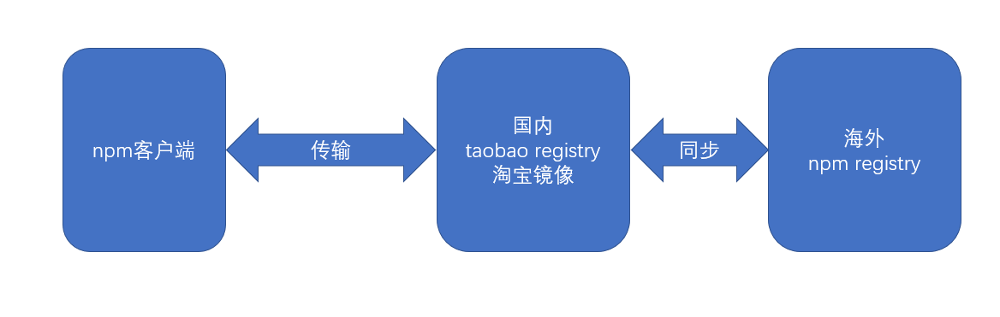
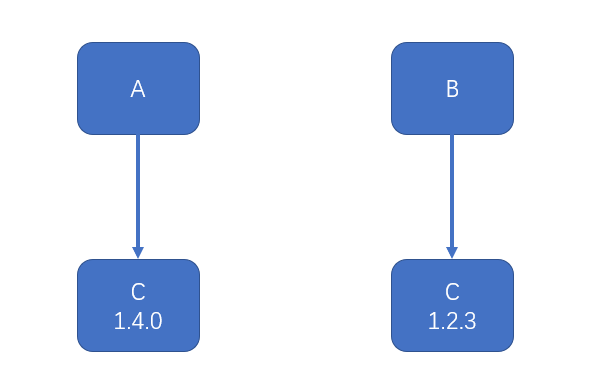
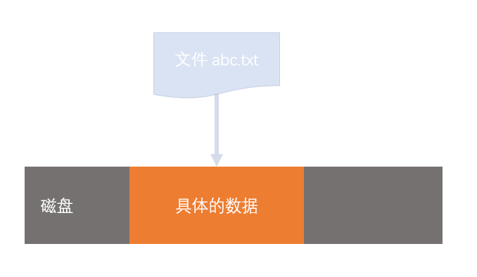
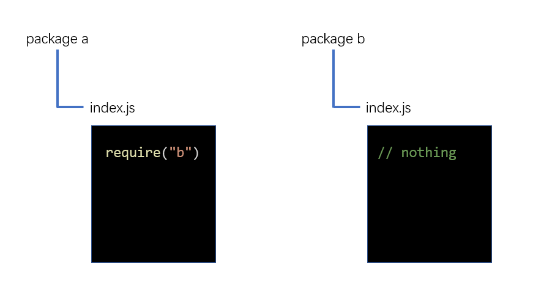
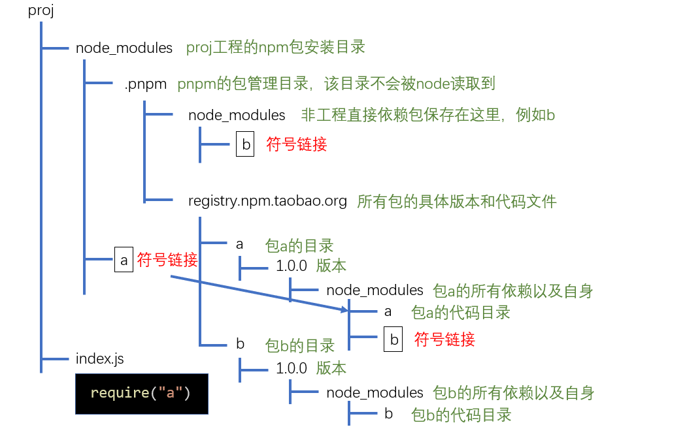

# 1. 包管理工具概述

> 本门课程的前置知识：JavaScript、ES6、模块化、git。
> 本门课程的所有代码均书写在 nodejs 环境中，不涉及浏览器环境。

## 1.1 概念

- 模块（module）

通常以单个文件形式存在的功能片段，入口文件通常称之为**入口模块**或**主模块**。

- 库（library，简称lib）

以一个或多个模块组成的完整功能块，为开发中某一方面的问题提供完整的解决方案。

- 包（package）

包含元数据的库，这些元数据包括：名称、描述、git主页、许可证协议、作者、依赖等等。


## 1.2 背景

CommonJS 的出现，使 node 环境下的 JS 代码可以用模块更加细粒度的划分。一个类、一个函数、一个对象、一个配置等等均可以作为模块，这种细粒度的划分，是开发大型应用的基石。

为了解决在开发过程中遇到的常见问题，比如加密、提供常见的工具方法、模拟数据等等，一时间，在前端社区涌现了大量的第三方库。这些库使用 CommonJS 标准书写而成，非常容易使用。

然而，在下载使用这些第三方库的时候，遇到难以处理的问题：

1. **下载过程繁琐**

- 进入官网或 github 主页
- 找到并下载相应的版本
- 拷贝到工程的目录中
- 如果遇到有同名的库，需要更改名称

2. 如果该库需要依赖其他库，还需要按照要求先下载其他库
3. 开发环境中安装的大量的库如何在生产环境中还原，又如何区分？
4. 更新一个库极度麻烦。
5. 自己开发的库，如何在下一次开发使用？

**以上问题，就是包管理工具要解决的问题。**


## 1.3 前端包管理器

> 本门课程讲解的包管理器
> npm：重点
> yarn：次重点
> 其他：了解

几乎可以这样认为，前端所有的包管理器都是基于 npm 的，目前，npm 即是一个包管理器，也是其他包管理的基石

npm 全称为 node package manager，即 node 包管理器，它运行在 node 环境中，让开发者可以用简单的方式完成包的查找、安装、更新、卸载、上传等操作

> npm 之所以要运行在 node 环境，而不是浏览器环境，根本原因是因为浏览器环境无法提供下载、删除、读取本地文件的功能。而 node 属于服务器环境，没有浏览器的种种限制，理论上可以完全掌控运行 node 的计算机。

npm 的出现，弥补了 node 没有包管理器的缺陷，于是很快，node 在安装文件中内置了 npm，当开发者安装好 node 之后，就自动安装了 npm，不仅如此，node 环境还专门为 npm 提供了良好的支持，使用 npm 下载的包更加方便了。

npm 由三部分组成：

- registry：入口
  - 可以把它想象成一个庞大的数据库
  - 第三方库的开发者，将自己的库按照 npm 的规范，打包上传到数据库中。
  - 使用者通过统一的地址下载第三方包。
- 官网：https://www.npmjs.com/
  - 查询包
  - 注册、登录、管理个人信息
- CLI：command-line interface 命令行接口
  - 这一部分是本门课讲解的重点
  - 安装好 npm 后，通过 CLI 来使用 npm 的各种功能

> node 和 npm 是互相成就的，node 的出现让 npm 火了，npm 的火爆带动了大量的第三方库的发展，很多优秀的第三方库打包上传到了 npm，这些第三方库又为 node 带来了大量的用户。


# 2. npm

## 2.1 包的安装

> 由于 npm 的官方 registry 服务器位于国外，可能受网速影响导致下载缓慢或失败。因此，安装好 npm 之后，需要重新设置 registry 的地址为国内地址。目前，淘宝 https://registry.npm.taobao.org 提供了国内的 registry 地址，先设置到该地址。
> 设置方式为： `npm config set registry https://registry.npm.taobao.org`。设置好后，通过命令`npm config get registry` 进行检查。

> 

npm 安装一个包，分为两种安装方式：

1. **本地安装**

使用命令:
```shell
npm install 包名
# OR
npm i 包名
```

本地安装的包出现在当前目录下的 `node_modules` 目录中。
> 1. 随着开发的进展， `node_modules`  目录会变得异常庞大，目录下的内容不适合直接传输到生产环境，因此通常使用 `.gitignore` 文件忽略该目录中的内容。
> 2. 本地安装适用于绝大部分的包，它会在当前目录及其子目录中发挥作用。
> 3. 通常在项目的根目录中使用本地安装。
> 4. 安装一个包的时候，npm 会自动管理依赖，它会下载该包的依赖包到 `node_modules` 目录中。
> 5. 如果本地安装的包带有 CLI(如：mocha测试工具)，npm 会将它的 CLI 脚本文件放置到 `node_modules/.bin` 下，使用命令 `npx 命令名` 即可调用。

2. **全局安装**

使用命令：
```shell
npm install --global 包名
# OR 
npm i -g 包名
```

全局安装的包放置在一个特殊的全局目录，该目录可以通过命令 `npm config get prefix` 查看。

<font color="red">将某个包进行全局安装，不是因为所有工程都要用到它，而是为了给所有工程提供全局的 CLI 工具。</font>
大部分情况下，都不需要全局安装包，除非同时满足以下三个条件：
  - 包的版本非常稳定，很少有大的更新。
  - 提供的 CLI 工具在各个工程中使用的非常频繁。
  - CLI 工具仅为开发环境提供支持，而非生产环境。

3. **补充**

以上两种安装都可以同时安装多个包。如：
```shell
npm i jquery lodash
```


## 2.2 包的配置

目前遇到的问题：

- 拷贝工程后如何还原原本的依赖关系？
    因为上传文件是不会上传`node_modules`文件夹的。
- 如何区分开发依赖和生产依赖？
- 如果自身的项目也是一个包，如何描述包的信息？

以上这些问题都需要通过包的**配置文件**解决。

1. **创建配置文件**

npm 将每个使用 npm 的工程本身都看作是一个包，包的信息需要通过一个名称固定的配置文件来描述。

<font color="red">名称固定为：package.json</font>。可以手动在**项目根目录**创建该配置文件，而更多的时候，是通过命令 `npm init` 创建的。

配置文件中可以描述大量的信息，包括：
- name：包的名称，该名称必须是英文单词字符，支持连接符
- version：版本
  - 版本规范：主版本号.次版本号.补丁版本号
  - 主版本号：仅当程序发生了重大变化时才会增长，如新增了重要功能、新增了大量的API、技术架构发生了重大变化
  - 次版本号：仅当程序发生了一些小变化时才会增长，如新增了一些小功能、新增了一些辅助型的API
  - 补丁版本号：仅当解决了一些 bug 或 进行了一些局部优化时更新，如修复了某个函数的 bug、提升了某个函数的运行效率
- description：包的描述
- homepage：官网地址
- author：包的作者，必须是有效的 npm 账户名。书写规范：```account <mail>```, 如：```zhangsan <zhangsan@gmail.com>```,不正确的账号和邮箱可能导致发布包时失败
- repository：包的仓储地址，通常指 git 或 svn 的地址，它是一个对象
  - type：仓储类型，git 或 svn
  - url：地址
- main：包的入口文件，使用包的人默认从该入口文件导入包的内容
- keywords: 搜索关键字，发布包后，可以通过该数组中的关键字搜索到包

> <font color="red">使用 `npm init --yes` 或 `npm init -y` 可以在生成配置文件时自动填充默认配置。</font>


2. **配置文件最重要的作用：记录当前工程的依赖关系**

- 大部分时候，我们仅仅是开发项目，并不会把它打包发布出去，尽管如此，我们仍然需要package.json文件。
  - dependencies：在生产环境用到的依赖包
  - devDependencies：仅在开发环境用到的依赖包

- 配置好依赖后，使用下面的命令即可安装配置文件里的依赖：
  ```shell
  ## 本地安装所有依赖 dependencies + devDependencies
      npm install
      # OR
      npm i

  ## 仅安装生产环境的依赖 dependencies
      npm i --production
  ```
  这样一来，代码移植就不是问题了，只需要移植源代码和package.json文件，不用移植node_modules目录，然后在移植之后通过命令即可重新恢复安装。

- 除了手动在配置文件里添加依赖，npm还支持在使用install命令时，加入一些额外的参数自动将安装的依赖包保存到配置文件中。

  涉及的命令如下：

  ```shell
  ## 安装依赖到生产环境
  npm i 包名          (现在可以不用加参数了)
  npm i --save 包名   (过去写法)
  npm i -S 包名

  ## 安装依赖到开发环境
  npm i --save-dev 包名
  npm i -D 包名
  ```

  > 自动保存的依赖版本，例如```^15.1.3```，这种书写方式叫做语义版本号（semver version），具体规则后续讲解


## 2.3 包的使用

nodejs 对 npm 支持非常良好。

1. 当使用 nodejs导入模块时，如果模块路径不是以 ./ 或 ../ 开头，则 node 会认为导入的模块来自于 node_modules 目录。如：
```js
require("lodash");
```
  - 它首先会从当前目录的以下位置寻找文件
      ```shell
          node_modules/lodash.js
          node_modules/lodash/入口文件
      ```
  - 如果当前目录没有这样的文件，则会回溯到上级目录按照同样的方式查找。
  - 如果到顶级目录都无法找到文件，则抛出错误。

2. 上面提到的入口文件按照以下规则确定：
    - 查看导入包的 `package.json` 文件，读取 main 字段作为入口文件。
    - 若不包含 main 字段，则默认使用 index.js 作为入口文件。

3. 入口文件的规则同样适用于自己工程中的模块。

4. 在 node 中，不仅可以导入模块的入口文件，还可以手动指定路径来导入模块里其他的文件。 
```js
require("lodash/fp/add")
```

5. 如果导入的模块是nodejs的内置模块，那么不会从 `node_modules` 目录下查找，而是直接从 `nodejs` 中查找。    

## 2.4 练习：简易数据爬虫

将豆瓣电影的电影数据抓取下来，保存到本地文件 movie.json 中。需要用到的包：
1. axios：专门用于在各种环境中发送网络请求，并获取到服务器响应结果
2. cheerio：jquery的核心逻辑包，支持所有环境，用于将一个html字符串转换成为jquery对象，并通过jquery对象完成后续操作。
3. fs：node核心模块，专门用于文件处理
   - fs.writeFile(文件名, 数据)

## 2.5 语义版本

> 思考：如果你编写了一个包A，依赖另外一个包B，你在编写代码时，包B的版本是2.4.1，那么你是希望使用你包的人一定要安装包B且是2.4.1版本，还是希望他可以安装更高的版本？ 如果你希望它安装更高的版本，高到什么程度呢？

1. **回顾：版本号规则**

- 版本规范：主版本号.次版本号.补丁版本号
  - 主版本号：仅当程序发生了重大变化时才会增长，如新增了重要功能、新增了大量的API、技术架构发生了重大变化
  - 次版本号：仅当程序发生了一些小变化时才会增长，如新增了一些小功能、新增了一些辅助型的API
  - 补丁版本号：仅当解决了一些 bug 或 进行了一些局部优化时更新，如修复了某个函数的 bug、提升了某个函数的运行效率

- 有的时候，我们希望：安装我的依赖包的时候，次版本号和补丁版本号是可以有提升的，但是主版本号不能变化；有的时候，我们又希望：安装我的依赖包的时候，只有补丁版本号可以提升，其他都不能提升；甚至我们希望依赖包保持固定的版本，尽管这比较少见。这样一来，就需要在配置文件中描述清楚具体的依赖规则，而不是直接写上版本号那么简单。<font color="red">这种规则的描述，即语义版本。</font>

- 语义版本的书写规则非常丰富，下面列出了一些常见的书写方式：

  | 符号  |         描述         |     示例      |                            示例描述                             |
  | :---: | :------------------: | :-----------: | :-------------------------------------------------------------: |
  |   >   |     大于某个版本     |    >1.2.1     |                          大于1.2.1版本                          |
  |  >=   |   大于等于某个版本   |    >=1.2.1    |                        大于等于1.2.1版本                        |
  |   <   |     小于某个版本     |    <1.2.1     |                          小于1.2.1版本                          |
  |  <=   |   小于等于某个版本   |    <=1.2.1    |                        小于等于1.2.1版本                        |
  |   -   |   介于两个版本之间   | 1.2.1 - 1.4.5 |                      介于1.2.1和1.4.5之间                       |
  |   x   |    不固定的版本号    |     1.3.x     |              只要保证主版本号是1，次版本号是3即可               |
  |   ~   |    补丁版本号可增    |    ~1.3.4     |        保证主版本号是1，次版本号是3，补丁版本号大于等于4        |
  |   ^   | 此版本和补丁版本可增 |    ^1.3.4     | 保证主版本号是1，次版本号可以大于等于3，补丁版本号可以大于等于4 |
  |   *   |       最新版本       |       *       |                        始终安装最新版本                         |


2. **如何避免还原依赖时出现差异？**

版本依赖控制始终是一个两难的问题：
  - 如果允许版本增加，可以让依赖包的bug得以修复（补丁版本号），可以带来一些意外的惊喜（次版本号），但同样可能带来不确定的风险（新的bug）
  - 如果不允许版本增加，可以获得最好的稳定性，但失去了依赖包自我优化的能力
  - 而有的时候情况更加复杂：如果某个包的依赖包A升级后，A的依赖包也发生了变化，那么会有更多不确定的情况出现。

基于此，npm 在安装包的时候，会自动生成一个 `package-lock.json` 文件，该文件记录了安装包时的确切依赖关系。
当移植工程时，如果移植了 `package-lock.json` 文件，那么恢复安装时，会按照 `package-lock.json` 文件中的确切依赖进行安装，最大限度的避免了差异。


3. **[扩展]npm的差异版本处理**

如果两个包依赖同一个包的不同版本，如下图



面对这种情况，在 node_modules 目录中，不会使用扁平的目录结构，而会形成嵌套的目录，如下图：

```
├── node_modules
│   ├── a 
│   │   ├── node_modules
│   │   │   ├── c
│   │   │   |   |—— c包的文件
│   │   │── a包的文件     
│   ├── b 
│   │   ├── node_modules
│   │   │   ├── c
│   │   │   |   |—— c包的文件
│   │   │── b包的文件           
```

## 2.6 npm 脚本 （npm scripts）
1. 在开发的过程中，我们可能会反复使用很多的 CLI 命令，例如：
    - 启动工程命令(node 或 一些第三方包提供的CLI命令)。如 `nodemon` ：可以避免修改输出结果后重新输入命令
    - 部署工程命令(一些第三方包提供的CLI命令)。
    - 测试工程命令(一些第三方包提供的CLI命令)。

    这些命令纷繁复杂，根据第三方包的不同命令也会不一样，非常难以记忆。于是，npm 非常贴心的支持了脚本，只需要在 `package.json` 中配置 scripts 字段，即可配置各种脚本名称。之后，我们就可以运行简单的指令来完成各种操作了。

2. 运行方式：
```shell
npm run 脚本名称
```

3. npm 还对某些常用的脚本名称进行了简化。下面的脚本名称是不需要使用run的：
    - start
    - stop
    - test

4. 一些细节：
    - 脚本中可以省略npx
    - start脚本有默认值：node server.js

## 2.7 运行环境配置

1. **我们书写的代码一般有三种运行环境：**
    - 开发环境：写代码阶段，自己运行。
    - 生产环境：代码全部完成，放到服务器上让用户使用。
    - 测试环境：用测试工具测试代码。

有的时候，我们可能需要在 node 代码中根据不同的环境做出不同的处理。如何优雅的让 node 知道处于什么环境，是极其重要的。

2. **通常使用如下处理方式，让 node 知道处于什么环境？**
    - node中有一个全局变量 global (可以类比浏览器环境的window)，该变量是一个对象，对象中的所有属性均可以直接使用。
    - global有一个属性是process，该属性是一个对象，包含了当前运行node程序的计算机的很多信息，其中有一个信息是env，是一个对象，包含了计算机中所有的系统变量。
    - 通常，我们通过系统变量 NODE_ENV 的值，来判定node程序处于何种环境。

3. **有两种方式设置 NODE_ENV 的值**
    1. 永久设置：在系统变量里添加。<font color="red">(不常用)</font>
    2. 临时设置：配置scripts脚本，在设置好了 NODE_ENV 后启动程序。<font color="red">(常用)</font>
    ```json
    "scripts": {
        "start": "set NODE_ENV=development&&node index.js",
        "build": "set NODE_ENV=production&&node index.js",
        "test": "set NODE_ENV=test&&node index.js"
    }
    ```

    为了避免不同系统的设置方式的差异，可以使用第三方库 `cross-env` 对环境变量进行设置:
    ```json
    "scripts": {
        "start": "cross-env NODE_ENV=development node index.js",
        "build": "cross-env NODE_ENV=production node index.js",
        "test": "cross-env NODE_ENV=test node index.js"
    }
    ```

4. **在node中读取package.json**

有的时候，我们可能在 `package.json` 中配置一些自定义的字段，这些字段需要在node中读取。在node 中，可以直接导入一个json格式的文件，它会自动将其转换为js对象。

```json
// package.json文件
{
    "name": "p2",
    "version": "1.0.0",
    "a": 123
}
```
```js
var config = require("./package.json");

// 读取package.json文件中的版本号
console.log(config.version)

// 读取package.json文件中自定义字段a
console.log(config.a)
```


## 2.8 其他npm命令 

1. **安装命令**

- 精确安装最新版本

```shell
npm install --save-exact 包名 
npm install -E 包名
```

- 安装指定版本

```shell
npm install 包名@版本号
```

2. **查询命令**

- 查询包安装路径：

```shell
npm root [-g]
## 加上-g 指：全局安装路径
## 不加-g 指：本地安装路径
```

- 查看包信息：

```shell
npm view 包名 [子信息]
## view的aliases(别名)：v info show
## 子信息就是package.json里的信息
```

- 查询已安装的包：

```shell
npm list [-g] [--depth=依赖深度]
## list aliases: ls  la  ll
```

3. **更新命令**

- 检查有哪些包需要更新：

```shell
npm outdated
```

- 更新包：

```shell
npm update [-g] [包名]
## update 别名（aliases）：up、upgrade
```

- 更新npm：

```shell
npm i -g npm
## 用旧版本 npm将新版本 npm下载到全局
## 之后再更新：npm update -g npm
```

4. **卸载命令**

```shell
npm uninstall [-g] 包名
## uninstall aliases: remove, rm, r, un, unlink
## 会将用不到的包全部卸载，其他包需要用到的会留下
```

5. **npm 本身的配置**

npm的配置会对其他命令产生或多或少的影响。

安装好npm之后，最终会产生两个配置文件，一个是用户配置，一个是系统配置，当两个文件的配置项有冲突的时候，用户配置会覆盖系统配置。通常，我们不关心具体的配置文件，而只关心最终生效的配置。

通过下面的命令可以查询目前生效的各种配置：

```shell
npm config ls [-l] [--json]
## -l: 以列表格式显示配置信息
## -json：以json对象格式显示配置信息
```

另外，可以通过下面的命令操作配置：

```shell
# 获取某个配置项
npm config get 配置项

# 设置某个配置项
npm config set 配置项=值

# 移除某个配置项
npm config delete 配置项
```


## 2.9 发布包

1. **准备工作**

- 移除淘宝镜像源
- 到npm官网注册一个账号，并完成邮箱认证
- 本地使用 npm cli 进行登录：
   1. 使用命令```npm login```登录
   2. 使用命令```npm whoami```查看当前登录的账号
   3. 使用命令```npm logout```注销
- 创建工程根目录
- 使用npm init进行初始化

2. **发布**

- 开发
- 确定版本
- 使用命令```npm publish```完成发布


# 三、yarn

## 3.1 yarn 简介

> yarn 官网：https://www.yarnpkg.com/zh-Hans/

yarn 是由 Facebook、Google、Exponent 和 Tilde 联合推出了一个新的 JS 包管理工具，**它仍然使用 npm 的registry**，不过提供了全新 CLI 来对包进行管理。

过去，yarn 的出现极大的抢夺了 npm 的市场，甚至有人戏言，npm 只剩下一个 registry 了。

之所以会出现这种情况，是因为在过去，npm 存在下面的问题：

- 依赖目录嵌套层次深：过去，npm 的依赖是嵌套的，这在 windows 系统上是一个极大的问题，由于众所周知的原因，windows 系统无法支持太深的目录
- 下载速度慢
  - 由于嵌套层次的问题，所以npm对包的下载只能是串行的，即前一个包下载完后才会下载下一个包，导致带宽资源没有完全利用
  - 多个相同版本的包被重复的下载
- 控制台输出繁杂：过去，npm 安装包的时候，每安装一个依赖，就会输出依赖的详细信息，导致一次安装有大量的信息输出到控制台，遇到错误极难查看
- 工程移植问题：由于 npm 的版本依赖可以是模糊的，可能会导致工程移植后，依赖的确切版本不一致。

针对上述问题，yarn 从诞生那天就已经解决，它用到了以下的手段：

- 使用扁平的目录结构
- 并行下载
- 使用本地缓存
- 控制台仅输出关键信息
- 使用yanr-lock文件记录确切依赖

不仅如此，yarn还优化了以下内容：

- 增加了某些功能强大的命令
- 让既有的命令更加语义化
- 本地安装的CLI工具可以使用 yarn 直接启动
- 将全局安装的目录当作一个普通的工程，生成package.json文件，便于全局安装移植

yarn 的出现给 npm 带来了巨大的压力，很快，npm 学习了 yarn 先进的理念，不断的对自身进行优化，到了目前的npm6版本，几乎完全解决了上面的问题：

- 目录扁平化
- 并行下载
- 本地缓存
- 使用package-lock记录确切依赖
- 增加了大量的命令别名
- 内置了npx，可以启动本地的CLI工具
- 极大的简化了控制台输出

**总结**

npm6 之后，可以说npm已经和yarn非常接近，甚至没有差距了。很多新的项目，又重新从yarn转回到npm。

这两个包管理器是目前的主流，都必须要学习。

## 3.2 yarn 的核心命令

1. **初始化**

```shell
yarn init [--yes/-y]
```

2. **安装**

```shell
# 添加指定包
yarn [global] add package-name [--dev/-D] [--exact/-E]

# 安装package.json中的所有依赖
yarn install [--production/--prod]
```

3. **脚本和本地CLI**

```shell
# 运行脚本。start、stop、test可以省略run
yarn run 脚本名

# 运行本地安装的CLI
yarn run CLI名
```

4. **查询**

```shell
# 查看bin目录
yarn [global] bin

# 查询包信息
yarn info 包名 [子字段]

# 列举已安装的依赖。注意：yarn的list命令和npm的不同。yarn输出的信息更加丰富，包括顶级目录结构、每个包的依赖版本号。
yarn [global] list [--depth=依赖深度]
```

> 

5. **更新**

```shell
# 列举需要更新的包
yarn outdated

# 更新包
yarn [global] upgrade [包名]
```

6. **卸载**


```shell
# 卸载包
yarn remove 包名
```

## 3.3 yarn 的特有命令

在终端命令上，yarn不仅仅是对npm的命令做了一个改名，还增加了一些原本没有的命令，这些命令在某些时候使用起来非常方便。

```shell
# 验证package.json文件的依赖记录和lock文件是否一致。这对于防止篡改非常有用。
yarn check

# 检查本地安装的包有哪些已知漏洞，以表格的形式列出。漏洞级别分为以下几种：
# - INFO：信息级别
# - LOW: 低级别
# - MODERATE：中级别
# - HIGH：高级别
# - CRITICAL：关键级别
yarn audit

# 在控制台打印出为什么安装了这个包，哪些包会用到它。
yarn why

# 一步完成安装和搭建脚手架。
yarn create <脚手架名> <项目名>
```

- **对 `yarn create` 的补充说明**

所谓脚手架，就是使用一个命令来搭建一个工程结构。

过去，我们都是使用如下的做法：
1) 全局安装脚手架工具
2) 使用全局命令搭建脚手架

由于大部分脚手架工具都是以`create-xxx`的方式命名的，比如react的官方脚手架名称为`create-react-app`。因此，可以使用`yarn create`命令来一步完成安装和搭建。

例如：

```shell
yarn create react-app my-app
# 等同于下面的两条命令
yarn global add create-react-app
create-react-app my-app
```

# 四、其他包管理器

## 4.1 cnpm

> 官网地址：https://npm.taobao.org/

为解决国内用户连接npm registry缓慢的问题，淘宝搭建了自己的registry，即淘宝npm镜像源

过去，npm没有提供修改registry的功能，因此，淘宝提供了一个CLI工具即cnpm，它支持除了```npm publish```以外的所有命令，只不过连接的是淘宝镜像源

如今，npm已经支持修改registry了，可能cnpm唯一的作用就是和npm共存，即如果要使用官方源，则使用npm，如果使用淘宝源，则使用cnpm


## 4.2 nvm

nvm并非包管理器，它是用于管理多个node版本的工具

在实际的开发中，可能会出现多个项目分别使用的是不同的node版本，在这种场景下，管理不同的node版本就显得尤为重要

nvm就是用于切换版本的一个工具

1. **下载和安装**

最新版下载地址：https://github.com/coreybutler/nvm-windows/releases

下载nvm-setup.zip后，直接安装

2. **使用nvm**

nvm提供了CLI工具，用于管理node版本

在终端中输入nvm，以查看各种可用命令

> 为了加快下载速度，建议设置淘宝镜像
> node淘宝镜像：https://npm.taobao.org/mirrors/node/
> npm淘宝镜像：https://npm.taobao.org/mirrors/npm/


## 4.3 pnpm

pnpm是一种新起的包管理器，从npm的下载量看，目前还没有超过yarn，但它的实现方式值得主流包管理器学习，某些开发者极力推荐使用pnpm。

从结果上来看，它具有以下优势：

- 目前，安装效率高于npm和yarn的最新版
- 极其简洁的node_modules目录
- 避免了开发时使用间接依赖的问题
- 能极大的降低磁盘空间的占用

1. **安装和使用**

全局安装pnpm

```shell
npm install -g pnpm
```

之后在使用时，只需要把npm替换为pnpm即可

如果要执行安装在本地的CLI，可以使用pnpx，它和 npx 的功能完全一样，唯一不同的是，在使用pnpx执行一个需要安装的命令时，会使用pnpm进行安装

> 比如```npx mocha```执行本地的```mocha```命令时，如果```mocha```没有安装，则npx会自动的、临时的安装mocha，安装好后，自动运行mocha命令

2. **pnpm原理**

- 同 yarn 和 npm 一样，pnpm 仍然使用缓存来保存已经安装过的包，以及使用 pnpm-lock.yaml 来记录详细的依赖版本

- 不同于 yarn 和 npm， pnpm 使用**符号链接和硬链接**（可将它们想象成快捷方式）的做法来放置依赖，从而规避了从缓存中拷贝文件的时间，使得安装和卸载的速度更快

- 由于使用了**符号链接和硬链接**，pnpm可以规避windows操作系统路径过长的问题，因此，它选择使用树形的依赖结果，有着几乎完美的依赖管理。也因为如此，项目中只能使用直接依赖，而不能使用间接依赖

3. **注意事项**

由于 pnpm 会改动 node_modules 目录结构，使得每个包只能使用直接依赖，而不能使用间接依赖，因此，如果使用 pnpm 安装的包中包含间接依赖，则会出现问题(**现在不会了，除非使用了绝对路径**)

由于 pnpm 超高的安装卸载效率，越来越多的包开始修正之前的间接依赖代码


## 4.4 pnpm 原理

### 前置知识：

> 要彻底理解pnpm是怎么做的，需要有一些操作系统知识

1. **文件的本质**

在操作系统中，文件实际上是一个指针，只不过它指向的不是内存地址，而是一个外部存储地址（这里的外部存储可以是硬盘、U盘、甚至是网络）


当我们删除文件时，删除的实际上是指针，因此，无论删除多么大的文件，速度都非常快。



2. **文件的拷贝**

如果你复制一个文件，是将该文件指针指向的内容进行复制，然后产生一个新文件指向新的内容


3. **硬链接 hard link**

硬链接的概念来自于 Unix 操作系统，它是指将一个文件A指针复制到另一个文件B指针中，文件B就是文件A的硬链接


通过硬链接，不会产生额外的磁盘占用，并且，两个文件都能找到相同的磁盘内容

硬链接的数量没有限制，可以为同一个文件产生多个硬链接

windows Vista操作系统开始，支持了创建硬链接的操作，在cmd中使用下面的命令可以创建硬链接

```shell
mklink /h 链接名称 目标文件
```

由于文件夹（目录）不存在文件内容，所以文件夹（目录）不能创建硬链接

> 由于种种原因，在windows操作系统中，通常不要跨越盘符创建硬链接

4. **符号链接 symbol link**

符号链接又称为软连接，如果为某个文件或文件夹A创建符号连接B，则B指向A。


windows Vista操作系统开始，支持了创建符号链接的操作，在cmd中使用下面的命令可以创建符号链接：

```shell
mklink /d 链接名称 目标文件
# /d表示创建的是目录的符号链接，不写则是文件的符号链接
```

> 早期的windows系统不支持符号链接，但它提供了一个工具junction来达到类似的功能

**符号链接和硬链接的区别**

1) 硬链接仅能链接文件，而符号链接可以链接目录
2) 硬链接在链接完成后仅和文件内容关联，和之前链接的文件没有任何关系。而符号链接始终和之前链接的文件关联，和文件内容不直接相关

5. **快捷方式**

快捷方式类似于符号链接，是windows系统早期就支持的链接方式。

它不仅仅是一个指向其他文件或目录的指针，其中还包含了各种信息：如权限、兼容性启动方式等其他各种属性

由于快捷方式是windows系统独有的，在跨平台的应用中一般不会使用

6. **node环境对硬链接和符号链接的处理**

**硬链接**：硬链接是一个实实在在的文件，node不对其做任何特殊处理，也无法区别对待，实际上，node根本无从知晓该文件是不是一个硬链接

**符号链接**：由于符号链接指向的是另一个文件或目录，当node执行符号链接下的JS文件时，会使用原始路径。

### pnpm原理：

pnpm使用符号链接和硬链接来构建node_modules目录

下面用一个例子来说明它的构建方式

假设两个包a和b，a依赖b：



假设我们的工程为proj，直接依赖a，则安装时，pnpm会做下面的处理

1. 查询依赖关系，得到最终要安装的包：a和b
2. 查看a和b是否已经有缓存，如果没有，下载到缓存中，如果有，则进入下一步
3. 创建 node_modules 目录，并对目录进行结构初始化


4. 从缓存的对应包中使用硬链接放置文件到相应包代码目录中


5. 使用符号链接，将每个包的**直接依赖**放置到自己的目录中


这样做的目的，是为了保证a的代码在执行过程中，可以读取到它们的直接依赖

6. 新版本的pnpm为了解决一些书写不规范的包（读取间接依赖）的问题，又将所有的工程非直接依赖，使用符号链接加入到了 .pnpm/node_modules 中

在本例中好像没有必要，但是如果b依赖c，a又要直接用c，这种不规范的用法现在pnpm通过这种方式支持了。

> 但对于那些使用绝对路径的奇葩写法，可能永远也无法支持

7. 在工程的node_modules目录中使用符号链接，放置直接依赖



8. 完成


