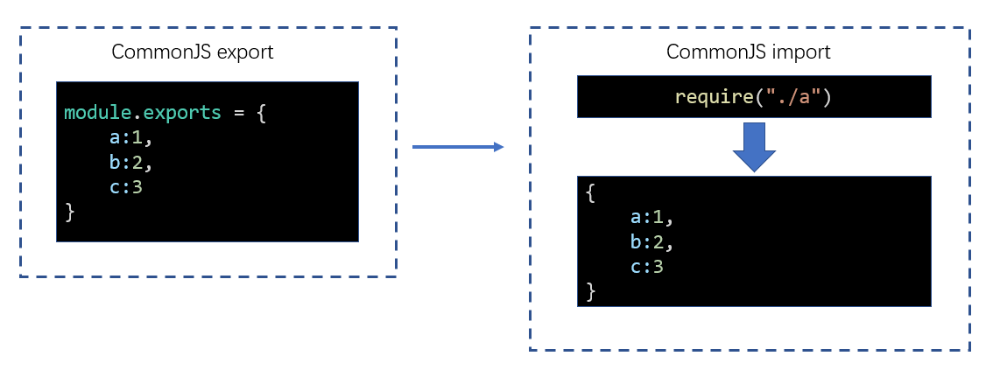

# 1. 如何在浏览器端实现模块化

1. **课程简介**

本门课需要的前置知识：ES6、模块化、包管理器、git
本门课的讲解特点：
- 合适的深度：webpack使用层面很简单，但原理层面非常复杂。
- 合适的广度：webpack生态圈极其繁荣，有海量的第三方库可以融入到webpack。


2. **浏览器端的模块化**

- 存在的问题：
    - 效率问题：精细的模块划分带来了更多的JS文件，更多的JS文件带来了更多的请求，降低了页面访问效率
    - 兼容性问题：浏览器目前仅支持ES6的模块化标准，并且还存在兼容性问题
    - 工具问题：浏览器不支持npm下载的第三方包

- 这些仅仅是前端工程化的一个缩影。
    - 当开发一个具有规模的程序，你将遇到非常多的非业务问题，这些问题包括：执行效率、兼容性、代码的可维护性可扩展性、团队协作、测试等等等等，我们将这些问题称之为工程问题。
    - 工程问题与业务无关，但它深刻的影响到开发进度，如果没有一个好的工具解决这些问题，将使得开发进度变得极其缓慢，同时也让开发者陷入技术的泥潭。


3. **浏览器端模块化问题，产生的根本原因：**

思考：上面提到的问题，为什么在node端没有那么明显，反而到了浏览器端变得如此严重呢？

- 在node端，运行的JS文件在本地，因此可以本地读取文件，它的效率比浏览器远程传输文件高的多
- 在浏览器端，开发时态（devtime）和运行时态（runtime）的侧重点不一样

**开发时态，devtime：**
- 模块划分越细越好
- 支持多种模块化标准
- 支持npm或其他包管理器下载的模块
- 能够解决其他工程化的问题

**运行时态，runtime：**
- 文件越少越好
- 文件体积越小越好
- 代码内容越乱越好
- 所有浏览器都要兼容
- 能够解决其他运行时的问题，主要是执行效率问题

这种差异在小项目中表现的并不明显，可是一旦项目形成规模，就越来越明显，如果不解决这些问题，前端项目形成规模只能是空谈。


4. **浏览器端模块化问题，解决的办法：**

既然开发时态和运行时态面临的局面有巨大的差异，因此，我们需要有一个工具。这个工具能够让开发者专心的在开发时态写代码，然后利用这个工具将开发时态编写的代码转换为运行时态需要的东西。这样的工具，叫做**构建工具**。


这样一来，开发者就可以专注于开发时态的代码结构，而不用担心运行时态遇到的问题了。


5. **常见的构建工具**

- **webpack**
- grunt
- gulp
- browserify
- fis
- 其他


# 2. 安装和使用

> webpack官网：https://www.webpackjs.com/
> 目前的最新版本：webpack4

## 2.1 webpack简介

1. webpack是基于模块化的打包（构建）工具，它把一切视为模块。
2. 它通过一个开发时态的入口模块为起点，分析出所有的依赖关系，然后经过一系列的过程（压缩、合并），最终生成运行时态的文件。

3. webpack的特点：

- **为前端工程化而生**：webpack致力于解决前端工程化，特别是浏览器端工程化中遇到的问题，让开发者集中注意力编写业务代码，而把工程化过程中的问题全部交给webpack来处理。
- **简单易用**：支持零配置，可以不用写任何一行额外的代码就使用webpack。
- **强大的生态**：webpack 是非常灵活、可以扩展的，webpack本身的功能并不多，但它提供了一些可以扩展其功能的机制，使得一些第三方库可以融于到webpack中。
- **基于nodejs**：由于webpack在构建的过程中需要读取文件，因此它是运行在node环境中的。
- **基于模块化**：webpack 在构建过程中通过模块化导入语句分析依赖关系。它支持各种模块化标准，包括但不限于CommonJS、ES6 Module。

## 2.2 安装

webpack通过npm安装，它提供了两个包：

- webpack：核心包，包含了webpack构建过程中要用到的所有api
- webpack-cli：提供一个简单的cli命令，它调用了webpack核心包的api，来完成构建过程

安装方式：

- 全局安装：可以全局使用webpack命令，但是无法为不同项目对应不同的webpack版本。
- 本地安装：推荐，每个项目都使用自己的webpack版本进行构建。

```shell
npm i -D webpack webpack-cli
```


## 2.3 使用

在工程根目录下运行命令，完成打包：
```shell
# --mode:指定 webpack 打包结果的运行环境。
# development：开发环境
# production：生产环境
npx webpack [--mode=development]
```

默认情况下，webpack会以```./src/index.js```作为入口文件分析依赖关系，打包到```./dist/main.js```文件中。


# 3. 模块化兼容性

由于webpack同时支持CommonJS和ES6 module，因此需要理解它们互操作时webpack是如何处理的

1. **同模块化标准**

如果导出和导入使用的是同一种模块化标准，打包后的效果和之前学习的模块化没有任何差异




2. **不同模块化标准**

不同的模块化标准，webpack按照如下的方式处理


3. **实际开发**

实际开发中，代码编写就选择同一个模块化标准，然后贯彻整个开发阶段。
只有用到第三方库才可能使用不同模块化标准。需要注意的是，绝大多数第三方库都是使用commonjs导出的。

# 4. 编译结果分析 (★)

见  `dist/my-main.js` 文件，它是自己写的一个运行时态代码文件。代替经过 webpack 打包后形成的运行时态代码文件 main.js。

```js
/*
    1.自己写一个webpack合并后的js文件，合并两个文件：
        ./src/a.js
        ./src/index.js

    2.为了防止全局变量污染，使用立即执行函数，参数为模块对象。
*/

(function (modules) {
    var moduleExports = {}; //用于缓存模块的导出结果
    /*
        最终缓存对象的结果：
        moduleExports = {
            "./src/a.js": 导出值,
            "./src/index.js": 导出值
        }
    */

    // __webpack_require函数相当于是运行一个模块，得到模块导出结果。
    // 参数：moduleId，即模块的路径。
    function __webpack_require(moduleId) { 
        if (moduleExports[moduleId]) { //检查是否有缓存
            return moduleExports[moduleId];
        }

        var func = modules[moduleId]; //得到该模块对应的函数
        var module = {
            exports: {}
        }
        func(module, module.exports, __webpack_require); //运行模块
        var result = module.exports; //得到模块导出的结果
        moduleExports[moduleId] = result; //将结果缓存起来
        return result;
    }

    // 执行入口模块
    return __webpack_require("./src/index.js"); //__webpack_require函数相当于是运行一个模块，得到模块导出结果

})(
    // 该对象保存了所有的模块，以及模块对应的代码
    {
        "./src/a.js": function (module, exports) {
            // 将函数代码写在eval()里，更容易调试。如果出错，可以避免其他代码的干扰，更容易找到问题。
            // 后面添加的注释可以显示函数代码文件在开发时态的位置。
            eval("console.log(\"module a\")\nmodule.exports = \"a\";\n //# sourceURL=webpack:///./src/a.js")
        },
        "./src/index.js": function (module, exports, __webpack_require) {
            eval("console.log(\"index module\")\nvar a = __webpack_require(\"./src/a.js\")\na.abc();\nconsole.log(a)\n //# sourceURL=webpack:///./src/index.js")

        }
    }
);
```

# 5. 配置文件

1. **配置文件**

webpack 提供的 cli 命令支持很多的参数，如 `--mode`。但是随着参数越来越多，书写变得较为复杂，我们会使用更加灵活的**配置文件**来控制 webpack 的行为。

默认情况下，webpack 会读取 `webpack.config.js` 文件作为配置文件。但也可以通过 cli 参数 `--config` 来指定某个文件为配置文件：
```shell
npx webpack --config xxx.js
```

在配置文件中，我们使用 CommonJS 模块标准导出对象。对象中的各种属性对应不同的 webpack 配置：
```js
module.exports = {
    entry: "./src/index1.js",
    output: {
        filename: "main-yu.js"
    }
}
```

<font color="red">注意：配置文件中的代码，必须是有效的node代码。</font>
在 webpack 打包过程中，自己写的模块代码是不会运行的，只会读取代码分析依赖关系，所以支持各种模块化标准。而配置文件是要在编译打包过程中运行的，所以只能使用commonjs模块标准。

当命令行参数与配置文件中的配置出现冲突时，**以命令行参数为准**。

2. **基本配置**

- `mode`：编译模式，字符串，取值为 development 或 production。指定编译结果代码运行的环境，会影响 webpack 对编译结果代码格式的处理。
- `entry`：入口，字符串（后续会详细讲解），指定入口文件。
- `output`：出口，对象（后续会详细讲解），指定编译结果文件。
- `watch`：启用 Watch 模式，意味着在初始构建之后，webpack 将继续监听任何已解析文件的更改。


# 6. 配置 devtool

> 如果运行打包后的代码出现了错误，devtool 配置可以让我们准确知道代码出错的位置。这个位置是src目录下的位置。
> 如果打包后的代码是开发时态的，默认的devtool配置是 eval。
> 如果打包后的代码是生产时态的，默认的devtool配置是 none。

## 6.1 source map (源码地图)

> 本小节的知识与 webpack 无关

1. **source map 是什么？**

前端发展到现阶段，很多时候都不会直接运行源代码，可能需要对源代码进行合并、压缩、转换等操作，真正运行的是转换后的代码。这就给调试带来了困难，因为当运行发生错误的时候，我们更加希望能看到源代码中的错误，而不是转换后代码的错误。

为了解决这一问题，Chrome 浏览器率先提出并支持了`source map`，其他浏览器纷纷效仿。目前，几乎所有新版浏览器都支持了`source map`。

`source map` 实际上是一个配置，配置中不仅记录了所有源码内容，还记录了和转换后的代码的对应关系。


2. **浏览器处理 source map 的原理**


3. **source map 的最佳实践**

`source map` 应在开发环境中使用，作为一种调试手段。
`source map` 不应该在生产环境中使用，source map的文件一般较大，不仅会导致额外的网络传输，还容易暴露原始代码。即便要在生产环境中使用source map，用于调试真实的代码运行问题，也要做出一些处理规避网络传输和代码暴露的问题。


## 6.2 webpack 中的 source map

1. **devtool 配置项**

> 具体的配置见文档：https://www.webpackjs.com/configuration/devtool/

使用 webpack 编译后的代码难以调试，可以通过 devtool 配置来**优化调试体验**。


之前 1-5 学到的 `eval()` 可以看作一个简易的 `source map`。通过在语句最后加上注释，来让浏览器更好的运行调试代码。

```js
module.exports = {
    mode: "development",
    devtool: "eval"
}
```

2. **devtool 的最佳配置值**

以下4个选项非常适合开发环境：
- `eval`：每个模块都使用 `eval()` 执行，并且都有 `//# sourceURL` 。此选项会非常快地构建，但不能正确的显示行数。
- `eval-source-map`：`source map`不会生成为单独文件，而是以注释形式嵌入 `eval()` 里。能准确显示错误的行列位置。会生成用于**开发环境的最佳品质**的 `source map`。
- `cheap-eval-source-map`：报错后，只映射行数，不映射列数。
- `cheap-module-eval-source-map`

以下4个选项非常适合生产环境：
- `none`: 不生成 `source map`。
- `source-map`: 整个 `source map` 作为一个单独的文件生成。它为 `bundle` 添加了一个引用注释，以便开发工具知道在哪里可以找到它。
- `hidden-source-map`: 与 `source-map` 相同，但不会为 `bundle` 添加引用注释。
- `nosources-source-map`


# 7. webpack 编译过程分析

webpack 的作用是将源代码编译（构建、打包）成最终代码。


整个过程大致分为三个步骤：
1. 初始化
2. 编译
3. 输出


## 7.1 初始化

此阶段，webpack会将**CLI参数**、**配置文件**、**默认配置**进行融合，形成一个最终的配置对象。

对配置的处理过程是依托一个第三方库```yargs```完成的

此阶段相对比较简单，主要是为接下来的编译阶段做必要的准备

目前，可以简单的理解为，初始化阶段主要用于产生一个最终的配置

## 7.2 编译

1. **创建chunk**

chunk是webpack在内部构建过程中的一个概念，译为```块```，它表示通过某个入口文件找到的所有依赖文件的统称。

根据入口模块（默认为```./src/index.js```）创建一个chunk


每个chunk都有至少两个属性：

- name：默认为main
- id：唯一编号，开发环境和name相同，生产环境是一个数字，从0开始

2. **构建所有依赖模块**


> AST在线测试工具：https://astexplorer.net/

- 检查记录：index.js 未加载
- 读取文件内容
```js
// 入口文件原来的代码
console.log("index")
require("./a");
require("./b");
```
- 通过语法分析得到AST树形结构。
- 然后遍历这个树形结构，找到所有依赖，存放在dependencies数组里。
- 替换依赖函数
```js
// 转换后的代码
console.log("index")
_webpack_require("./src/a");
_webpack_require("./src/b");
```
- 将转换后的模块保存到表格里。
- 根据dependencies数组内容递归加载模块

简图：


3. **产生chunk assets**

在第二步完成后，chunk中会产生一个模块列表，列表中包含了**模块id**和**模块转换后的代码**。接下来，webpack会根据配置为chunk生成一个资源列表，即```chunk assets```。
- 资源列表可以理解为是生成到最终文件的文件名和文件内容。
- 资源列表中的每一个资源都是一个bundle(即:捆)。


> chunk hash是根据所有chunk assets的内容生成的一个hash字符串
> hash：一种算法，具体有很多分类，特点是将一个任意长度的字符串转换为一个固定长度的字符串，而且可以保证原始内容不变，产生的hash字符串就不变

简图


4. **合并chunk assets**

将多个chunk的assets合并到一起，并产生一个总的hash


## 7.3 输出

此步骤非常简单，webpack将利用node中的fs模块（文件处理模块），根据编译产生的总的assets，生成相应的文件。


## 7.4 总过程


注意：当启动watch后，一旦文件发送变化，编译过程将从编译阶段开始，跳过初始化阶段。


**涉及术语**

1. module：模块，分割的代码单元，webpack中的模块可以是任何内容的文件，不仅限于JS
2. chunk：webpack内部构建模块的块，一个chunk中包含多个模块，这些模块是从入口模块通过依赖分析得来的
3. bundle：chunk构建好模块后会生成chunk的资源清单，清单中的每一项就是一个bundle，可以认为bundle就是最终生成的文件
4. hash：最终的资源清单所有内容联合生成的hash值
5. chunkhash：chunk生成的资源清单内容联合生成的hash值
6. chunkname：chunk的名称，如果没有配置则使用main
7. id：通常指chunk的唯一编号，如果在开发环境下构建，和chunkname相同；如果是生产环境下构建，则使用一个从0开始的数字进行编号


# 8. 配置 entry，output

## 8.1 如何配置


1. **前置知识**

- node内置模块：path

> path: https://nodejs.org/dist/latest-v12.x/docs/api/path.html

```js
/*

./ : 
1. 模块化代码中，比如require("./")，表示当前js文件所在的目录
2. 在路径处理中，"./"表示node运行目录

__dirname: 所有情况下，都表示当前运行的js文件所在的目录，它是一个绝对路径。

*/
```

2. **出口**

配置：<font color="red">资源列表的路径 和 文件名</font>。

```json
output: {
    path: path.resolve(__dirname, "dist"), //必须配置一个绝对路径，表示资源放置的文件夹。默认是dist。
    filename: "[name].[id].[chunkhash:5].js" //配置合并后的js文件名的命名规则。可以是静态规则，也可以是动态规则。
}
```

- 常用动态规则：放在 `[]` 里
    - name：使用chunk的name
    - hash: 使用总的资源hash，通常用于解决缓存问题。加数字表示取几位
    - chunkhash: 使用每一个chunk的hash。加数字表示取几位
    - id: 使用chunkid，不推荐


3. **入口**

配置：<font color="red">chunk</font>。

```json
entry: {
    main: "./src/index.js", //属性名：chunk的名称。属性值：入口模块（启动模块）
    a: ["./src/a.js", "./src/index.js"] // 启动模块有两个，但是最后还是返回一个js文件
}
```


## 8.2 最佳配置

**具体情况具体分析**

对初学者而已，不需要了解如何配置入口和出口。`Vue`、`React` 会帮我们配置好。就算不使用框架配置好的，也会有公司大神配置好。

<font color="red">经典场景：</font>

1. **一个页面一个JS**


源码结构

```
|—— src
    |—— pageA   页面A的代码目录
        |—— index.js 页面A的启动模块
        |—— ...
    |—— pageB   页面B的代码目录
        |—— index.js 页面B的启动模块
        |—— ...
    |—— pageC   页面C的代码目录
        |—— main1.js 页面C的启动模块1 例如：主功能
        |—— main2.js 页面C的启动模块2 例如：实现访问统计的额外功能
        |—— ...
    |—— common  公共代码目录
        |—— ...
```

webpack配置

```js
module.exports = {
    entry:{
        pageA: "./src/pageA/index.js",
        pageB: "./src/pageB/index.js",
        pageC: ["./src/pageC/main1.js", "./src/pageC/main2.js"]
    },
    output:{
        filename:"[name].[chunkhash:5].js"
    }
}
```

这种方式适用于页面之间的功能差异巨大、公共代码较少的情况，这种情况下打包出来的最终代码不会有太多重复。

2. **一个页面多个JS**


源码结构

```
|—— src
    |—— pageA   页面A的代码目录
        |—— index.js 页面A的启动模块
        |—— ...
    |—— pageB   页面B的代码目录
        |—— index.js 页面B的启动模块
        |—— ...
    |—— statistics   用于统计访问人数功能目录
        |—— index.js 启动模块
        |—— ...
    |—— common  公共代码目录
        |—— ...
```

webpack配置

```js
module.exports = {
    entry:{
        pageA: "./src/pageA/index.js",
        pageB: "./src/pageB/index.js",
        statistics: "./src/statistics/index.js"
    },
    output:{
        filename:"[name].[chunkhash:5].js"
    }
}
```

这种方式适用于页面之间有一些**独立**、相同的功能，专门使用一个chunk抽离这部分JS有利于浏览器更好的缓存这部分内容。

> 思考：为什么不使用多启动模块的方式？

3. **单页应用**

所谓单页应用，是指整个网站（或网站的某一个功能块）只有一个页面，页面中的内容全部靠JS创建和控制。 `Vue` 和 `React` 都是实现单页应用的利器。


源码结构

```
|—— src
    |—— subFunc   子功能目录
        |—— ...
    |—— subFunc   子功能目录
        |—— ...
    |—— common  公共代码目录
        |—— ...
    |—— index.js
```

webpack配置

```js
module.exports = {
    entry: "./src/index.js",
    output:{
        filename:"index.[hash:5].js"
    }
}
```


# 9. 配置 loader

> webpack做的事情，仅仅是分析出各种模块的依赖关系，然后形成资源列表，最终打包生成到指定的文件中。更多的功能需要借助 `loaders` 和 `plugins` 完成。

## 9.1 loader 介绍

loader 本质上是一个函数，它的作用是将某个源码字符串转换成另一个源码字符串返回。
loader 函数是在模块进行语法解析时被调用的，调用之后可以得到最终的源码。


## 9.2 webpack 打包的流程

1. **全流程**


2. **chunk 中解析模块的流程**


3. **chunk中解析模块的更详细流程**


4. **处理 loaders 的流程**


## 9.3 如何配置

1. **完整配置**

```js
module.exports = {
    module: { //针对模块的配置。目前版本只有两个配置，rules、noParse。
        rules: [    //配置模块匹配的规则，可以存在多个规则。每个规则是一个对象。
            { 
                test: /\.js$/, //通过正则来匹配模块的路径
                use: [ //匹配到后使用的规则模块(即加载器loader)。每个规则是一个对象
                    { 
                        loader: "模块路径", //loader模块的路径，该字符串会被放置到require中。
                        options: { //向对应loader传递的额外参数
                            
                        }
                    }
                ]
            }
        ]
        // noParse：是否不要解析某个模块
    }
}
```
- 如何获取配置中的 options 呢？通过第三方库 `loader-utils`。
- <font color="red">如果有多个规则，规则是从上往下匹配的，依次将规则放入loaders数组。然后是将入口文件的源代码交给数组最后一个规则匹配，输出的代码再交给倒数第二个规则匹配，依次往前。</font>

2. **简化配置**

如果use中的规则对象只有loader，没有options，那么可以简写。

```js
module.exports = {
    module: {       // 针对模块的配置，目前版本只有两个配置，rules、noParse
        rules: [    // 模块匹配规则，可以存在多个规则
            {       // 每个规则是一个对象
                test: /\.js$/,                  // 匹配的模块正则
                use: ["模块路径1", "模块路径2"]  // loader模块的路径，该字符串会被放置到require中
            }
        ]
    }
}
```


# 10. 配置 plugin

> loader 主要用来转换代码，plugin 主要用来注册钩子函数，干预webpack的编译过程。

1. loader的功能定位是转换代码，而一些其他的操作难以使用loader完成，比如：
    - 当webpack生成文件时，顺便多生成一个说明描述文件
    - 当webpack编译启动时，控制台输出一句话表示webpack启动了
    - 当xxxx时，xxxx

这种类似功能的实现，需要把功能嵌入到webpack的编译流程中，而这是要依托于plugin的。
**可以说，plugin就是用来注册事件的。**


2. plugin的**本质**是一个带有apply方法的对象
```js
var plugin = {
    apply: function(compiler){
        
    }
}
```

通常，习惯上，我们会将该对象写成构造函数的模式

```js
class MyPlugin{
    apply(compiler){

    }
}

var plugin = new MyPlugin();
```

要将插件应用到webpack，需要把插件对象配置到webpack的plugins数组中，如下：

```js
module.exports = {
    plugins:[
        new MyPlugin()     // 构造函数可以传参
    ]
}
```

3. plugin原理
    - apply函数会在初始化阶段，创建好Compiler对象后立即运行。
    - compiler对象是在初始化阶段构建的，整个webpack打包期间只有一个compiler对象。后续完成打包工作的是compiler对象内部创建的compilation对象。
    - apply方法会在**创建好compiler对象后调用**，并向方法传入一个compiler对象。
    - compiler对象提供了大量的钩子函数（hooks，可以理解为事件）。plugin的开发者可以注册这些钩子函数，参与webpack编译和生成。
        
    

4. 在apply方法中使用下面的代码注册钩子函数:
```js
class MyPlugin{
    apply(compiler){
        compiler.hooks.事件名称.事件类型(name, function(compilation){
            //事件处理函数
        })
    }
}
```

**事件名称：**

即要监听的事件名，即钩子名，所有的钩子：https://www.webpackjs.com/api/compiler-hooks

**事件类型：**

这一部分使用的是 Tapable API，这个小型的库是一个专门用于钩子函数监听的库。

它提供了一些事件类型：

- tap：注册一个同步的钩子函数，函数运行完毕则表示事件处理结束
- tapAsync：注册一个基于回调的异步的钩子函数，函数通过调用一个回调表示事件处理结束
- tapPromise：注册一个基于Promise的异步的钩子函数，函数通过返回的Promise进入已决状态表示事件处理结束

**处理函数：**

处理函数有一个事件参数 `compilation` ，它是一个对象，里面包含很多信息。
```js
compilation = {
    // 1.要输出的资源列表。每个资源又包括很多内容，如：source(返回文件内容), size(返回文件大小)等等。
    assets: {
        'main.js': {
            source: fun(){
                return "文件内容"
            },
            size: fun () {
                return "文件大小"
            }，
            ...
        },
        'main.js.map': {

        }
    }，
    // 2.其他
    ...
}
```

# 11. 区分环境

1. 有些时候，我们需要针对生产环境和开发环境分别书写webpack配置。
    - 过去写法：分别写两个配置文件。一个是开发环境的，一个是生产环境的。然后利用npm脚本执行不同的打包命令。
    - 现在写法：只写一个配置文件。webpack允许配置不仅可以是一个对象，还可以是一个**函数**。
    ```js
    module.exports = env => {
        return {
            //配置内容
        }
    }
    ```

2. 
- 在开始构建时，webpack如果发现配置是一个函数，会调用该函数，将函数返回的对象作为配置内容。
- 在调用webpack函数时，webpack会向函数传入一个参数env，该参数的值来自于webpack命令中给env指定的值。
```shell
npx webpack --env abc # env: "abc"
npx webpack --env.abc # env: {abc:true}
npx webpack --env.abc=1  # env： {abc:1}
npx webpack --env.abc=1 --env.bcd=2 # env: {abc:1, bcd:2}
```

- 这样一来，我们就可以在命令中指定环境，在代码中进行判断，根据环境返回不同的配置结果。
```js
module.exports = function (env) {
    if (env && env.pro) {
        return {
            mode:"production",
            devtool:"none"
        }
    }
    else {
        return {
            mode:"development",
            devtool:"source-map"
        }
    }
}
```

# 12. 其他细节配置 

1. **context(上下文)**
```js
context: path.resolve(__dirname, "app")
```

- 该配置会影响入口和loaders的解析，入口和loaders的相对路径会以context的配置作为基准路径。
- 这样，你的配置会独立于CWD（current working directory 当前执行路径）


2. **output**

以下这两个配置是用来暴露打包后的自执行函数的返回结果的。

- library

<font color="red">用来将打包后的js文件中的立即执行函数的返回结果，暴露(赋值)给abc。</font>

```js
library: "abc"
```

- libraryTarget

<font color="red">用来更加精细的控制，如何暴露入口包的导出结果。</font>

```js
libraryTarget: "var"
```

libraryTarget 可用值：
- var：默认值，暴露给一个普通变量
- window：暴露给window对象的一个属性
- this：暴露给this的一个属性
- global：暴露给global的一个属性
- commonjs：暴露给exports的一个属性
- 其他：https://www.webpackjs.com/configuration/output/#output-librarytarget


3. **target:**

<font color="red">设置打包结果最终要运行的环境。设置解析源代码依赖时，用什么环境解析。</font>

```js
target:"web"        //默认值
```

常用值:
- web: 打包后的代码运行在web环境中
- node：打包后的代码运行在node环境中
- 其他：https://www.webpackjs.com/configuration/target/


4. **module.noParse**

<font color="red">不解析正则表达式匹配的模块。</font>

```js
noParse: /jquery/
```

通常用它来忽略那些大型的单模块库，以提高构建性能。


5. **resolve**

resolve的相关配置主要用于控制模块解析过程。包含：modules、extensions、alias。

- modules

<font color="red">用来控制，查找不带./或../的库的路径，默认是在node_modules。</font>

```js
modules: ["node_modules"]  //默认值
```

当解析模块时，如果遇到导入语句 `require("test")` ，webpack会按照下面的顺序依次寻找依赖的模块：
1. 当前目录下的 `node_modules` 目录
2. 上级目录下的 `node_modules` 目录
3. ...

- extensions

<font color="red">webpack用来自动补全后缀名。</font>

```js
extensions: [".js", ".json"]    // 默认值
```

当解析模块时，遇到无具体后缀的导入语句，例如 `require("test")` ，会依次测试它的后缀名：
1. test.js
2. test.json


- alias

<font color="red">设置别名，会影响导入模块的路径书写</font>

```js
alias: {
  "@": path.resolve(__dirname, 'src'),
  "_": __dirname
}
```

有了alias（别名）后，导入语句中可以加入配置的键名。
例：```require("@/abc.js")```，webpack会将其看作是```require(src的绝对路径+"/abc.js")```。

在大型系统中，源码结构往往比较深和复杂，别名配置可以让我们更加方便的导入依赖。


6. **externals**

<font color="red">从最终的bundle文件中，排除掉配置的第三方库的源码</font>

从main.js中去掉jquery和lodash库的源码

```js
externals: {
    jquery: "$",
    lodash: "_"
}
```

例如，入口模块是:

```js
//index.js
require("jquery")
require("lodash")
```

生成的bundle是：

```js
(function(){
    ...
})({
    "./src/index.js": function(module, exports, __webpack_require__){
        __webpack_require__("jquery")
        __webpack_require__("lodash")
    },
    "jquery": function(module, exports){
        //jquery的大量源码
    },
    "lodash": function(module, exports){
        //lodash的大量源码
    },
})
```

但有了上面的配置后，则变成:

```js
(function(){
    ...
})({
    "./src/index.js": function(module, exports, __webpack_require__){
        __webpack_require__("jquery")
        __webpack_require__("lodash")
    },
    "jquery": function(module, exports){
        module.exports = $;
    },
    "lodash": function(module, exports){
        module.exports = _;
    },
})
```

这比较适用于一些第三方库来自于外部CDN的情况。
这样一来，即可以在页面中使用CDN，又让bundle的体积变得更小，还不影响源码的编写。


7. **stats**

<font color="red">控制构建过程中控制台的输出内容</font>


# 13. 常用扩展

## 13.1 clean-webpack-plugin

当我们重新打包后，这个插件可以帮助我们自动删除之前打包的文件。

## 13.2 html-webpack-plugin

以往想要运行打包后的js文件，需要手动书写html文件并引入js。现在可以自动生成页面，并且可以传参数配置生成的HTML的内容。
```js
plugins: [
        new HtmlWebpackPlugin({
            template: "./public/index.html", //以某个js文件作为模板生成页面
            filename: "home.html", //指定生成页面的名称
            chunks: ["home"] //指定生成页面中导入的是哪一个chunk。默认all
        }),
        new HtmlWebpackPlugin({
            template: "./public/index.html",
            filename: "a.html",
            chunks: ["a"]
        })
    ]
```

## 13.3 copy-webpack-plugin (复制静态资源)

如果模板html文件里加载了其他静态资源(如图片)，那么打包会出错。因为当webpack打包只会按照模板生成页面，不会加载那些静态资源。

可以使用这个插件复制静态资源，并且如果加载到的目录有些文件已经存在，它就不会复制。
```js
const CopyPlugin = require('copy-webpack-plugin');

plugins: [
        new CopyPlugin([
            { from: "./public", to: "./" }
        ])
    ]
```


## 13.4 webpack-dev-server (开发服务器)

> webpack-dev-server 是专门为开发阶段服务的，不会生成 dist 目录。

1. **为什么要用？**

在**开发阶段**，目前遇到的问题是打包、运行、调试过程过于繁琐，回顾一下我们的操作流程：
- 编写代码
- 控制台运行命令完成打包
- 打开页面查看效果
- 继续编写代码，回到步骤2

并且，我们往往希望把最终生成的代码和页面部署到服务器上，来模拟真实环境。

为了解决这些问题，webpack官方制作了一个单独的库： `webpack-dev-server` ，它既不是 `plugin` 也不是 `loader` ，它和 `webpack` 同级。


2. **如何使用？**

- 安装
- 执行命令:
```shell
npx webpack-dev-server
``` 

`webpack-dev-server` 命令几乎支持所有的 `webpack`命令参数，如 `--config` 、 `-env` 等等，你可以把它当作webpack命令使用。
这个命令是专门为开发阶段服务的，真正部署的时候还是得使用webpack命令。

当我们执行```webpack-dev-server```命令后，它做了以下操作：
```js
1. 内部执行webpack命令，传递命令参数
2. 开启watch
3. 注册hooks：类似于plugin，webpack-dev-server会向webpack中注册一些钩子函数，主要功能如下：
   1. 将资源列表（aseets）保存起来
   2. 禁止webpack输出文件
4. 用express开启一个服务器，监听某个端口。当请求到达后，根据请求的路径，从资源列表里找到对应的文件内容。
```

3. **如何配置？**

针对webpack-dev-server的配置，参考：https://www.webpackjs.com/configuration/dev-server/

常见配置有：
- port：配置监听端口
- open：自动打开浏览器，输入文件url访问服务器。
- index：只输入端口号，webpack-dev-server会自动在后面加上配置的文件名。
- proxy：配置代理，常用于跨域访问
- stats：配置控制台输出内容。可以写在devServer外面。

```js
devServer: {
        port: 8000,
        open: true,
      //   index："index.html"
        proxy: {                          // 代理规则，只要请求地址包含"/api"就符合规则
            "/api": {
                target: "http://open.duyiedu.com",
                changeOrigin: true        // 更改请求头中的host和origin，改为target的值
            }
        },
        stats: {
            modules: false,
            colors: true
        }
    },
    
```


4. **补充**

- 当前端页面与js开发完成之后，一般部署到服务器的域与后端是一样的。但是，在开发阶段并不是这样，会产生跨域问题。
- 并且在开发阶段，url里一般不写协议，主机名，端口号这些。因为服务器会自动加上那些。这就导致使用webpack-dev-server后，会自动加上localhost：8080，与要请求的地址不一样。
- 我们可以配置proxy解决上述问题。

- 跨域是浏览器端的问题，服务器端没有。
- 有些浏览器发送请求，会根据请求头里的host将协议，主机名，端口号改变。而webpack-dev-server后续虽然改变了协议，主机名，端口号，但是没改变请求头里的host，依旧会报错。可以通过配置```changeOrigin: true```来改变请求头里的host。


## 普通文件处理

1. **file-loader**

做两件事：
- 将入口文件中的依赖文件生成到输出目录。
- 然后在生成的js文件中，将依赖文件的源码变为：导出一个路径 (如：export default "文件名")

```js
//file-loader
function loader(source){
	// source：文件内容（图片内容 buffer）
	// 1. 生成一个具有相同文件内容的文件到输出目录
	// 2. 在生成的js文件里返回一段代码   export default "文件名"
}
```

配置：

```js
rules: [
    {
        test: /\.(png)|(gif)|(jpg)$/,
        use: [{
            loader: "url-loader",
            options: {
                name: "imgs/[name].[hash:5].[ext]"
            }
        }]
    }
]
```

2. **url-loader**

将入口文件中的依赖文件转换为：导出一个base64格式的字符串

```js
//url-loader
function loader(source){
	// source：文件内容（图片内容 buffer）
	// 1. 根据buffer生成一个base64编码
	// 2. 返回一段代码   export default "base64编码"
}
```

配置：

```js
rules: [
    {
        test: /\.(png)|(gif)|(jpg)$/,
        use: [{
            loader: "url-loader",
            options: {
                // limit: false 		// 不限制文件大小。所有经过loader的文件进行base64编码返回
                limit: 10 * 1024, 	// 限制文件大小。只要文件<=100*1024 字节，就使用base64编码，否则，交给file-loader进行处理。正因为如此可以在里面写file-loader的配置。
                name: "imgs/[name].[hash:5].[ext]"
            }
        }]
    }
]
```

为什么要限制文件大小？
- 因为当文件体积非常小的时候，如果用file-loader生成文件，那么请求文件需要发送http网络请求。
- 这样一来，如果小文件非常多，建立请求会浪费大量时间(如：三次握手四次挥手)。


## 解决路径问题

比如，通过webpack打包的目录结构如下：

```yaml
dist
    |—— img
        |—— a.png  #file-loader生成的文件
    |—— scripts
        |—— main.js  #export default "img/a.png"
    |—— html
        |—— index.html #<script src="../scripts/main.js" ></script>
```

1. 在使用 `file-loader` 或 `url-loader` 时，可能会遇到一个非常有趣的问题：
我们会发现，生成的html文件被放在HTML文件夹里，而img和script文件夹都是在dist文件夹里的。这样会导致html文件的 `<script>` 的src值错误，从而找不到加载的内容。

2. 这种问题发生的根本原因：
模块中的路径来自于某个 loader 或 plugin ，当产生路径时，loader 或 plugin只有相对于 dist 目录的路径，并不知道该路径将在哪个资源中使用，从而无法确定最终正确的路径。

3. 如何解决：
面对这种情况，需要依靠 `webpack` 的配置 publicPath 解决。

```js
output: {
        filename: "scripts/[name].[chunkhash:5].js",
        publicPath: "/"         // 形成绝对路径，前面省略了协议，主机名，端口号
    }
```
publicPath的值本身只是一个字符串，没什么用。
但是某些插件会将publicPath的值自动加到，html文件中的 `<script>` 的src值的前面，从而解决html页面的路径问题。

- 也可以给支持配置publicPath的插件，单独配置


# webpack内置插件

所有的webpack内置插件都作为webpack的静态属性存在的，使用下面的方式即可创建一个插件对象:

```js
const webpack = require("webpack")

module.exports = {
    plugins: [
        new webpack.插件名(options)
    ]
}

```

## DefinePlugin

全局常量定义插件，使用该插件通常定义一些常量值。例如：

```js
new webpack.DefinePlugin({
    PI: `Math.PI`, // PI = Math.PI
    VERSION: `"1.0.0"`, // VERSION = "1.0.0"
    DOMAIN: JSON.stringify("duyi.com")
})
```

这样一来，在源码中，我们可以直接使用插件中提供的常量，当webpack编译完成后，会自动替换为常量的值。

## BannerPlugin

它可以为每个chunk生成的文件头部添加一行注释，一般用于添加作者、公司、版权等信息

```js
new webpack.BannerPlugin({
  banner: `
  hash:[hash]
  chunkhash:[chunkhash]
  name:[name]
  author:yujie
  corporation:duyi
  `
})
```

## ProvidePlugin

自动加载模块，而不必到处 import 或 require 

```js
new webpack.ProvidePlugin({
  $: 'jquery',
  _: 'lodash'
})
```

然后在我们任意源码中：

```js
$('#item');             // 这行代码会起作用
_.drop([1, 2, 3], 2);   // 这行代码会起作用
```