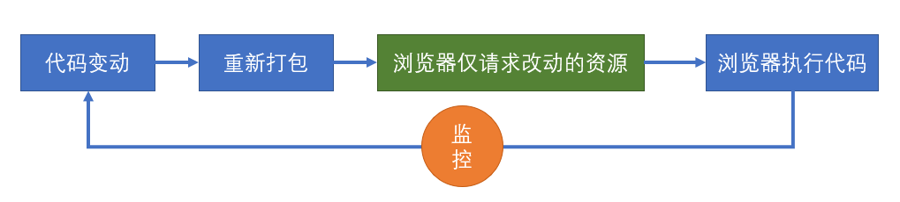
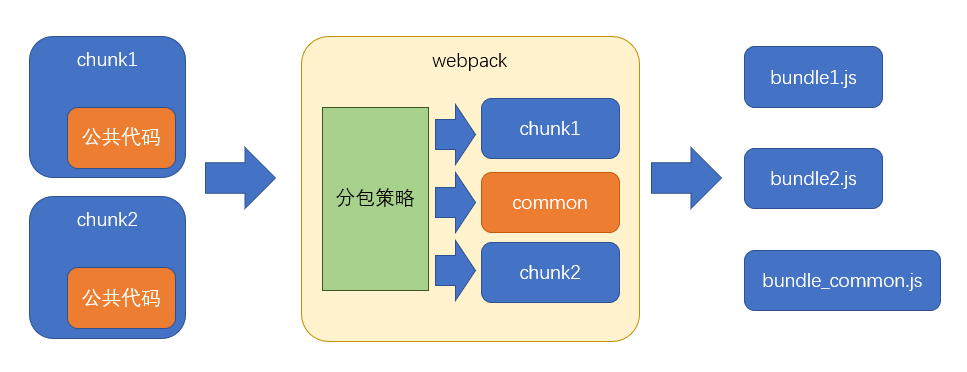

# 1. 性能优化概述

本章所讲的性能优化主要体现在三个方面：


1. **构建性能**

这里所说的构建性能，是指：在**开发阶段的构建性能**，而不是生产环境的构建性能。

优化的目标：降低从打包开始，到代码效果呈现所经过的时间。

构建性能会影响开发效率。构建性能越高，开发过程中时间的浪费越少。

2. **传输性能**

传输性能是指：打包后的JS代码传输到浏览器经过的时间。

在优化传输性能时要考虑到：
- 总传输量：所有需要传输的JS文件的内容加起来，就是总传输量。如果重复代码越少，那么总传输量就越少。
- 文件数量：当访问页面时，需要传输的JS文件数量越多，http请求就越多，响应速度也就越慢。
- 浏览器缓存：JS文件会被浏览器缓存，被缓存的文件不会再进行传输。

3. **运行性能**

运行性能是指：JS代码在浏览器端的运行速度。

它主要取决于我们如何书写高性能的代码。

<font color="red">永远不要过早的关注于性能。</font>因为你在开发的时候，无法完全预知最终的运行性能，过早的关注性能会极大的降低开发效率。

---------

性能优化主要从上面三个维度入手。并且**性能优化没有完美的解决方案，需要具体情况具体分析**


# 2. 构建性能优化

## 2.1 减少模块解析

1. **什么叫做模块解析？**

模块解析包括：抽象语法树分析、依赖分析、模块语法替换。


2. **不做模块解析会怎样？**

- 如果某个模块不做解析，该模块经过loader处理后的代码就是最终代码。

- 如果没有loader对该模块进行处理，该模块的源码就是最终打包结果的代码。

- 如果不对某个模块进行解析，可以缩短构建时间。


3. **哪些模块不需要解析？**

模块中无其他依赖。比如：一些已经打包好的第三方库(jquery...)。

4. **如何让某个模块不要解析？**

配置 `module.noParse` ，它是一个正则，被正则匹配到的模块不会解析。

## 2.2 优化loader性能

1. **进一步限制 loader 的应用范围**

> 思路是：对于某些库，不使用 loader。

例如：`babel-loader` 可以转换ES6或更高版本的语法，可是有些库本身就是用ES5语法书写的，不需要转换，使用 `babel-loader` 反而会浪费构建时间。lodash 就是这样的一个库。它是在ES5之前出现的库，使用的是ES3语法。
通过 `module.rule.exclude` 或 `module.rule.include` ，排除 或 仅包含 需要应用loader的场景。
```js
module.exports = {
    module: {
        rules: [
            {
                test: /\.js$/,
                exclude: /lodash/,
                use: "babel-loader"
            }
        ]
    }
}
```

如果暴力一点，甚至可以排除掉`node_modules`目录中的模块，或仅转换`src`目录的模块。

```js
module.exports = {
    module: {
        rules: [
            {
                test: /\.js$/,
                exclude: /node_modules/,
                //或
                // include: /src/,
                use: "babel-loader"
            }
        ]
    }
}
```

> 这种做法是对 loader 的范围进行进一步的限制，和 noParse 不冲突，想想看，为什么不冲突？

2. **缓存 loader 的结果**

我们可以基于一种假设：如果某个文件内容不变，经过相同的loader解析后，解析后的结果也不变。于是，可以将loader的解析结果保存下来，让后续的解析直接使用保存的结果。`cache-loader` 可以实现这样的功能。

```js
module.exports = {
  module: {
    rules: [
      {
        test: /\.js$/,
        use: ['cache-loader', ...loaders]
      },
    ],
  },
};
```


<font color="red">有趣的是：</font>`cache-loader`放到最前面，却能够决定后续的loader是否运行。

实际上，loader的运行过程中，还包含一个过程，即 `pitch`。


`cache-loader` 还可以实现各自自定义的配置，具体方式见文档。

3. **为 loader 的运行开启多线程**

`thread-loader` 会开启一个线程池，线程池中包含适量的线程。它会把后续的loader放到线程池的线程中运行，以提高构建效率。

由于后续的loader会放到新的线程中，所以，后续的loader不能：
- 使用 webpack api 生成文件
- 无法使用自定义的 plugin api
- 无法访问 webpack options

> 在实际的开发中，可以进行测试，来决定 `thread-loader` 放到什么位置。

<font color="red">特别注意：</font>开启和管理线程需要消耗时间，在小型项目中使用 `thread-loader` 反而会增加构建时间。


## 2.3 热替换 HMR

> 热替换并不能降低构建时间（可能还会稍微增加），但可以降低代码改动到效果呈现的时间。

当使用`webpack-dev-server`时，代码改动到效果呈现的过程如下：


而使用了热替换后，流程发生了变化：



1. **使用和原理**

- 更改配置

```js
module.exports = {
  devServer:{
    hot: true // 开启HMR
  },
  plugins:[ 
    // 可选
    new webpack.HotModuleReplacementPlugin()
  ]
}
```

- 更改代码

```js
// index.js
if(module.hot){ // 是否开启了热更新
  module.hot.accept() // 接受热更新
}
```

首先，这段代码会参与最终运行！

当开启了热更新后，`webpack-dev-server`会向打包结果中注入`module.hot`属性。

默认情况下，`webpack-dev-server`不管是否开启了热更新，当重新打包后，都会调用`location.reload`刷新页面。但如果运行了`module.hot.accept()`，将改变这一行为。

`module.hot.accept()` 的作用是让 `webpack-dev-server` 通过 `socket` 管道把服务器更新的内容发送到浏览器。然后将结果交给插件 `HotModuleReplacementPlugin` 注入的代码执行。插件 `HotModuleReplacementPlugin` 会根据更新的内容覆盖原始代码，然后让代码重新执行。**所以热替换发生在代码运行期**。


2. **样式热替换**

对于样式也是可以使用热替换的，但需要使用 `style-loader`。

因为热替换发生时，`HotModuleReplacementPlugin`只会简单的重新运行模块代码。

因此`style-loader`的代码一运行，就会重新设置`style`元素中的样式。

而 `mini-css-extract-plugin`，由于它生成文件是在**构建期间**，运行期间无法改动文件，因此它对于热替换是无效的。


# 3. 传输性能优化


## 3.1 分包

### 3.1.1 手动分包

1. **基本原理**

手动分包的总体思路是：

- 先单独的打包公共模块：


公共模块会被打包成为动态链接库(dll Dynamic Link Library)，并生成资源清单。

- 根据入口模块进行正常打包：

打包时，如果发现模块中使用了资源清单中描述的模块，则不会形成下面的代码结构

```js
//源码，入口文件index.js
import $ from "jquery"
import _ from "lodash"
_.isArray($(".red"));
```

由于资源清单中包含`jquery`和`lodash`两个模块，因此打包结果的大致格式是：

```js
(function(modules){
  //...
})({
  // index.js文件的打包结果并没有变化
  "./src/index.js":
  function(module, exports, __webpack_require__){
    var $ = __webpack_require__("./node_modules/jquery/index.js")
    var _ = __webpack_require__("./node_modules/lodash/index.js")
    _.isArray($(".red"));
  },
  // 由于资源清单中存在，jquery的代码并不会出现在这里
  "./node_modules/jquery/index.js":
  function(module, exports, __webpack_require__){
    module.exports = jquery;
  },
  // 由于资源清单中存在，lodash的代码并不会出现在这里
  "./node_modules/lodash/index.js":
  function(module, exports, __webpack_require__){
    module.exports = lodash;
  }
})
```

2. **打包公共模块**

打包公共模块是一个**独立的**打包过程。

- 单独打包公共模块，暴露变量名

```js
// webpack.dll.config.js
module.exports = {
  mode: "production",
  entry: {
    jquery: ["jquery"],
    lodash: ["lodash"]
  },
  output: {
    filename: "dll/[name].js",
    library: "[name]"
  }
};

```

- 利用`DllPlugin`生成资源清单

```js
// webpack.dll.config.js
module.exports = {
  plugins: [
    new webpack.DllPlugin({
      path: path.resolve(__dirname, "dll", "[name].manifest.json"), //资源清单的保存位置
      name: "[name]"//资源清单中，暴露的变量名
    })
  ]
};

```

运行后，即可完成公共模块打包。

3. **使用公共模块**

- 在页面中手动引入公共模块：

```html
<script src="./dll/jquery.js"></script>
<script src="./dll/lodash.js"></script>
```

- 重新设置 `clean-webpack-plugin` ：

如果使用了插件 `clean-webpack-plugin` ，为了避免它把公共模块清除，需要做出以下配置：

```js
new CleanWebpackPlugin({
  // 要清除的文件或目录
  // 排除掉dll目录本身和它里面的文件
  cleanOnceBeforeBuildPatterns: ["**/*", '!dll', '!dll/*']
})
```

> 目录和文件的匹配规则使用的是[globbing patterns](https://github.com/sindresorhus/globby#globbing-patterns)

- 使用 `DllReferencePlugin` 控制打包结果：

```js
module.exports = {
  plugins:[
    new webpack.DllReferencePlugin({
      manifest: require("./dll/jquery.manifest.json")
    }),
    new webpack.DllReferencePlugin({
      manifest: require("./dll/lodash.manifest.json")
    })
  ]
}

```

4. **总结**

手动打包的过程：
```js
1. 开启`output.library`暴露公共模块
2. 用`DllPlugin`创建资源清单
3. 用`DllReferencePlugin`使用资源清单
```

手动打包的注意事项：
```js
1. 资源清单不参与运行，可以不放到打包目录中
2. 记得手动引入公共JS，以及避免被删除
3. 不要对小型的公共JS库使用
```

优点：
```js
1. 极大提升自身模块的打包速度
2. 极大的缩小了自身文件体积
3. 有利于浏览器缓存第三方库的公共代码
```

缺点：
```js
1. 使用非常繁琐
2. 如果第三方库中包含重复代码，则效果不太理想
```


### 3.1.2 自动分包

1. **基本原理**

不同与手动分包，自动分包是从**实际的角度**出发，从一个更加**宏观的角度**来控制分包，而一般不对具体哪个包要分出去进行控制。因此使用自动分包，不仅非常方便，而且更加贴合实际的开发需要。

要控制自动分包，关键是要配置一个合理的**分包策略**。有了分包策略之后，不需要额外安装任何插件，webpack会自动的按照策略进行分包。

> 过去 webpack 在内部使用 `CommonsChunkPlugin` 实现分包，不过由于该库某些地方并不完善，到了`webpack4` 之后，已被 `SplitChunksPlugin` 取代。



从分包流程中至少可以看出以下几点：

- 分包策略至关重要，它决定了如何分包。
- 分包时，webpack开启了一个**新的chunk**，对分离的模块进行打包。
- 打包结果中，公共的部分被提取出来形成了一个单独的文件，它是新chunk的产物。


2. **分包策略的基本配置**

webpack提供了 `optimization` 配置项，用于配置一些优化信息，其中 `splitChunks` 是分包策略的配置：
```js
module.exports = {
    optimization: {
        splitChunks: {  //配置分包策略
            chunks: "all",
            // maxSize: 60000,
            // automaticNameDelimiter: ".",
            // minChunks: 1,
            // minSize: 0
            cacheGroups: {
                styles: {
                    minSize: 0,
                    test: /\.css$/,
                    minChunks: 2
                }
            }
        }
    },
}
```

事实上，分包策略有其默认的配置，我们只需要轻微的改动，即可应对大部分分包场景。

- chunks

> 我们知道，分包是从已有的chunk中分离出新的chunk，那么哪些chunk需要分离呢？
> 使用 `chunks` 配置需要应用分包策略的 chunk。

chunks 有三个取值：
- `all`: 对于所有的chunk都要应用分包策略。
- `async`：【默认】仅针对异步chunk应用分包策略。
- `initial`：仅针对普通chunk应用分包策略。

所以，你只需要配置`chunks`为`all`即可。

- maxSize

> 该配置可以控制包的最大字节数。

如果某个包（包括分出来的包）超过了该值，则 webpack 会尽可能的将其分离成多个包。

但是不要忽略的是，分包的**基础单位是模块**，如果一个完整的模块超过了该体积，它是无法做到再切割的。因此，尽管使用了这个配置，但某个包还是有可能会超过这个体积。

另外，该配置看上去很美妙，实际意义其实不大。因为分包的目的是**提取大量的公共代码**，从而减少总体积和充分利用浏览器缓存。虽然该配置可以把一些包进行再切分，但是实际的总体积和传输量并没有发生变化。

> 如果要进一步减少公共模块的体积，只能是压缩和 `tree shaking`。

3. **分包策略的其他配置**

- `automaticNameDelimiter`：新chunk名称的分隔符。默认值 `~` 。
- `minChunks`：一个模块被多少个chunk使用时，才会进行分包。默认值 1。
- `minSize`：当分包达到多少字节后才允许被真正的拆分。默认值 30000。

4. **缓存组**

之前配置的分包策略是全局的。而实际上，分包策略是基于缓存组的。

每个缓存组提供一套独有的策略，webpack按照缓存组的优先级依次处理每个缓存组，被缓存组处理过的分包不需要再次分包。默认情况下，webpack提供了两个缓存组：

```js
module.exports = {
    optimization:{
        splitChunks: {
            //全局配置
            cacheGroups: {
                // 属性名是缓存组名称，会影响到分包的chunk名
                // 属性值是缓存组的配置，缓存组继承所有的全局配置，也有自己特殊的配置
                vendors: { 
                    test: /[\\/]node_modules[\\/]/, // 当匹配到相应模块时，将这些模块进行单独打包
                    priority: -10 // 缓存组优先级，优先级越高，该策略越先进行处理，默认值为0
                },
                default: {
                    minChunks: 2,  // 覆盖全局配置，将最小chunk引用数改为2
                    priority: -20, // 优先级
                    reuseExistingChunk: true // 重用已经被分离出去的chunk
                }
            }
        }
    }
}
```

很多时候，缓存组对于我们来说没什么意义，因为默认的缓存组就已经够用了。但是我们同样可以利用缓存组来完成一些事情，比如对公共样式的抽离：

```js
module.exports = {
    optimization: {
        splitChunks: {
            chunks: "all",
            cacheGroups: {
                styles: {
                    test: /\.css$/, // 匹配样式模块
                    minSize: 0, // 覆盖默认的最小尺寸，这里仅仅是作为测试
                    minChunks: 2 // 覆盖默认的最小chunk引用数
                }
            }
        }
    },
    module: {
        rules: [{ test: /\.css$/, use: [MiniCssExtractPlugin.loader, "css-loader"] }]
    },
    plugins: [
        new CleanWebpackPlugin(),
        new HtmlWebpackPlugin({
            template: "./public/index.html",
            chunks: ["index"]
        }),
        new MiniCssExtractPlugin({
            filename: "[name].[hash:5].css",
            // chunkFilename是配置来自于分割chunk的文件名
            chunkFilename: "common.[hash:5].css"
        })
    ]
}
```

5. **配合多页应用**

虽然现在单页应用是主流，但免不了还是会遇到多页应用。

由于在多页应用中需要为每个html页面指定需要的chunk，这就造成了问题。

```js
new HtmlWebpackPlugin({
    template: "./public/index.html",
    chunks: ["index~other", "vendors~index~other", "index"]
});
```

我们必须手动的指定被分离出去的chunk名称，这不是一种好办法。

幸好 `html-webpack-plugin` 的新版本中解决了这一问题。

```shell
npm i -D html-webpack-plugin@next
```

做出以下配置即可：

```js
new HtmlWebpackPlugin({
    template: "./public/index.html",
    chunks: ["index"]
})
```

它会自动的找到被`index`分离出去的chunk，并完成引用。

> 目前这个版本仍处于测试解决，还未正式发布。

6. **原理**

自动分包的原理其实并不复杂，主要经过以下步骤：
```js
1. 检查每个chunk编译的结果。
2. 根据分包策略，找到那些满足策略的模块。
3. 根据分包策略，生成新的chunk打包这些模块（代码有所变化）。
4. 把打包出去的模块从原始包中移除，并修正原始包代码。
```

在代码层面，有以下变动:
```js
1. 分包的代码中，加入一个全局变量，类型为数组，其中包含公共模块的代码。
2. 原始包的代码中，使用数组中的公共代码。
```

## 3.2 单模块体积优化

### 3.2.1 代码压缩

1. **前言**

（1）为什么要进行代码压缩？

- 减少代码体积；
- 破坏代码的可读性，提升破解成本；

（2）什么时候要进行代码压缩？

在生产环境进行代码压缩。

（3）使用什么压缩工具？

目前最流行的代码压缩工具主要有两个：`UglifyJs` 和 `Terser`。

- `UglifyJs`是一个传统的代码压缩工具，已存在多年，曾经是前端应用的必备工具，但由于它不支持`ES6`语法，所以目前的流行度已有所下降。

- `Terser`是一个新起的代码压缩工具，支持`ES6+`语法，因此被很多构建工具内置使用。`webpack`安装后会内置 `Terser`，当启用生产环境后即可用其进行代码压缩。

因此，我们选择`Terser`。


2. **关于副作用 side effect**

> 函数运行过程中，可能会对外部环境造成影响的功能称为副作用。

如果函数中包含以下代码，该函数叫做副作用函数：
- 异步代码
- localStorage
- 对外部数据的修改

如果一个函数没有副作用，同时函数的返回结果仅依赖参数，则该函数叫做纯函数(pure function)。

3. **压缩工具：Terser**

> Terser官网：https://terser.org/

在`Terser`的官网可尝试它的压缩效果。

4. **webpack + Terser**

webpack 自动集成了 `Terser` 。

如果你想更改、添加压缩工具，又或者是想对Terser进行配置，使用下面的webpack配置即可：

```js
const TerserPlugin = require('terser-webpack-plugin');
const OptimizeCSSAssetsPlugin = require('optimize-css-assets-webpack-plugin');
module.exports = {
    optimization: {
        minimize: true, // 是否要启用压缩，默认情况下，生产环境会自动开启。
        minimizer: [ // 压缩时使用的插件，可以有多个
            new TerserPlugin(),
            new OptimizeCSSAssetsPlugin()
        ],
    },
};
```


### 3.2.2 tree shaking

> 压缩可以移除模块内部的无效代码
> tree shaking 可以移除模块之间的无效代码


1. **背景**

某些模块导出的代码并不一定会被用到

```js
// myMath.js
export function add(a, b){
  console.log("add")
  return a+b;
}

export function sub(a, b){
  console.log("sub")
  return a-b;
}
```

```js
// index.js
import {add} from "./myMath"
console.log(add(1,2));
```

tree shaking 用于移除掉不会用到的导出

2. **使用**

`webpack2`开始就支持了`tree shaking`

只要是生产环境，`tree shaking`自动开启。

3. **原理**

webpack会从入口模块出发寻找依赖关系。

当解析一个模块时，webpack会根据ES6的模块导入语句来判断，该模块依赖了另一个模块的哪个导出。

webpack之所以选择ES6的模块导入语句，是因为ES6模块有以下特点：
- 导入导出语句只能是顶层语句
- import的模块名只能是字符串常量
- import绑定的变量是不可变的

这些特征都非常有利于分析出稳定的依赖。

在具体分析依赖时，webpack坚持的原则是：**保证代码正常运行，然后再尽量tree shaking**

所以，如果你依赖的是一个导出的对象，由于JS语言的动态特性，以及`webpack`还不够智能，为了保证代码正常运行，它不会移除对象中的任何信息。

因此我们在编写代码的时候，**尽量**：
- 使用`export xxx`导出，而不使用`export default {xxx}`导出
- 使用`import {xxx} from "xxx"`导入，而不使用`import xxx from "xxx"`导入

依赖分析完毕后，`webpack`会根据每个模块每个导出是否被使用，标记其他导出为`dead code`，然后交给代码压缩工具处理。代码压缩工具最终移除掉那些`dead code`代码

4. **使用第三方库**

某些第三方库可能使用的是 `commonjs` 的方式导出，比如 `lodash` 。又或者没有提供普通的ES6方式导出。对于这些库，`tree shaking`是无法发挥作用的。

因此要寻找这些库的`es6`版本，好在很多流行但没有使用的`ES6`的第三方库，都发布了它的`ES6`版本，比如`lodash-es`。

5. **作用域分析** (webpack-deep-scope-plugin)

`tree shaking`本身并没有完善的作用域分析，可能导致在一些`dead code`函数中的依赖仍然会被视为依赖。插件 `webpack-deep-scope-plugin` 提供了作用域分析，可解决这些问题。

6. **副作用问题**

webpack在 `tree shaking` 的使用，有一个原则：**一定要保证代码正确运行**。在满足该原则的基础上，再来决定如何 `tree shaking`。因此，当`webpack`无法确定某个模块是否有副作用时，它往往将其视为有副作用。

因此，某些情况可能并不是我们所想要的：

```js
//common.js
var n  = Math.random();

//index.js
import "./common.js"
```

虽然我们根本没用有`common.js`的导出，但`webpack`担心`common.js`有副作用，如果去掉会影响某些功能。如果要解决该问题，就需要标记该文件是没有副作用的。

在`package.json`中加入`sideEffects`
```json
{
    "sideEffects": false
}
```

有两种配置方式：

- false：当前工程中，所有模块都没有副作用。注意，这种写法会影响到某些css文件的导入
- 数组：设置哪些文件拥有副作用，例如：`["!src/common.js"]`，表示只要不是`src/common.js`的文件，都有副作用。

> 这种方式我们一般不处理，通常是一些第三方库在它们自己的`package.json`中标注。

7. **css tree shaking** (purgecss-webpack-plugin)

`webpack` 无法对`css`完成`tree shaking`，因为`css`跟`es6`没有半毛钱关系。因此对`css`的`tree shaking`需要其他插件完成。如：`purgecss-webpack-plugin`。

<font color="red">注意：</font> `purgecss-webpack-plugin` 对 `css module` 无能为力。


## 3.3 懒加载


## 3.4 gzip


# 4. 其他优化

## 4.1 ESLint

> 官网：https://eslint.org/
> 民间中文网：https://eslint.bootcss.com/

ESLint是一个针对JS的代码风格**检查**工具，当不满足其要求的风格时，会给予警告或错误。

### 4.1.1 使用

ESLint可以和构建工具一起使用，但更多的时候是配合编辑器使用，如vscode。

1. 在vscode中安装插件： `ESLint`：

该插件会自动检查工程中的JS文件。
但是检查的工作依然是交给 `eslint` 库完成的。如果当前工程没有下载，则会去全局库中查找，如果都没有，则无法完成检查。
另外，检查的依据是 `eslint` 的配置文件：`.eslintrc.json` 。如果找不到工程中的配置文件，也无法完成检查。

2. 安装`eslint`库

```shell
npm i [-g] eslint
```

3. 创建配置文件

可以通过 `eslint` 交互式命令创建配置文件:
```shell
npx eslint --init
```
eslint会识别工程中的`.eslintrc.*`文件，也能够识别`package.json`中的`eslintConfig`字段。
> 由于windows环境中git窗口对交互式命名支持不是很好，建议使用powershell


### 4.1.2 配置

1. env

配置代码的运行环境

- browser：代码是否在浏览器环境中运行
- es6：是否启用ES6的全局API，例如 `Promise` 等

2. parserOptions

该配置指定 `eslint` 对哪些语法支持。
- ecmaVersion: 支持的ES语法版本
- sourceType
  - script：传统脚本
  - module：模块化脚本

3. parser

`eslint` 的工作原理是：先将代码进行解析，然后按照规则进行分析。

`eslint` 默认使用`Espree`作为其解析器。你可以在配置文件中指定一个不同的解析器。

4. globals

配置可以使用的额外的全局变量：

```json
{
  "globals": {
    "var1": "readonly",     // 只读
    "var2": "writable"      // 可写
  }
}
```

`eslint` 支持注释形式的配置。当我们想在某一个js文件，配置一下全局变量的时候，可以在代码中使用下面的注释完成配置：

```js
/* global var1, var2 */
/* global var3:writable, var4:writable */

let var1 = 1;
let var2 = 2;
let var3 = 3;
let var4 = 4;
console.log(var1, var2, var3, var4)
```

5. extends

该配置继承自哪里。eslint 配置完成后就继承一个抽象的规则。

它的值可以是字符串或者数组。比如：
```json
{
  "extends": "eslint:recommended"    // 启用推荐的规则
}
```

上面的配置表示：该配置缺失的位置，使用`eslint`推荐的规则。

6. ignoreFiles

排除掉某些不需要验证的文件。新建一个文件 `.eslintignore` 。想要它生效，必须放在项目根目录。用法和`.gitignore` 一样。

```
dist/**/*.js
node_modules
```

7. rules

`eslint` 规则集。

每条规则影响某个方面的代码风格。每条规则都有下面几个取值：
- off 或 0 或 false: 关闭该规则的检查
- warn 或 1 或 true：警告，不会导致程序退出
- error 或 2：错误，当被触发的时候，程序会退出

当我们想在某一个js文件，使用某一条规则时，可以在代码中使用下面的注释完成配置：
```js
/* eslint eqeqeq: "off", curly: "error" */

let a = 1;
let b = 2;
console.log(a==b)       // 不报错
```

> https://eslint.bootcss.com/docs/rules/

### 4.1.3 补充

1. **自动修复**

命令行的 `--fix` 选项用来自动修复规则所报告的问题（目前，大部分是对空白的修复）。
```shell
# 自动修复 src/index.js 里的不合规则的语句
npx eslint --fix src/index.js
```

除了上面的方法，我们还可以在下载的插件的配置文件里配置：
```json
"editor.codeActionsOnSave": {
        "source.fixAll": true
    }
```
这样就避免手动运行命令来修复。文件一保存，就自动修复。

2. **最佳实践**

实际开发中，公司会给我们一个 `.eslintrc` 配置文件。
当我们写代码报错的时候，要么是不符合规则，提示的最右侧会有规则名，去官网查查文档即可。要么我们不想要某个风格，去配置文件关闭即可。

## 4.2 bundle analyzer

进行bundle分析。


# 5 gzip

gzip是一种压缩文件的算法

1. **B/S结构中的压缩传输**


优点：传输效率可能得到大幅提升

缺点：服务器的压缩需要时间，客户端的解压需要时间

2. **使用webpack进行预压缩**

使用`compression-webpack-plugin`插件对打包结果进行预压缩，可以移除服务器的压缩时间

