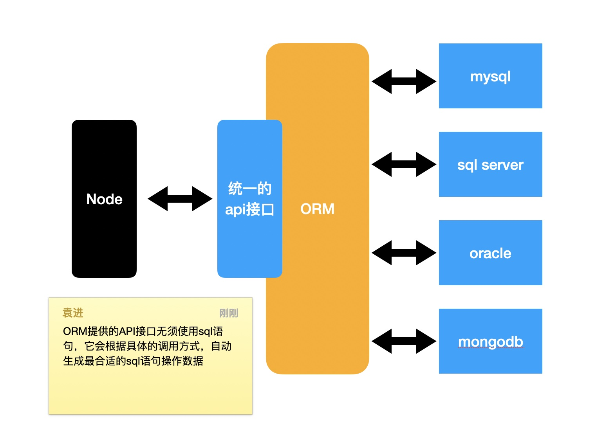
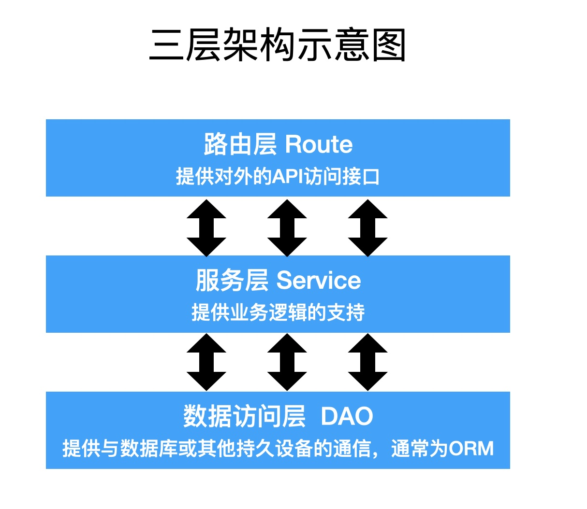
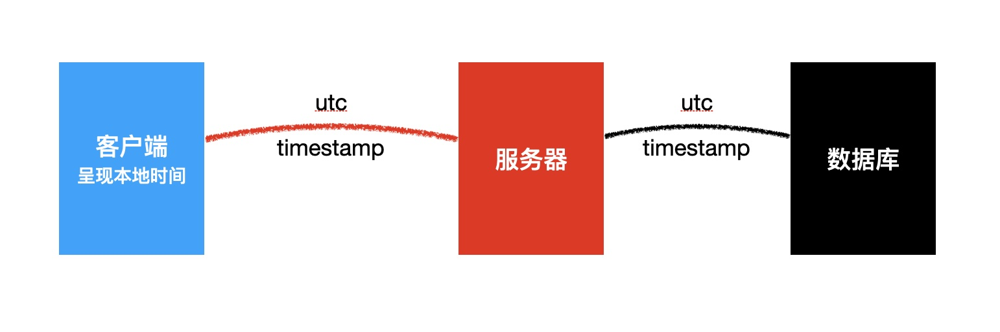

## 2. MySql

>菜鸟教程：https://www.runoob.com/mysql/mysql-tutorial.html

### 2-1. 数据库简介

1. **数据库能干什么？**

- 持久的存储数据，因为数据是存储在硬盘文件中的。
- 备份和恢复数据
- 快速的存取数据
- 权限控制

2. **数据库的类型**

- 关系数据库
	- 特点：以表和表的关联构成的数据结构。
	- 优点：能表达复杂的数据关系；有强大的查询语言，能精确查找想要的数据。
	- 缺点：读写性能比较差，尤其是海量数据的读写；数据结构比较死板。
	- 用途：存储结构复杂的数据。
	- 代表数据库：`Oracle、MySql、Sql Server`

- 非关系型数据库
    - 特点：
        - 以极其简单的结构存储数据
        - 文档型
        - 键值对
    - 优点：格式灵活；海量数据读写效率很高。
    - 缺点：难以表示复杂的数据结构；对于复杂的查询，效率不好。
    - 用途：存储结构简单的数据。
    - 代表数据库：`MongoDB、Redis、Membase`

- 面向对象数据库
    - 略

3. **术语**

- DB： database 数据库
- DBA：database administrator 数据库管理员
- DBMS：database management system 数据库管理系统
- DBS：database system 数据库系统。
注意：DBS 包含 DB、DBA、DBMS


### 2-2. MySql的安装

1. **MySql特点**

- 关系型数据库
- 瑞典MySQL AB：已被Oracle收购
- 开源
- 轻量
- 快速

2. **安装MySql**

- 下载
    - 官方下载源：https://dev.mysql.com/downloads/mysql/
    - 腾讯下载源：https://pc.qq.com/detail/3/detail_1303.html 

- 安装

3. **Mysql的使用**

- (1) 进入mysql命令交互页面：mysql -uroot -p
- (2) 查看当前数据库字符编码：show variables like 'character\_set\_%';
- (3) 在 `C:\ProgramData\MySQL\MySQL Server 8.0my.ini` 文件里修改字符编码，改为utf8mb4：
    - 在第66行写上：default-character-set=utf8mb4  
    - 在第99行写上：character-set-server=utf8mb4
    - 修改完将my.ini复制到安装目录下，并且要重新启动服务。然后修改的字符编码才会生效。
        - 在管理员命令行输入：net stop mysql80 停止服务
        - 在管理员命令行输入：net start mysql80 启动服务
        - 当然也可以直接services.msc 进入服务页面手动重启。
- (4) 查看当前拥有的数据库：show databases;

4. **navicat工具**


### 2-3. 数据库设计（DDL）

1. **SQL语言**

- 全称：`Structured Query Language`(结构化查询语言)。大部分关系型数据库都拥有着基本一致的SQL语法。
- 分支
    - DDL (`Data Definition Language` 数据定义语言): 操作数据库对象，如库、表、视图、存储过程。
    - DML (`Data Manipulation Language` 数据操控语言): 操作数据库中的记录。
    - DCL (`Data Control Language` 数据控制语言)：操作用户权限。

2. **管理数据库**

- 创建库：create database <数据库名>
- 切换数据库：use <数据库名>
- 删除库：drop database <数据库名>

3. **管理表**

- 创建表
    - 字段
        - 字段名
        - 字段类型
            - bit：占1位，0或1，false或true
            - int：占32位，整数
            - decimal(M,N)：能精确计算的实数，M是总的数字位数，N是小数位数
            - char(n)：固定长度为n的字符
            - varchar(n)：长度可变，最大长度为n的字符
            - text：大量的字符
            - date：仅日期
            - datetime：日期和时间
            - time：仅时间
        - 是不是null
        - 自增
        - 默认值
- 修改表
- 删除表：DROP TABLE  <表名>

4. **主键和外键**

- 主键: 根据设计原则，每张表都要有主键。主键必须满足的要求：唯一、不能更改、无业务含义。
- 外键：用于产生表关系的列。外键列会连接到另一张表（或自己）的主键。

5. **表关系**

- 一对一
    - 一个A对应一个B，一个B对应一个A
    - 例如：用户和用户信息
    - 把任意一张表的主键同时设置为外键

- 一对多
    - 一个A对应多个B，一个B对应一个A，A和B是一对多，B和A是多对一
    - 例如：班级和学生，作者和文章
    - 在 "多" 端的表上设置外键，对应到另一张表的主键

- 多对多
    - 一个A对应多个B，一个B对应多个A
    - 例如：学生和老师
    - 需要新建一张关系表，关系表至少包含两个外键，分别对应到两张表

6. **三大设计范式**

- (1) 要求数据库表的每一列都是不可分割的原子数据项
- (2) 非主键列必须依赖于主键列
- (3) 非主键列必须直接依赖主键列


### 2-4. 表记录的增删改（DML）

1. **增 CREATE**

```sql
/*
    增加语句：INSERT INTO 表名(各字段) VALUES(字段值)
        - sql语句里不写分号就不会结束语句。
        - `stu`表示数据库对象stu
        - 'stu'表示字符串stu
        - 可以不写``，但必须保证不与数据库的关键字冲突。
        - 数字也可以写成字符串形式。会自动解析为数字
*/

-- sex为bit类型。可以写true/false，也可以写数字及字符串1/2。
INSERT INTO `student`(sNo, `name`, birthday, sex, phone, classid)
VALUES('100', '成哥', '1900-1-1', TRUE, '13344445555', 2); 
 
-- 如果sex有默认值的话，也可以写default。或者直接不用给sex设置内容，会自动添加
INSERT INTO `student`(sNo, `name`, birthday, phone, classid)
VALUES('100', '成哥', '1900-1-1', '13344445555', 2);

-- 同时增加多条数据
INSERT INTO `student`(sNo, `name`, birthday, phone, classid)
VALUES('100', '成哥', '1900-1-1', '13344445555', 2), ('101', '邓哥', '1900-1-2', '13344445556', 2);
```

2. **改 UPDATE**

```sql
/*
    修改语句：UPDATE 表名 SET 字段=字段值 WHERE 条件语句
        - WHERE 表示条件限制。写法很多，见查询语句
*/

-- 只给 id=12 的行修改name字段值
UPDATE student SET `name`='邓旭名' 
WHERE id=12;
```

3. **删 DELETE**

```sql
/*
    删除语句：DELETE FROM 表名 WHERE 条件语句
        - WHERE 表示条件限制。写法很多，见查询语句
*/

DELETE FROM student
WHERE `name`='袁哥';
```

### 2-5. 表记录的查-单表基本查询（DML）

1. **基本写法**

```sql
select ...
from ...
where ...
order by ...
limit ...
```

2. **select from 的用法**

- as (别名)
- case  (数据处理)
- distinct (去重)

```sql
/*
    1.查询某一列的数据：SELECT 字段(可以有多个) from 表名;
        - 可以是不存在的列
        - 可以给字段定别名 (写法1：as ，写法2：直接在字段后跟别名)
        - *：查所有列
*/
SELECT id, loginid, loginpwd, 'abc' as '额外的一列' from `user`;    -- 查不存在的列
SELECT ismale '性别' from `employee`;     -- 别名
SELECT *, 'abc' as 'extra' from `employee`;     -- 查所有列


/*
    2.查询某一列的数据，并将某一个字段处理后在显示。
        如：employee表的 `ismale字段` 值为0/1，我们希望展示时为男/女。
        - 写法1：
            case ismale
            when 1 then '男'
            else '女'
            end 
            sex,
        - 写法2：
            case
            when ismale = 1 then '男'
            else '女'
            end 
            sex,
*/
SELECT id, `name`, 
case ismale
when 1 then '男'
else '女'
end sex, 
salary 
FROM employee;

SELECT id, `name`, 
case
when ismale = 1 then '男'
else '女'
end sex, 
case
when salary>=10000 then '高'
when salary>=5000 then '中'
else '低'
end `level`,
salary
FROM employee;


/*
    3.去重：将所有员工分布的地址重复的去掉
        DISTINCT 后一般只写一列
*/
select DISTINCT location from employee;
```

3. **where 的用法**

- `=`
- `in`
- `is`
- `is not`
- `> < >= <=`
- `between`
- `like`
- `and`
- `or`

```sql
SELECT * FROM employee
WHERE ismale = 1;

SELECT * FROM department
WHERE companyId in (1, 2);

SELECT * from employee
WHERE location is not null;

SELECT * from employee
WHERE location is null;

SELECT * from employee
WHERE salary>=10000;

SELECT * from employee
WHERE salary BETWEEN 10000 and 12000;

-- 模糊查询：%代表一系列字符。
SELECT * from employee
WHERE `name` like '%袁%';

-- 模糊查询：_代表一个字符
SELECT * from employee
WHERE `name` like '袁_';

-- 多个条件查询，and优先级高于or
SELECT * from employee
WHERE `name` like '张%' and ismale=0 and salary>=12000;

SELECT * from employee
WHERE `name` like '张%' and (ismale=0 and salary>=12000 or birthday>='1996-1-1');
```

4. **order by 的用法**

- asc
- desc

```sql
/* 
    排序：ORDER BY 列名 排序方式
        - 升序asc (默认)
        - 降序desc
*/

-- 按性别升序排，性别相同时，按薪资降序排。
SELECT *, case ismale
when 1 then '男'
else '女'
end sex from employee
ORDER BY sex asc, salary desc;
```

5. **limit 的用法**

- n,m 跳过n条数据，取出m条数据

```sql
-- 默认取所有行的记录。
SELECT * from employee
limit 2,3;              -- 跳过前两行，从第三行开始取3行记录。
```
6. **进行查找时的运行顺序**

- from
- where
- select
- order by
- limit


### 2-6. 联表查询（DML）

- 笛卡尔积
- 左连接，左外连接，left join
- 右连接，右外连接，right join
- 内连接，inner join

```sql
-- 笛卡尔积: 将两张表内容相乘。即第一张表的每一行后面拼上其他表的每一行。
SELECT * 
from `user`, company

-- 左连接 (left join): 将左边的表的每一行拿出，与另一张表的每一行比较，满足条件的就连接并显示。如果没有一个条件满足，那么左表必须出现一次，右表的内容为null
SELECT * 
from department as d left join employee as e
on d.id = e.deptId;         -- 连接条件

-- 右连接 (right join)：将右边的表的每一行拿出，与另一张表的每一行比较，满足条件的就连接并显示。如果没有一个条件满足，那么右表必须出现一次，左表的内容为null
SELECT * 
from employee as e right join department as d 
on d.id = e.deptId;

-- 内连接 (inner join)：两张表的内容必须满足条件才会出现。不满足则不出现。也可以连接多张表。
SELECT e.`name` as empname, d.`name` as dptname, c.`name` as companyname
from employee as e 
inner join department as d on d.id = e.deptId 
inner join company c on d.companyId = c.id;

```

### 2-7. 函数和分组

1. **函数**

>函数分为内置函数和自定义函数两部分，我们前端了解内置函数即可。
>内置函数有4种: 数学函数、聚合函数、字符函数、日期函数
    
- 数学函数
    - `ABS(x)`：返回x的绝对值
    - `CEILING(x)`: 向上取整。别名：ceil
    - `FLOOR(x) `: 向下取整。
    - `MOD(x,y)`: 返回x/y的模（余数）
    - `PI()`: 返回pi的值（圆周率）
    - `RAND()`: 返回０到１内的随机值
    - `ROUND(x,y)`: 返回参数x的四舍五入的有y位小数的值。不写y，则返回整数。
    - `TRUNCATE(x,y)`: 返回数字x截断为y位小数的结果。y必须写

    ```sql
    /*
        1.数学函数
    */

    SELECT ABS(-1);
    SELECT CEIL(1.4);
    SELECT ROUND(3.1415926, 3);   -- 3.142
    SELECT TRUNCATE(3.1415926,3); -- 3.141

    SELECT TRUNCATE(salary,0)
    FROM employee
    ```

- 聚合函数(重点)
    - `AVG(col)` 返回指定列的平均值
    - `COUNT(col)` 返回指定列中非NULL值的个数。col可以写单列，也可以写*，表示所有列但凡有一个列有值就算，个数+1。
    - `MIN(col)` 返回指定列的最小值
    - `MAX(col)` 返回指定列的最大值
    - `SUM(col)` 返回指定列的所有值之和

    ```sql
    /*
        2.聚合函数只能和聚合函数一起查询，查询的结果只有一个数据。
    */
    -- 下面查询会出错，因为查第一个薪水平均值只会返回一个值。而查id会返回所有人的id。
    SELECT AVG(salary) as `avg`, id     
    FROM employee;

    -- 查询表中有id值的人的数量，即员工数量。
    SELECT COUNT(id)
    FROM employee;

    SELECT count(id) as 员工数量,
    avg(salary) as 平均薪资,
    sum(salary) as 总薪资,
    min(salary) as 最小薪资
    FROM employee;
    ```

- 字符函数
    - `CONCAT(s1,s2...,sn)` 将 s1,s2...,sn 列的查询结果连接成字符串。即将两列查询结果放到一列显示。
    - `CONCAT_WS(sep,s1,s2...,sn)` 将 s1,s2...,sn 连接成字符串，并用sep字符分隔。
    - `TRIM(str)` 去除 字符串str 首部和尾部的所有空格。
    - `LTRIM(str)` 去除 字符串str 开头的空格。
    - `RTRIM(str)` 去除 字符串str 尾部的空格。

    ```sql
    /*
        3.字符串函数
    */
    SELECT CONCAT_WS('@', `name`,salary)
    FROM employee;
    ```

- 日期函数
    - `CURDATE()` 或 `CURRENT_DATE()` 返回当前的日期
    - `CURTIME()` 或 `CURRENT_TIME()` 返回当前的时间
    - `TIMESTAMPDIFF(part,  date1,date2)` 返回date1到date2之间相隔的part值，part是用于指定的相隔的年或月或日等。取值如下：
        - MICROSECOND
        - SECOND
        - MINUTE
        - HOUR
        - DAY
        - WEEK
        - MONTH
        - QUARTER
        - YEAR
    ```sql
    /*
        4.日期函数
    */
    SELECT CURDATE();
    SELECT CURTIME();
    SELECT TIMESTAMPDIFF(DAY,'2010-1-1 11:11:11','2010-1-2 11:11:12');

    -- 一般用于查年龄
    SELECT TIMESTAMPDIFF(YEAR, birthday, CURDATE()) as age
    from employee
    ORDER BY age;
    ```


2. **分组**

>分组查询，只能查询分组的列和聚合列。
- `GROUP BY`：分组
- `HAVING` : 分组后再筛选使用 `HAVING`，不能用 `where`。因为运行顺序是先 where 再 GROUP BY。

```sql
/*
    - GROUP BY 列字段1，列字段2，...: 该列相同的记录会被分为一组。也可以写多列，这些列都相同才会被分为一组。
    - HAVING 列字段：用于分组后再筛选
*/

-- 查询员工分布的居住地，以及每个居住地有多少名员工
SELECT location, count(id) as 该居住地的员工数
FROM employee
GROUP BY location                   -- 按照居住地分组
HAVING 该居住地的员工数 >= 40        -- 筛选出 员工数>=40 的居住地 

-- 查询所有薪水在 10000 以上的员工的分布的居住地，然后仅得到聚集地大于30的结果
SELECT location, count(id) as empnumber
FROM employee
WHERE salary>=10000
GROUP BY location
HAVING count(id) >= 30
```

- 运行顺序
    - from
    - join ... on ...
    - where
    - group by
    - select
    - having
    - order by
    - limit


### 2-8. 视图（DDL）

>我们希望经过一次复杂查询之后，能将那个大的表保存起来，作为缓存方便之后在使用。这种缓存起来的表就是视图。

- 操作视图属于DDL，我们可以新建视图、设计视图，就像新建表、设计表一样。
- 用处：一般用来查询
- 好处：方便查询；减少网络传输。


## 3. 数据驱动和ORM

### 3-1. mysql驱动程序

1. **什么是驱动程序**

- 驱动程序是连接内存和其他存储介质的桥梁
- mysql驱动程序：是连接内存数据和mysql数据(存放在硬盘)的桥梁。
- 不同的语言有不同的mysql驱动程序，nodejs通常使用以下两种，它们几乎一样：
    - 官方：`mysql`
    - 第三方：`mysql2` (前身：mysql-native)

2. **mysql2的使用**

>github: https://github.com/sidorares/node-mysql2#readme

3. **要注意防止sql注入**

(1) 什么是sql注入？

用户通过注入sql语句到最终查询中，导致了整个sql与预期行为不符。

(2) 如何防止：mysql支持变量

变量的内容不作为任何sql关键字


### 3-2. Sequelize简介

>github: https://github.com/demopark/sequelize-docs-Zh-CN

1. **什么是ORM框架？**

- Object Relational Mapping 对象关系映射。
- 通过 `ORM` 框架，可以自动的把程序中的对象和数据库关联。
- `ORM` 框架会隐藏具体的数据库底层细节，让开发者使用同样的数据操作接口，完成对不同数据库的操作。



- ORM的优势:
    - 开发者不用关心数据库，仅需关心对象
    - 可轻易的完成数据库的移植
    - 无须拼接复杂的sql语句即可完成精确查询

2. **Node中的ORM框架**

- `Sequelize`:
    - 支持JS
    - 支持TS
    - 成熟

- `TypeORM`:
    - 仅支持TS
    - 不成熟


### 3-3. 模型定义和同步

```js
/*
    1.定义模型：一个模型就是数据库的一张表，js的一个对象。
        - 方法1：调用 sequelize.define(modelName, attributes, options)
        - 方法2：扩展 Model 并调用 init(attributes, options)

    2.同步模型：
        - 方法1：一个一个同步
            - 模型名.sync()
            - 模型名.sync({ force: true })
            - 模型名.sync({ alter: true })
        - 方法2：一起同步
            - sequelize.sync()：如果表不存在,则创建该表(如果已经存在,则不执行任何操作)
            - sequelize.sync({ force: true })：将会创建表。如果表已经存在，则将其先删除。
            - sequelize.sync({ alter: true })：检查数据库中表的当前状态(它具有哪些列,它们的数据类型等),然后在表中进行必要的更改以使其与模型匹配。

    3.补充：自动生成外键
        假设我们有两个模型 A 和 B， 告诉 Sequelize 两者之间的关联仅需要调用一个函数：
        - A.hasOne(B)：     A 和 B 之间存在一对一的关系,外键在目标模型(B)中定义.
        - A.belongsTo(B)：  A 和 B 之间存在一对一的关系,外键在源模型中定义(A).
        - A.hasMany(B)：    A 和 B 之间存在一对多关系,外键在目标模型(B)中定义.
        - A.belongsToMany(B, { through: 'C' })：将表 C 用作联结表,在 A 和 B 之间存在多对多关系.


    4.案例：学校数据库
        - 管理员
            - id
            - 账号
            - 密码
            - 姓名
        - 班级
            - id
            - 名称
            - 开班时间
        - 学生
            - id
            - 姓名
            - 出生日期
            - 性别
            - 联系电话
            - 所属班级
        - 书籍
            - id
            - 名称
            - 图片
            - 出版时间
            - 作者
*/
```


### 3-4. 模型的增删改

```js
/*
    1.三层架构：是一个经典的后端开发架构。分为：路由层，服务层，数据访问层。
        - 其中路由层与服务层打交道，服务层与数据访问层打交道。
        - 路由层提供对外的api访问接口，服务层写功能，数据访问层操作数据库。
        - 本demo中，models表示数据访问层，services表示服务层。

    2.三重验证：
        - 客户端(如：pc浏览器，手机app，iPad，小程序)验证：主要是为了用户体验。完全没有安全性可言。
        - 服务器端验证：为了业务逻辑的完整性，安全性。一般写在业务逻辑层。
        - 数据库验证：为了保证数据库完整性。例如外键约束。
    注意：一个完整的系统，最重要的验证一定在服务器端。并且，中小型系统一般只有前两个验证。因为业务逻辑验证就包含了数据库验证，但因为有的东西可以跳过业务逻辑验证直接操作数据库，所以需要数据库验证。
*/
```



### 3-5. 模拟数据

>官网：http://mockjs.com/
使用 mock库，详情见 `jQuery` 课程下的 `mock.js`

### 3-6. 数据抓取

- 抓取豆瓣读书中的书籍信息：https://book.douban.com/latest

- 涉及到的库：
	- axios：https://github.com/axios/axios
		- 发送一个http请求，得到服务器的响应结果
		- 客户端和服务器通用：在客户端发送ajax请求，在服务器端发送http请求。
	- cheerio：https://github.com/cheeriojs/cheerio#readme
		- Jquery的核心库
		- 与dom无关

我们使用 axios 从服务器拿到网页源代码(字符串形式)，使用 cheerio 从该字符串提取我们想要的信息。


### 3-7. 数据查询

1. 查询单个数据：findOne()

2. 按照主键查询单个数据：findByPK()

3. findAll()
    - 查询多个数据，返回一个数组。
    - 无参数，则查所有数据

4. count()
    - 查询模型中实例的数量。
    - 无参数，则查总数

5. findAndCountAll()
    是 findAll() 和 count() 的结合

6. 以上方法的参数对象中的字段 
    - include 字段
        - 查包含关系
        - 文档在 '预先加载'

```js
    // 见 studentService.js 中的 getStudents 函数
    const result = await Student.findAndCountAll({
        attributes: ["id", "name"],     //控制要查哪些字段(列)的信息
        where,
        include: [Class],               //可以联表查询，查学生表和class表的所有信息。要先导入class模型，并且定义好表关系
        offset: (page - 1) * limit,
        limit: +limit,                  //将字符串转为数字
    });
```


### 3-8. MD5加密

>https://www.npmjs.com/package/md5 
- md5加密的特点
	- hash加密算法的一种
	- 可以将任何一个字符串，加密成一个固定长度的字符串
	- 单向加密：只能加密无法解密
	- 同样的源字符串加密后得到的结果固定

- 用处：
    数据库中的密码不能明文存储，需要加密存储。md5加密是很安全的方法。


### 3-9. moment

- 官网: https://momentjs.com/

- 民间中文网: http://momentjs.cn/

1. **时间概念**

- utc和北京时间
    - utc：世界协调时
    - 以英国格林威治时间为标准
    - utc时间和北京时间相差8小时
    - utc的凌晨相当于北京时间的上午8点

- 时间戳 timestamp
    - 某个utc时间到 utc1970-1-1 凌晨经过的毫秒数。也可以是秒数，用小数部分记录毫秒
    - 注意：时间戳表示的是utc时间的差异

2. **对于服务器的影响**

- 服务器可能会部署到世界的任何位置
- 服务器内部应该统一使用utc时间或时间戳，包括数据库

3. **对于客户端的影响**

- 客户端要给不同地区的客户友好的显示时间
- 客户端应该把时间戳或utc时间转换为本地时间显示

4. **时间处理模式**



- 只有在客户端显示才会转为本地时间。
- 客户端与服务器交互、服务器与数据库交互，传递的都是 utc 时间或时间戳。


### 3-10. 数据验证

1. **数据验证的位置**

- 前端（客户端）：为了用户体验
- 路由层：验证接口格式是否正常
- 业务逻辑层：保证业务完整性。如：手机号必须11位、姓名不能有几十个字。
- 数据库验证（约束）：保证数据完整性

2. **相关库**

- `validator.js` ：用于验证某个**字符串**是否满足某个规则。
>https://github.com/validatorjs/validator.js 

- `validate.js` ：用于验证某个**对象的属性**是否满足某些规则。
>http://validatejs.org


### 3-11. 访问器和虚拟字段

1. **访问器**

在模型定义时可以使用，存在于字段配置中。有如下两个：
- get(): 从数据库拿到的数据会走 get() 函数。
- set()：通过模型实例添加的记录会走 set() 函数。

2. **虚拟字段**

不是真实存在于数据库中的字段，而是使用数据库字段计算得到的值。类似于 `vue` 的 `computer` 。

3. **示例**

```js
module.exports = sequelize.define(
    "Student",
    {
        birthday: {
            type: DataTypes.DATE,
            allowNull: false,
            get() { //访问器。在数据库中保存的是日期，但我想拿到时是个时间戳，同时又不改变数据库的值。此时可以使用访问器。
                return this.getDataValue("birthday").getTime();
            },
        },
        // 虚拟字段 age。
        age: {
            type: DataTypes.VIRTUAL,       //类型
            get() {
                const now = moment.utc();
                const birth = moment.utc(this.birthday);
                return now.diff(birth, "y"); //得到两个日期的年份的差异
            },
        }
    },
    {
        createdAt: false,
        updatedAt: false,
        paranoid: true,
    }
);

```


### 3-12. 日志记录

> log4js：https://log4js-node.github.io/log4js-node/ 

1. **log4js 中的概念**

- level：日志级别。例如：调试日志、信息日志、错误日志等等


- category：日志分类。例如：sql日志、请求日志等等，是自定义的

- appender：日志出口
    - 应该把日志写到哪？
    - 日志的书写格式由 layouts 配置

```js
log4js.configure({
    // 1.配置出口。名称自定义
    appenders: {
        sql: {          //定义sql日志出口
            type: "dateFile",           //与file 几乎一样。dateFile 会在文件名中加上时间
            filename: path.resolve(__dirname, "logs", "sql", "logging.log"),
            maxLogSize: 1024 * 1024,    //配置文件的最大字节数
            keepFileExt: true,          //保持日志文件后缀不变。不然加时间或数字是在文件后缀后加的。
            layout: {                   //配置日志内容的书写格式
                type: "pattern",
                pattern: "%c [%d{yyyy-MM-dd hh:mm:ss}] [%p]: %m%n",
            },
        },
        default: {      //定义默认日志出口
            type: "stdout",
        },
    },
    // 2.配置日志类别。名称自定义，最好与出口对应。
    categories: {
        sql: {
            appenders: ["sql"], //该分类使用出口sql的配置写入日志
            level: "all",       //日志级别，只有该等级及以上才会被记录到该类别日志。
        },
        default: {
            appenders: ["default"],
            level: "all",
        },
    },
});
```


