# NodeJs

## 1-1. Node概述

>Node的官网：
>Node民间中文网：http://nodejs.cn/api/assert.html 

1. **什么是Node?**

>可以说，Java 能做的，node都能做，只是没它做得好。
>1. node 的 I/O 速度比 Java 快，但是大量计算比不上 Java。
>2. node 的全局对象是 global ，并且将 global 本身赋值给 global 的 global 属性。浏览器的全局对象是 window，，并且将  window 本身赋值给 window 的 window 属性。
>3. 浏览器的 settimeout() 返回的 timer，是一个数字。而 node的 settimeout() 返回的是一个对象。


Node是一个JS的运行环境，它比浏览器拥有更多的能力。

- 浏览器中的JS：
    web API 提供了操作浏览器窗口和页面的能力，如：`BOM` ，`DOM`，`AJAX`。但是这种能力是非常有限的，如：存在跨域问题，不能进行文件读写。
    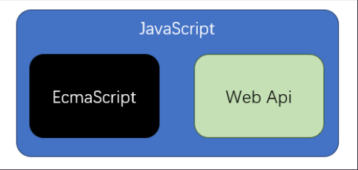

- Node中的JS：
    Node API 几乎提供了所有能做的事。
    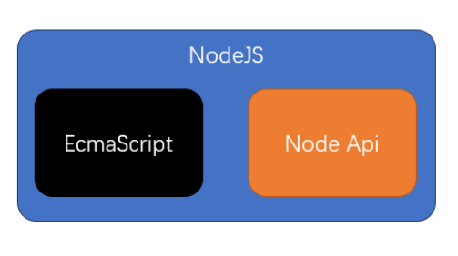

- 分层结构对比图
    - 浏览器提供了有限的能力，JS只能使用浏览器提供的功能做有限的操作。
    - Node提供了完整的控制计算机的能力，NodeJS几乎可以通过Node提供的接口，实现对整个操作系统的控制。
    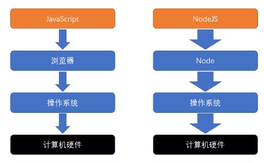


2. **我们通常用Node干什么?**

(1) 开发桌面应用程序，配合`electron`框架。
(2) 开发服务器应用程序，有两种开发结构：
- <font color='red'>结构1</font>：这种结构通常应用在微型的站点上。
Node服务器要完成请求的处理、响应、和数据库交互、各种业务逻辑。
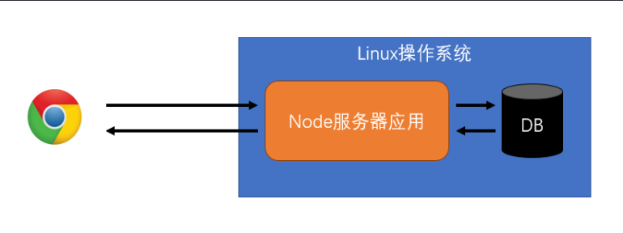

- <font color='red'>结构2</font>：这种结构非常常见，应用在各种规模的站点上。
Node服务器不做任何与业务逻辑有关的事情。绝大部分时候，只是简单的转发请求。但可能会有一些额外的功能：
    - 记录一些简单的信息，如：请求日志，用户偏好，广告信息等。
    - 进行静态资源托管
    - 进行缓存
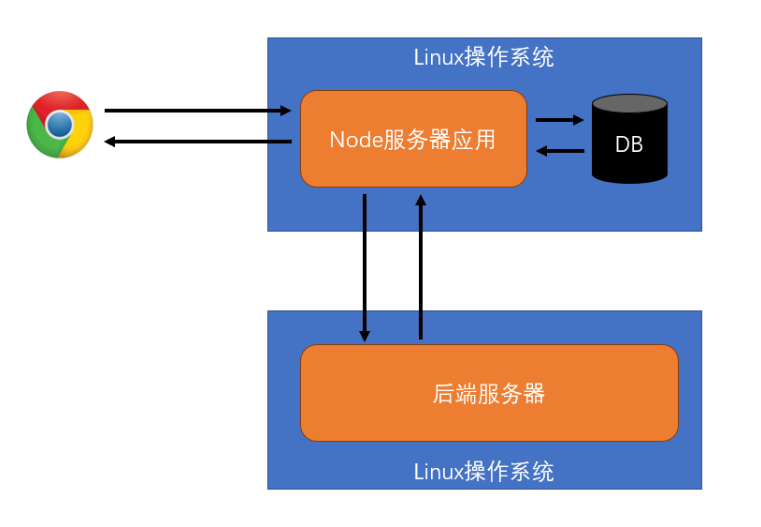


3. **前置课程**

- 网络通信
- ES6
- 模块化
- 包管理器


## 1-2. 全局对象

```node
//全局对象 global，以下都是 global 里的属性和方法，可以直接用就像浏览器环境的全局对象 window 一样。
setTimeout:

setInterval:

setImmediate: 类似于 setTimeout 0

console:

__dirname：
	- 获取当前模块所在的目录
	- 并非 global 对象的属性

__filename：
	- 获取当前模块的文件路径
	- 并非 global 对象的属性

Buffer：
	- 类型化数组
	- 继承自 UInt8Array
	- 计算机中存储的基本单位：字节
	- 使用时、输出时可能需要用十六进制表示。http://blog.yuanjin.tech/article/94 

process：
	- cwd()
		- 返回当前nodejs进程的工作目录
		- 绝对路径

	- exit()
		- 强制退出当前node进程
		- 可传入退出码，0表示成功退出，默认为0

	- argv
		- String[]
		- 获取命令中的所有参数

	- platform
		- 获取当前的操作系统

	- kill(pid)
		- 根据进程ID杀死进程

	- env
		- 获取环境变量对象
```

## 1-3. 【回顾】Node的模块化细节

>原理：当执行一个模块或使用require时，会将模块放置在一个函数环境中。

1. **模块的查找**

- 绝对路径: 根据绝对路径直接加载模块。

- 相对路径 (./ 或 ../)：相对于当前模块，然后转换为绝对路径，之后再加载模块。

- 相对路径
    - 检查是否是内置模块，如：fs、path等
    - 检查当前目录中的node_modules
    - 检查上级目录中的node_modules
    - 转换为绝对路径
    - 加载模块

- 关于后缀名：
    - 如果导入的模块不提供后缀名，会按 `js`、`json`、`node`、`mjs` 的顺序自动补全。

- 关于文件名:
    - 如果仅提供目录，不提供文件名，则自动寻找该目录中的 `index.js` (由 package.json 中的 main 字段决定)
    - package.json中的 `main` 字段:
        - 表示包的默认入口
        - 导入或执行包时若仅提供目录，则使用main补全入口
        - 默认值为index.js

```js
/*
    1. 模块的查找。不管写什么路径，最终都是转为绝对路径。
*/

//写法1：绝对路径
require("C:\\Users\\Administrator\\Desktop\\17th code\\L15. node\\1. node核心\\3. node的模块化细节\\module\\ab.js");

//写法2：相对路径(自己写的模块)
require("./module/ab");

//写法3：相对路径(内置模块 或 node_modules目录下的模块)
require("fs");


//先找文件，按4种后缀依次找。找不到当作目录，再找该目录下的 index.js 文件(由 package.jso 的 main 字段决定)
require("./src");
```

2. **module对象**

记录当前模块的信息

3. **require函数**

除了导入模块，`require` 还可以作为对象，里面有其他东西:
- resolve()，将相对路径转为绝对路径。
- cache对象，获取缓存。

4. **模块化的原理**

```js
/*
    4. 模块化的原理(伪代码)
        const result = require("./index3");
        require() 的内部原理见下：
*/

require.cache = {};

function require(modulePath) {
    //1. 将modulePath转换为绝对路径：D:\repository\NodeJS\源码\myModule.js
    //2. 判断该模块是否已有缓存
    if (require.cache["D:\\repository\\NodeJS\\源码\\myModule.js"]) {
        return require.cache["D:\\repository\\NodeJS\\源码\\myModule.js"].result;
    }

    //3. 没有缓存的话，读取模块的文件内容。
    //4. 将文件内容包裹到一个函数中：

    function __temp(module, exports, require, __dirname, __filename) {
        console.log("当前模块路径：", __dirname);
        console.log("当前模块文件：", __filename);
        exports.c = 3;
        module.exports = {
            a: 1,
            b: 2
        };
        this.m = 5;
    }

    //5. 创建module对象
    module.exports = {};
    const exports = module.exports;
    // 一开始的时候，this == exports == module.exports，都指向同一个空对象。
    __temp.call(module.exports, module, exports, require, module.path, module.filename)
    return module.exports;
}
```


## 1-4. 【扩展】Node的ES模块化

目前，Node中的ES模块化仍然处于试验阶段。Node中的模块化要么是commonjs，要么是ES：
- commonjs：默认情况下，都是commonjs
- ES：文件后缀名为.mjs。最近的 `package.json` 中 `type` 的值是module

当使用ES模块化运行时，必须添加 `--experimental-modules` 标记。


## 1-5. 基本内置模块

- `os` :
>https://nodejs.org/dist/latest-v12.x/docs/api/os.html

```js
// 用来操作操作系统的对象os
const os = require("os");

console.log(os.EOL);                    // 表示换行符，Windows下是\r\n，其他操作系统是\n

console.log(os.arch())                  // 获取CPU架构名

console.log(os.cpus().length);          // CPU 每个内核的信息，是数组。

console.log(os.freemem() / 2 ** 30);    // freemem：当前还有多少空闲内存(单位：字节)

console.log(os.homedir());              // 获取用户目录

console.log(os.hostname());             // 获取主机名

console.log(os.tmpdir());               // 获取操作系统的临时目录
```

- `path` :
>https://nodejs.org/dist/latest-v12.x/docs/api/path.html

```js
// path是一个对象。只是根据规则做一些操作，不检测路径存不存在。
const path = require("path");
console.log(path);

// 1.参数是绝对路径，获取路径中最后一个值。两个参数的话，第二个参数是文件后缀。相同的话，输出值可省
const basename = path.basename("fdg/dfgdfg/adfaf/fdgdfgd/a.asf", ".html"); 
console.log(basename);      

// 2.获取路径分隔符。window系统是\，其他系统为/。
console.log(path.sep);     

// 3.获取环境变量中值的分隔符。window系统是';'，其他系统为':'。
console.log(path.delimiter);     
console.log(process.env.PATH.split(path.delimiter));

// 4.获取路径的目录。与 basename 互补。
const dir = path.dirname("fdg/dfgdfg/adfaf/fdgdfgd/a.asf");
console.log(dir);

// 5.获取文件后缀名。没有返回空字符串
const ext = path.extname("a/b/c/a.js");
console.log(ext);

// 6.拼接路径
const basePath = "a/b";
const fullpath = path.join(basePath, "../", "d.js");
console.log(fullpath);

// 7.将路径，变得规范
path.normalize('/foo/bar//baz/asdf/quux/..');
path.normalize('C:\\temp\\\\foo\\bar\\..\\');

// 8.获取 第二个参数相对于第一个参数 的相对路径。
const rel = path.relative('/data/orandea/test/aaa', '/data/orandea/impl/bbb');
console.log(rel)

// 9.将参数转为绝对路径。相对于node命令行。但如果前面拼接__dirname，就相对于模块所在位置
const absPath = path.resolve(__dirname, "./a.js");
console.log(absPath);

```

- `url`
>https://nodejs.org/dist/latest-v12.x/docs/api/url.html

```js
// URL 是一个构造函数
const URL = require("url");

/* 
    1.字符串url 转 对象，两种写法：
        new URL.URL() ==  URL.parse()。但输出对象有些许差别。
*/
const url = new URL.URL("https://nodejs.org:80/a/b/c?t=3&u=5#abc");
console.log(url);
console.log(url.searchParams.has("a"));
console.log(url.searchParams.has("t"));
console.log(url.searchParams.get("t"));

/* 
    2.对象 转 字符串url：
        URL.format()
*/
const obj = {
  href: "https://nodejs.org:80/a/b/c?t=3&u=5#abc",
  origin: "https://nodejs.org:80",
  protocol: "https:",
  username: "",
  password: "",
  host: "nodejs.org:80",
  hostname: "nodejs.org",
  port: "80",
  pathname: "/a/b/c",
  search: "?t=3&u=5",
  hash: "#abc"
};

const url1 = URL.format(obj);
console.log(url1);      // 输出：https://nodejs.org:80/a/b/c?t=3&u=5#abc
```

- `util`
>https://nodejs.org/dist/latest-v12.x/docs/api/util.html

```js
// 工具包对象
const util = require("util");

// 1.将异步模式函数，统统转为 callback 模式。
async function delay1(duration = 1000) {
  return new Promise(resolve => {
    setTimeout(() => {
      resolve(duration);
    }, duration);
  });
}
const delayCallback1 = util.callbackify(delay1);  // 将异步模式函数，统统转为 callback模式
delayCallback1(500, (err, d) => {                 // 回调函数的参数：第一个固定为error信息，第二个为参数。
  console.log(d);
});

// 2.将回调模式函数，统统转为 异步模式。
function delayCallBack2(duration, callback) {
  setTimeout(() => {
    callback(null, duration);
  }, duration);
}
const delay2 = util.promisify(delayCallBack2);    // 将回调模式，统统转为 异步模式。
// delay2(500).then(re => console.log(re))
(async () => {
  const r = await delay2(600);
  console.log(r);
})();


// 3.inherits(a, b) 表示 构造函数a 继承自 构造函数b。现在不用，用类。


// 4.比较两个对象是否 深度严格相等。
const obj1 = {
  a: 1,
  b: {
    c: 3,
    d: {
      e: 5
    }
  }
};
const obj2 = {
  a: 1,
  b: {
    c: 3,
    d: {
      e: 5,
      g: 6
    }
  }
};
console.log(util.isDeepStrictEqual(obj1, obj2)); //false
console.log(util.isDeepStrictEqual({},{})); //true

```

## 1-6. 文件I/O

1. **I/O：input output**

- I/O：对外部设备的输入输出。外部设备包括: 磁盘、网卡、显卡、打印机、其他...
- `I/O` 的速度往往低于 `内存 和 CPU` 的交互速度。

2. **fs模块**
>https://nodejs.org/dist/latest-v12.x/docs/api/fs.html

- 读取一个文件：fs.readFile()

```js
/* 
    1.异步读取文件内容：fs.readFile()
        这时ES6之前的方法，即回调函数法。
        参数1：文件路径；
        参数2：配置(可以是对象，也可以是字符串)。不写默认按buffer形式读取
        参数3：回调函数。
        
    2.具体配置：
        如果不配置编码方式为utf-8，那么输出的文件内容为Buffer形式(如：<Buffer 79 75 79 75 2d 31 2e 74 78 74>)。
*/
fs.readFile(filename, {
    encoding:"utf-8"
}, (err, content) => {
    console.log(1, content);
});
console.log("========1========")

/* 
    2.同步读取文件内容：fs.readFileSync()
        Sync系列的函数是同步的，会导致JS运行阻塞，极其影响性能。通常只会用在程序初始化的时候。
*/
const content = fs.readFileSync(filename, "utf-8");
console.log(2, content);
console.log("========2========")

/* 
    3.异步读取文件内容：fs.promises.readFile()
        这是ES6的方法。
*/
async function test() {
    const content = await fs.promises.readFile(filename, "utf-8");
    console.log(3, content);
}
test();

// 注意:fs模块的其他api用法和readFile 一样，之后都统一使用第三种方式
```

- 向文件写入内容：fs.writeFile()

```js
/* 
    1.异步写入文件内容：fs.promises.writeFile()
        参数1：写到哪(文件路径)；
        参数2：要写入的内容(可以是字符串，也可以是Buffer)；
        参数3：配置(可以是对象，也可以是字符串)。不写默认"utf-8"
        
    2.具体配置如下：
        - encoding: 编码方式
        - flag: 标识(默认是w覆盖写入；a 表示追加内容append)

    3.注意：
        - 若要写入的文件不存在，就新建一个。
        - 若要写入的文件的上一级目录不存在，会报错。

*/

// 1.以字符串形式写入
async function test1() {
    await fs.promises.writeFile(filename, os.EOL + "add 1 俞杰", {
        flag: "a"
    });
    console.log("写入成功1");
}
test1();

// 2.以Buffer形式写入
async function test2() {
    const buffer = Buffer.from(os.EOL + "add 2 俞杰", "utf-8");
    await fs.promises.writeFile(filename, buffer, {
        flag: "a"
    });
    console.log("写入成功2");
}
test2();
```

- 获取文件或目录的状态信息：fs.stat()
    - size: 占用字节
    - atime：上次访问时间
    - mtime：上次文件内容被修改时间
    - ctime：上次文件状态被修改时间
    - birthtime：文件创建时间
    - isDirectory()：判断是否是目录
    - isFile()：判断是否是文件

```js
/* 
    1.获取文件或目录的状态信息：fs.promises.stat()
        参数：哪一个文件或目录(文件或目录路径)
        返回一个状态对象。有两个方法：isDirectory()、isFile()

    2.目录的状态信息中size: 0,为什么？
        因为目录本身也是一个文件，它什么也不存，就有一个指针指向其他文件。
*/
async function test() {
    const stat = await fs.promises.stat(filename);
    console.log(stat);
    console.log("是否是目录：", stat.isDirectory());
    console.log("是否是文件：", stat.isFile());
    /*
        输出：
            Stats {
                dev: 2365185402,
                mode: 16822,
                nlink: 1,
                uid: 0,
                gid: 0,
                rdev: 0,
                blksize: 4096,
                ino: 1125899906992208,
                size: 0,
                blocks: 8,
                atimeMs: 1597825678467.347,
                mtimeMs: 1597825678467.347,
                ctimeMs: 1597825678467.347,
                birthtimeMs: 1597751551942.4165,
                atime: 2020-08-19T08:27:58.467Z,
                mtime: 2020-08-19T08:27:58.467Z,
                ctime: 2020-08-19T08:27:58.467Z,
                birthtime: 2020-08-18T11:52:31.942Z
            }
            是否是目录： true
            是否是文件： false
    */
}
```

- 获取目录中的文件和子目录(不包括子目录的内容)：fs.readdir('目录')

```js
/* 
    1.获取目录中的文件和子目录：fs.promises.readdir()
        参数：目录的路径
        返回一个数组，每一项是目录中的文件和子目录的字符串
*/
const dirname = path.resolve(__dirname, "./myfiles");
async function test() {
  const pathes = await fs.promises.readdir(dirname);
  console.log(pathes);      // 输出：[ '1', '1.txt', '2.txt', '3.jpeg', '3copy.jpeg', 'sub' ]
}
```

- 创建目录：fs.mkdir('目录')

```js
/* 
    1.创建目录：fs.promises.mkdir()
        参数：要创建的目录的路径
*/
const dirname = path.resolve(__dirname, "./myfiles/1");
async function test() {
  await fs.promises.mkdir(dirname);
  console.log("创建目录成功");
}
```
- 判断文件或目录是否存在：fs.exists()

```js
/* 
    1.判断文件或目录是否存在：exists()
        该函数已经过时了，不能使用 fs.promises.exists() 这种形式。但是依然可以使用另外两种：fs.exists() fs.existsSync()
        参数：要判断的目录的路径

    2.手写 fs.promises.exists()，见下：
*/
async function exists(filename) {
    try {
        await fs.promises.stat(filename);
        return true;
    } catch (err) {
        if (err.code === "ENOENT") {    // 文件不存在的错误
            return false;
        }
        throw err;  // 其他错误，如无权限访问等。
    }
}

async function test() {
    const result = await exists(dirname);
    if (result) {
        console.log("目录已存在，无需操作");
    } else {
        await fs.promises.mkdir(dirname);
        console.log("目录创建成功");
    }
}
test();
```

- 删除文件：fs.unlink


3. **练习**

读取一个目录中的所有子目录和文件，每个目录或文件都是一个对象。

- 属性
    - name：文件名
    - ext：后缀名，目录为空字符串
    - isFile：是否是一个文件
    - size：文件大小
    - createTime：日期对象，创建时间
    - updateTime：日期对象，修改时间

- 方法
    - getChildren()：得到目录的所有子文件对象，如果是文件，则返回空数组
    - getContent(isBuffer = false)：读取文件内容，如果是目录，则返回null

## 1-7. 文件流

1. **什么是流**

- 流是指数据的流动，数据从一个地方缓缓的流动到另一个地方。
- 流是有方向的：(相对于内存)
    - 可读流: Readable。数据从源头流向内存
    - 可写流: Writable。数据从内存流向源头
    - 双工流：Duplex。数据即可从源头流向内存，又可从内存流向源头

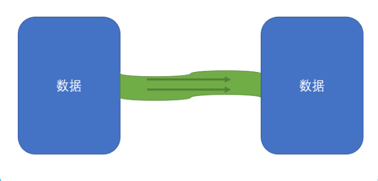

2. **为什么需要流**

- 其他介质和内存的数据规模不一致
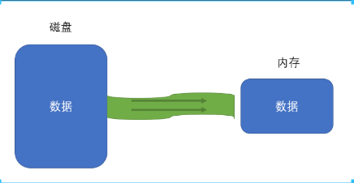

- 其他介质和内存的数据处理能力不一致
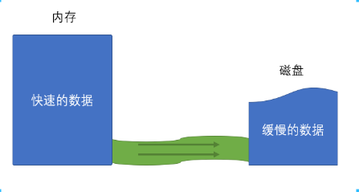

3. **文件流**

- 什么是文件流？

内存数据和磁盘文件数据之间的流动。

- 文件流的创建：分为可读流与可写流。

```js
/* 
    1.创建可读文件流，用于读取文件内容: fs.createReadStream(path,  [options])
        参数1：要读的文件路径
        参数2：配置对象
            - encoding：编码方式。默认null，以buffer形式读出来
            - start/end：起始字节/结束字节。指定要读的字符位置
            - highWaterMark：每次读的数量。默认64 *1024。如果encoding有值，该数量表示一个字符数。如果encoding为null，该数量表示字节数。
            - autoClose: 读完是否自动完毕。默认为true

        返回：Readable的子类ReadStream。该子类有5个事件，2个方法。
            5个事件：rs.on(事件名, 处理函数)
                - open：文件打开事件，文件被打开后触发
                - error：发生错误时触发
                - close：文件被关闭后触发。可通过rs.close手动关闭，或者文件读取完成后自动关闭，此时 autoClose 为 true
                - data: 读取到一部分数据后触发。
                    - 注册data事件后，才会真正开始读取
                    - 每次读取highWaterMark指定的数量
                    - 回调函数中会附带读取到的数据。若指定了编码，则读取到的数据会自动按照编码转换为字符串。若没有指定编码，读取到的数据是Buffer
                - end：所有数据读取完毕后触发
            2个方法：
                - rs.pause()：暂停读取，会触发pause事件
                - rs.resume()：恢复读取，会触发resume事件

    注意：utf-8编码模式下，中文一个字占3个字节，英文一个字母占一个字节。
*/
const rs = fs.createReadStream(filename, {
    encoding: "utf-8",
    highWaterMark: 4,
    autoClose: true   // 读完后会自动完毕，默认为true
});

// 打开文件时触发
rs.on("open", () => {
    console.log("文件被打开了");
});

// 发生错误时触发
rs.on("error", () => {
    console.log("出错了！！");
});

// 关闭文件时触发。读完会自动关闭。也可以手动：rs.close()
rs.on("close", () => {
    console.log("文件关闭了");
});

// 读取数据。读多少取决于配置对象里的 highWaterMark。注册data事件后，才会真正开始读取。回调函数中会附带读取到的数据。
rs.on("data", chunk => {
    console.log("读到了一部分数据：", chunk);
    rs.pause(); //暂停
});

// 暂停读取时触发
rs.on("pause", () => {
    console.log("暂停了");
    setTimeout(() => {
        rs.resume();
    }, 1000);
});

// 恢复读取时触发
rs.on("resume", () => {
    console.log("恢复了");
});

// 数据读取完毕触发
rs.on("end", () => {
    console.log("全部数据读取完毕");
});
```

```js
/* 
    2.创建可写文件流:fs.createWriteStream(path, [options])
        参数1：要写的文件路径
        参数2：配置对象
            - flags：操作文件的方式(默认是w覆盖写入；a 表示追加内容append)
            - encoding：如果chunk是字符串，默认值：utf8。对象模式下的可写流将始终忽略编码参数。
            - start/end：指定要读的字符位置
            - highWaterMark：每次最多写入的字节数。默认16 *1024 (即16kb)

        返回：Writable的子类WriteStream。该子类有4个事件，2个方法。
            事件：ws.on(事件名, 处理函数)
                - open
                - error
                - close
                - drain: 当写入队列清空时，会触发drain事件
            方法：
                - .write(data)：写入一组数据。data可以是字符串或Buffer。返回一个boolean值：
                    为true：写入通道没有被填满，接下来的数据可以直接写入，无须排队。
                    为false：写入通道目前已被填满，接下来的数据将进入写入队列。要特别注意背压问题，因为写入队列是内存中的数据，是有限的
                - .end([data])：结束写入，将自动关闭文件。是否自动关闭取决于autoClose配置，默认为true。data是可选的，表示关闭前的最后一次写入

    
    注意：utf-8编码模式下，中文一个字占3个字节，英文一个字母占一个字节。
*/
const ws = fs.createWriteStream(filename, {
    encoding: 'utf-8',
    flags: 'w',
    highWaterMark: 3,
});

// 写入:可以是字符串，也可以是buffer。返回布尔值
// const sign = ws.write("渡一")
// console.log(sign)
// ws.end("abcde")


/*
    2.从内存写入数据到磁盘会出现内压问题(内存处理速度很快，而磁盘处理速度比较慢)
        如何解决？
        当返回的布尔值为true(表示队列未满)再写入
*/

// 一直写，直到到达上限，或无法再直接写入，需要等待。
let i = 0;
function write() {
    let sign = true;
    while (i < 1024 * 512 && sign) {
        sign = ws.write("====Yokyul****");
        i++;
    }
}
write();

// 当写入队列清空时，会触发drain事件
ws.on("drain", () => {
    write();
});
```

.write(data) 返回true:


.write(data) 返回false:
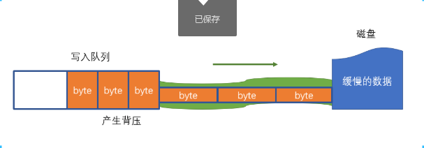

```js
/*
    3. rs.pipe(ws)
        - 将可读流连接到可写流
        - 返回参数的值
        - 该方法可解决背压问题
*/
```


## 1-8. net模块

1. **回顾http请求**

- 普通模式
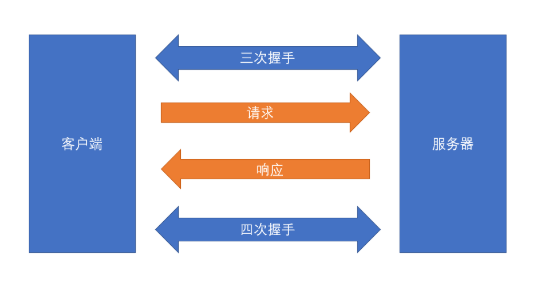

- 长连接模式
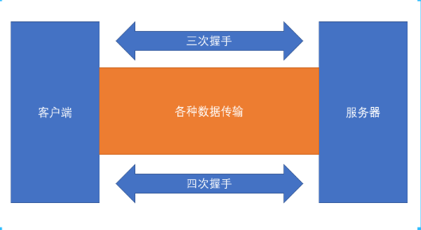
发送 `http` 请求的请求头带上字段：`Connection: keep-alive` 就可以开启长连接模式。

2. **net模块能干什么**

net是一个通信模块。利用它，可以实现：
- 进程间的通信 `IPC`
- 网络通信 `TCP/IP` (重点)

3. **创建客户端连接**

- net.createConnection(options [, connectListener])
- 返回：socket
    - `socket` 是一个特殊的文件
    - 在 `node` 中表现为一个双工流对象
    - 通过向流写入内容发送数据
    - 通过监听流的内容获取数据

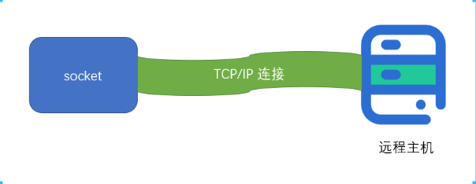

```js
/* 
    1.创建客户端连接：net.createConnection(options, [connectListener])
        参数1：配置对象
            - host：主机名 (不用写协议)
            - port: 端口号 (必须的配置)
        参数2：监听函数，完成连接之后做的事情。
        返回：socket对象。可以当作一个文件，可以通过文件流操作。
            - 服务器响应的数据会放到该文件，
            - 客户端向该文件写入数据就等于发送请求，客户端也可以读取文件内容从而获取服务器响应的数据。
    
    注意：net模块内部会自动进行三次握手，四次挥手。
    注意：必须先向服务器发送请求，然后服务器才会返回内容。
*/
const socket = net.createConnection(
    {
        host: "duyi.ke.qq.com",
        port: 80
    },
    () => {
        console.log("连接成功");
    }
);

//================================================================================================================

// // 使用net模块进行http请求
// // 读socket的数据，来自服务器
// socket.on("data", chunk => {
//     console.log(chunk.toString("utf-8"))
//     socket.end();   // 断开连接，一般都是客户端断开连接。需要注意的是，服务器传数据chunk是一块一块传递的。这种写法只传了一块数据就断开连接了。想要传递完再断开见2。
// });

// // 向socket写入数据(需要样按照格式书写：请求行/n请求头/n/n请求体)
// socket.write(`GET / HTTP/1.1
// Host: duyi.ke.qq.com
// Connection: keep-alive

// `);

// socket.on('close', () => {
//     console.log("连接关闭了")
// })

//================================================================================================================

/*
    2.服务器传递完数据，客户端再断开连接：
        通过服务器发送回的响应头的 Content-Length 来判断服务器是否传输完成。
*/

var receive = null;
// 提炼出响应字符串的消息头和消息体
function parseResponse(response) {
    const index = response.indexOf("\r\n\r\n"); 
    const head = response.substring(0, index);      // 从字符串中提取一些字符，到index前一位
    const body = response.substring(index + 2);
    const headParts = head.split("\r\n");
    const headerArray = headParts.slice(1).map(str => {
        return str.split(":").map(s => s.trim());
    });
    const header = headerArray.reduce((a, b) => {
        a[b[0]] = b[1];
        return a;
    }, {});
    return {
        header,
        body: body.trimStart()
    };
}
function isOver() {
    //需要接收的消息体的总字节数
    const contentLength = +receive.header["Content-Length"];
    const curReceivedLength = Buffer.from(receive.body, "utf-8").byteLength;
    console.log(contentLength, curReceivedLength);
    return curReceivedLength > contentLength;
}

// 读socket的数据
socket.on("data", chunk => {
    const response = chunk.toString("utf-8");
    if (!receive) {
        //第一次
        receive = parseResponse(response);
        if (isOver()) {
            socket.end();
        }
        return;
    }
    receive.body += response;
    if (isOver()) {
        socket.end();
        return;
    }
});

// 向socket写入数据
socket.write(`GET / HTTP/1.1
Host: duyi.ke.qq.com
Connection: keep-alive

`);

// 读完自动关闭
socket.on("close", () => {
    console.log(receive.body);
    console.log("连接关闭了");
});

//================================================================================================================

// 3.使用http模块进行http请求
// const http = require("http");
// const request = http.request("http://duyi.ke.qq.com", { method: "GET" }, re => {
//     console.log(re.statusCode)
//     console.log(re.headers)
//     let result = "";
//     re.on("data", chunk => {      // 以流的方式，读取响应体
//         result += chunk.toString("utf-8");
//     });

//     re.on("end", () => {
//         console.log(JSON.parse(result));
//     });
// })
// request.end()
```

4. **创建服务器**

- net.createServer()
- 返回：server对象
    - server.listen(port): 监听当前计算机中某个端口
    - server.on("listening", ()=>{}): 开始监听端口后触发的事件
    - server.on("connection", socket=>{}): 当某个连接到来时，触发该事件。事件的监听函数会获得一个socket对象

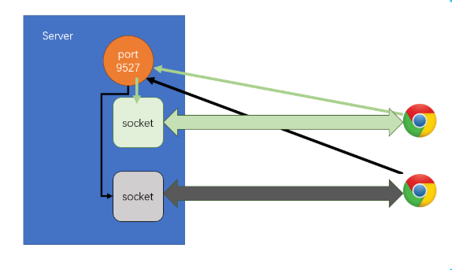

```js
/* 
    1.创建服务器：net.createServer()
        参数：监听函数(监听是否创建)
        返回：server对象
*/
const server = net.createServer();

//===============================================================================================================

// 1.服务器监听当前计算机中某个端口，等客户端发请求过来
server.listen(9527);

// 2.开始监听端口后触发的事件
server.on("listening", () => {
    console.log("server listen 9527");
});

// 3.当某个连接到来时，触发connection事件。事件的监听函数会获得一个socket对象。
// 不仅client有socket对象，server也有，只不过服务器会有很多socket分别与不同客户端对接。
server.on("connection", socket => {
    console.log("有客户端连接到服务器");

    socket.on("data", async chunk => {
        // console.log(chunk.toString("utf-8"));
        const filename = path.resolve(__dirname, "./static/hsq.jpg");
        const bodyBuffer = await fs.promises.readFile(filename);
        const headBuffer = Buffer.from(`HTTP/1.1 200 OK
Content-Type: image/jpeg

`, "utf-8");
        const result = Buffer.concat([headBuffer, bodyBuffer]);
        socket.write(result);   // 写入消息头和消息体
        socket.end();
    });

    socket.on("end", () => {
        console.log("数据读完了");
    });
    socket.on("close", () => {
        console.log("连接关闭了");
    });
});
```

## 1-9. http模块

1. **简介**

http模块建立在net模块之上。无须手动管理socket，无须手动组装消息格式。

- http.request(url[, options][, callback])
>https://nodejs.org/dist/latest-v12.x/docs/api/http.html#http_http_request_url_options_callback

```js
const http = require("http");

/* 
    1.客户端发送http请求：http.request(url[, options][, callback])
        参数1：url
        参数2：配置对象
        参数3：回调。服务器的响应结果(对象形式)，是一个可读流。是Class: http.IncomingMessage 的子类。
        返回：request对象，是一个可写流。是Class: http.ClientRequest 的子类。

    注意：http模块比之前学的ajax更底层。需要写上请求体(消息体)才行。
            - request.write()：写消息体
            - request.end()：表示消息体写完
            - 由于get不需要消息体，所以只写request.end()就可以了。http模块会自动将这个空串加到http请求里。

*/

// 1.发送请求。但是服务器会一直等待客户端的消息体
const request = http.request("http://yuanjin.tech:5005/api/movie", { method: "GET" }, resp => {
    console.log("服务器响应的状态码:", resp.statusCode);     // 读取响应的状态码
    console.log("服务器响应头:", resp.headers);             // 读取响应头
    let result = "";
    resp.on("data", chunk => {                              // 以流的方式，读取响应体
        result += chunk.toString("utf-8");
    });

    resp.on("end", () => {
        console.log("服务器响应体:", JSON.parse(result));
    });
});

// 2.表示消息体结束
request.end(); 

```

- http.createServer([options][, requestListener])
>https://nodejs.org/dist/latest-v12.x/docs/api/http.html#http_http_createserver_options_requestlistener

```js
const http = require("http");
const url = require("url");

/* 
    1.搭建服务器：http.createServer([options], [requestListener])
        参数1：配置对象
        参数2：回调函数。监听是否有请求来了
            - 回调参数1：request，是 http.IncomingMessage 的子类
            - 回调参数2：response，是一个可写流。是 http.ServerResponse 的子类
        返回：server对象。是 Class: http.Server 的子类
*/
const server = http.createServer((req, res) => {
    handleReq(req);
    res.setHeader("a", "1");    // 写入消息头
    res.setHeader("b", "2");
    res.statusCode = 404;       // 响应的状态码
    res.write("你好！");        // 写入消息体
    res.end();
});

// 1.监听某个端口
server.listen(9527);

// 2.开始监听端口后触发的事件
server.on("listening", () => {
    console.log("server listen 9527");
});

// 处理请求
function handleReq(req) {
    console.log("有客户端连接到服务器！");
    const urlobj = url.parse(req.url);
    console.log("请求路径：", urlobj);
    console.log("请求方法：", req.method);
    console.log("请求头：", req.headers);

    let body = "";
    req.on("data", chunk => {
        body += chunk.toString("utf-8");
    });

    req.on("end", () => {
        console.log("请求体：", body);
    });
}
```

2. **总结**

- 我是客户端
    - 请求：ClientRequest对象
    - 响应 (别人给我的)：IncomingMessage对象

- 我是服务器
    - 请求 (别人给我的)：IncomingMessage对象
    - 响应：ServerResponse对象

## 1-10. https协议

```js
/* 
    https协议：保证数据在传输过程中 不被窃取和篡改，从而保证传输安全。
    
    加密方法：
        - 对称加密。缺点是：一开始沟通好的秘钥发给对方时，会被获取。
        - 非对称加密。缺点是：会产生一个公钥、一个私钥，但总有一方不知道私钥。
            - 解决方法：两种加密混用。但依然有风险。
        - 最终方法：第三方机构发证书。
            服务器端花钱去第三方机构，第三方机构通过它的私钥加密：服务器公钥与证书签名，最终生成证书。
            证书签名 = 域名 + CA公钥 + 自身服务器公钥
            因为域名、CA公钥、自身服务器公钥与证书签名算法全是公开的，所以必然是独一无二的。
            请求双方每次收到数据，只需要通过证书签名算法计算一下，只有得到的签名结果一样，数据才是没有被篡改的。
            具体流程：
                - 服务器获取证书，发给浏览器。
                  (由于浏览器要验证证书签名，所以黑客改不了)
                - 浏览器验证证书签名，没问题的话，将自身生成的对称密钥通过服务器公钥发给服务器。
                  (由于上一步没改，所以黑客解不了服务器公钥)
                - 服务器收到，开始使用对称密钥正常交流。
                  (黑客也不知道对称秘钥是什么)
                  
    具体见PPT。
*/
```

## 1-11. https模块

1. **服务器的两种结构**

- 结构1：本节课学习的服务器搭建：(一般不用)
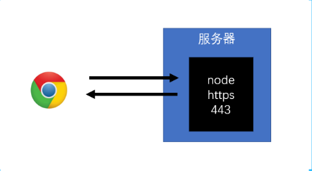

- 结构2：实际开发时，搭建服务器的方式。
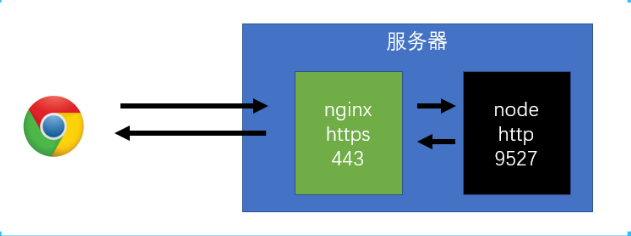


2. **证书准备**

>https://www.aliyun.com/?utm_content=se_1000301881
- 方式1：网上购买权威机构证书
    - 准备好money
    - 准备好服务器
    - 准备好域名
    - 该方式应用在部署环境中

- 方案2：本地产生证书。自己作为权威机构发布证书，具体方法如下：
	- 安装 `openssl`  
        - 下载源码，自行构建    (https://github.com/openssl/openssl)
        - 下载 `windows` 安装包   (https://slproweb.com/products/Win32OpenSSL.html)
        - `mac` 下自带
        - 通过输入命令 `openssl` 测试
    - 生成CA私钥
        - openssl genrsa -des3 -out ca-pri-key.pem 1024
        - genrsa：密钥对生成算法
        - -des3：使用对称加密算法des3对私钥进一步加密
            - 命令运行过程中会让用户输入密码，该密码将作为des3算法的key
        - -out ca-pri-key.pem：将加密后的私钥保存到当前目录的ca-pri-key.pem文件中
            - pem：Privacy-Enhanced Mail (PEM) 
        - 1024：私钥的字节数
    - 生成CA公钥（证书请求）
        - openssl req -new -key ca-pri-key.pem -out ca-pub-key.pem
        - 通过私钥文件 `ca-pri-key.pem` 中的内容，生成对应的公钥，保存到 `ca-pub-key.pem` 中
        - 运行过程中要使用之前输入的密码来实现对私钥文件的解密
        - 其他输入信息：
            - Country Name：国家名  CN
            - Province Name：省份名 Sichuan
            - Local Name：城市名
            - Company Name：公司名
            - Unit Name：部门名
            - Common Name：站点名
            - ...
    - 生成CA证书
        - openssl x509 -req -in ca-pub-key.pem -signkey ca-pri-key.pem -out ca-cert.crt
        - 使用X.509证书标准，通过证书请求文件ca-pub-key.pem生成证书，并使用私钥ca-pri-key.pem加密，然后把证书保存到ca-cert.crt文件中

    - 生成服务器私钥
        - openssl genrsa -out server-key.pem 1024
    - 生成服务器公钥
        - openssl req -new -key server-key.pem -out server-scr.pem
    - 生成服务器证书
        - openssl x509 -req -CA ca-cert.crt -CAkey ca-pri-key.pem -CAcreateserial -in server-scr.pem -out server-cert.crt

3. **https模块**


## 1-12. node生命周期

- timers：存放计时器的回调函数
- poll：轮询队列
    - 除了timers、checks
    - 绝大部分回调都会放入该队列
    - 比如：文件的读取、监听用户请求
    - 运作方式:
        - 如果poll中有回调，依次执行回调，直到清空队列
        - 如果poll中没有回调，等待其他队列中出现回调，结束该阶段，进入下一阶段。如果其他队列也没有回调，持续等待，直到出现回调为止。
- check：检查阶段。使用setImmediate的回调会直接进入这个队列
- nextTick和promise：事件循环中，每次打算执行一个回调之前，必须要先清空nextTick和promise队列

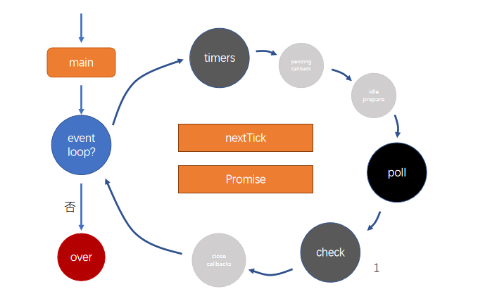


## 1-13. [扩展]EventEmitter

- node事件管理的通用机制
- 内部维护多个事件队列


# express

## 4-1. express的基本使用

> 官网：http://expressjs.com/
> 民间中文网：https://www.expressjs.com.cn/

0. **为什么要学 express ？**

之前搭建服务器都是使用 `http` 模块或者 `https` 模块。它们有如下缺点：
- 所有请求都会到 http.creatServer((req, res) => {}) 里面，还要根据不同请求路径、请求方法做不同处理，比较麻烦。
- 读取请求体、写入响应体是通过流的方式，比较麻烦。

所以我们一般使用第三方库：
- `express`：经典，生态完整。
- `koa2`：接口先进，API 更友好。

1. **基本使用 - 只监听端口**

```js
const http = require("http");
const express = require("express");
const app = express();      //创建一个express应用。app实际上是一个用于处理请求的函数。
const port = 5008;


// 写法1：使用 express + http 模块
// const server = http.createServer(app);
// server.listen(port, () => {  
//     console.log(`server listen on ${port}`);
// });


// 写法2：只用 express
app.listen(port, () => {
    console.log(`server listen on ${port}`);
});
```

2. **基本使用 - 监听端口 + 发出响应**

```js
const express = require("express");
const app = express();
const port = 5008;

app.listen(port, () => {
    console.log(`server listen on ${port}`);
});

/* 
    配置一个请求映射：app.请求方法("请求路径", 处理函数)
        如果 请求方法 和 请求路径 均满足匹配，就交给相应的处理函数进行处理。
        请求方法all 可以匹配所有的请求方法。
        请求路径* 可以匹配所有的get请求。
        

    在处理函数中：
        1)获取请求信息：
            请求头：req.headers         // 对象形式
            请求路径：req.path
            请求参数：req.query         // 对象形式
            动态参数：req.params

        2)发出响应:
            - 自动设置响应头，只要写响应体：
                res.send(响应体);       //响应体可以为：字符串，数组，对象。不同的响应体会有不同的响应头。

            - 手动设置响应头，再写响应体：
                res.setHeader("a", "123");
                res.send([2, 3, 4]);

            - 可以设置重定向：(以下操作都会返回response对象，所以可以链式操作)
                res.status(302).header("location", "https://duyi.ke.qq.com").end();
                简写：res.status(302).location("https://duyi.ke.qq.com").end();
                再简写：res.redirect(302, "https://duyi.ke.qq.com");

            注意：send() 会在内部调用 end()。  调用 end() 服务器就不会一直等待响应。  
            
            
    url路径，我们一般遵循REST风格：
        api/student     get         获取学生
        api/student     post        添加学生
        api/student     put         修改学生
        api/student     delete      删除学生

    该风格使用统一的url路径，通过请求方法来区别要进行什么操作。
*/
// 请求来了后触发回调
app.get("/news/:id/:aaa", (req, res) => {       // req 和 res 是被express封装过后的对象
    // 获取请求信息
    console.log("请求头：", req.headers);
    console.log("请求路径：", req.path);
    console.log("请求参数：", req.query);
    console.log("动态参数：", req.params);

    // 发出响应
    // res.send({
    //     id: 123,
    //     name: "成哥",
    //     age: 18,
    // });
    // res.setHeader("a", "123");
    // res.send([2, 3, 4]);
    res.redirect(302, "https://duyi.ke.qq.com");        //默认信息码 301
});

app.get("*", (req, res) => {
    console.log("======= 匹配任何get请求 =======");
    res.send([2, 3, 4]);
});
```

## 4-2. nodemon

>https://github.com/remy/nodemon#nodemon

nodemon是一个监视器。在node环境中，用于监控工程中的文件变化。如果发现文件有变化，可以执行一段脚本。

1. **nodemon 的配置文件：nodemon.json**

```json
    "env": {
        "NODE_ENV": "development"
    },
    "watch": ["*.js", "*.json"],        //监听的文件
    "ignore": ["package*.json", "nodemon.json", "node_modules", "public"]       //忽视监听的文件或目录
```

2. **nodemon 的使用**

```json
 "scripts": {
        "start": "nodemon -x npm run server",       // 文件变化就执行 npm run server
        "server": "node index"
    },
```

## 4-3. express中间件

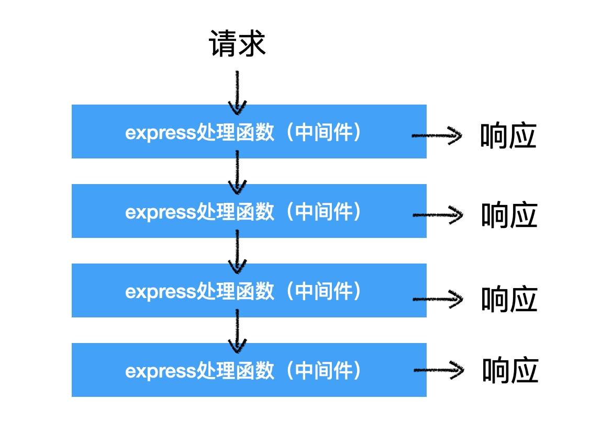

1. **中间件的使用**

- 一个中间件就是一个处理函数。一个请求可以对应多个中间件。
```js
app.get("/news", 
    (req, res) => {
        console.log("handler1");
    },
    (req, res) => {
        console.log("handler2");
    }
);

app.get("/news", 
    (req, res) => {
        console.log("handler3");
    },
    (req, res) => {
        console.log("handler4");
    }
);
```

- 当匹配到了请求后，会交给第一个中间件处理。如果还需要被后续的中间件处理，那么需要手动交给后续中间件，通过第三个参数 next 。
```js
app.get("/news", 
    (req, res, next) => {
        console.log("handler1");
        next();
    },
    (req, res) => {
        console.log("handler2");
    }
);
```

2. **中间件处理的细节**

- 如果后续已经没有了中间件，并且 `express` 发现响应没有结束( 即没有执行 res.end() )，那么 `express` 会响应 404
```js
app.get("/news", 
    (req, res, next) => {
        console.log("handler1");
        next();
    },
    (req, res, next) => {
        console.log("handler2");
        next();
    }
);
app.get("/news", (req, res, next) => {
        console.log("handler3");
        next();
});

// 此时客户端访问 /news，服务器响应 404
```

- 如果后续已经没有了中间件，但 `express` 发现响应结束了。服务器会正常响应
```js
app.get("/news", 
    (req, res, next) => {
        console.log("handler1");
        res.status(200);
        res.end();
        next();
    },
    (req, res, next) => {
        console.log("handler2");
        next();
    }
);
app.get("/news", (req, res, next) => {
        console.log("handler3");
        next();
});

// 此时客户端访问 /news，服务器响应 200
// 注意：前一个中间件若已经结束响应，后面的中间件就不能继续响应了。即再写：res.status(200); res.send();
```

- 如果某一个中间件发生了错误，不会停止服务器。只是相当于调用了 next(错误对象)，express 会寻找后续的错误处理中间件。如果没有错误处理中间件，则服务器响应 500
```js
app.get("/news", 
    (req, res, next) => {
        console.log("handler1");
        throw new Error("abc");   //相当于 next( new Error("abc") );
    },
    (req, res, next) => {
        console.log("handler2");
        next();
    }
);
app.get("/news", (err, req, res, next) => {     //错误处理中间件
        console.log("服务器发生了错误");
        next();
});
```

3. **错误中间件的写法**

- 直接写
```js
app.get("/news", 
    (req, res, next) => {
        console.log("handler1");
        throw new Error("abc");   //相当于 next( new Error("abc") );
    },
    (req, res, next) => {
        console.log("handler2");
        next();
    }
);
app.get("/news", (err, req, res, next) => {     //错误处理中间件
        console.log("服务器发生了错误");
        next();
});
```

- 单独写一个模块导入(不用)
```js
app.get("/news", 
    (req, res, next) => {
        console.log("handler1");
        throw new Error("abc");
    },
    (req, res, next) => {
        console.log("handler2");
        next();
    }
);
app.get("/news", require("./errorMiddleware") );    //一般不会这么写，而是使用 app.use()
```

- 使用 app.use()
```js
app.get("/news", 
    (req, res, next) => {
        console.log("handler1");
        throw new Error("abc");
    },
    (req, res, next) => {
        console.log("handler2");
        next();
    }
);
app.use("/news", require("./errorMiddleware") );    //写在最后。

// app.use() 如果不写第一个参数，表示匹配所有请求路径。
// app.use() 中的中间件有一个： req.baseUrl，表示请求的基地址 /news
```

- app.use() 与 app.get()等的区别
```js
app.use("/news", require("./errorMiddleware"));
app.get("/news", require("./errorMiddleware") );

// app.use() 匹配以 /news 开头的。如 /news  /news/abc   /news/123   /news/ab/adfs
// app.get() 只匹配 /news
```

## 4-4. express 内置中间件

- express.static()：加载静态资源。参数1：静态资源根目录，参数2：配置对象。
```js
const staticRoot = path.resolve(__dirname, "../public");
/**
 * 下面这句代码的作用：
 * 当请求时，会根据请求路径( req.path 而不是 req.baseUrl )，从指定的目录中寻找是否存在该文件。
 * 如果存在该文件，直接响应文件内容，而不再移交给后续的中间件。
 * 如果不存在文件，则直接移交给后续的中间件处理。
 * 默认情况下，如果映射的结果是一个目录，则会自动使用index.html文件。也可以配置
 */
app.use(express.static(staticRoot));

// 浏览器输入：localhost:5008/css/index.css
```

- express.urlencoded(): 将以 Content-Type: application/x-www-form-urlencoded 格式提交的数据放到请求体中。参数1：配置对象。
```js
// 以往使用post请求添加学生信息。我们需要使用流的方式读取学生信息，再将学生信息放到请求体中。现在使用 express.urlencoded() 中间件即可。post请求的content-type 要等于 x-www-form-urlencoded
app.use(express.urlencoded({
        extended: true      //官方建议写，因为使用了新库。
    }
));
app.post("/api/addStudent", (req, res) => {
  console.log(req.body);
});
```

- express.json()：将以 Content-Type: application/json 格式提交的数据放到请求体中。参数1：配置对象。


## 4-5. express路由

- 路由就是一个中间件


## 4-6. cookie的基本概念

1. **一个不大不小的问题**

假设服务器有一个接口，通过请求这个接口，可以添加一个管理员。但是，不是任何人都有权力做这种操作的。那么服务器如何知道请求接口的人是有权力的呢？

答案是：只有登录过的管理员才能做这种操作。

可问题是，客户端和服务器的传输使用的是http协议，http协议是无状态的。什么叫无状态？就是<font color="red">服务器不知道这一次请求的人，跟之前登录请求成功的人是不是同一个人</font>。


由于http协议的无状态，服务器<font color="red">忘记</font>了之前的所有请求，它无法确定这一次请求的客户端，就是之前登录成功的那个客户端。

> 你可以把服务器想象成有着严重脸盲症的东哥，他没有办法分清楚跟他说话的人之前做过什么

于是，服务器想了一个办法，它按照下面的流程来认证客户端的身份：

1. 客户端登录成功后，服务器会给客户端一个出入证（令牌 token）
2. 后续客户端的每次请求，都必须要附带这个出入证（令牌 token）


服务器发扬了认证不认人的优良传统，就可以很轻松的识别身份了。

但是，用户不可能只在一个网站登录，于是客户端会收到来自各个网站的出入证。因此，就要求客户端要有一个类似于卡包的东西，能够具备下面的功能：

(1) **能够存放多个出入证**。这些出入证来自不同的网站，也可能是一个网站有多个出入证，分别用于出入不同的地方
(2) **能够自动出示出入证**。客户端在访问不同的网站时，能够自动的把对应的出入证附带请求发送出去。
(3) **正确的出示出入证**。客户端不能将肯德基的出入证发送给麦当劳。
(4) **管理出入证的有效期**。客户端要能够自动的发现那些已经过期的出入证，并把它从卡包内移除。

能够满足上面所有要求的，就是 `cookie` 。

`cookie` 类似于一个卡包，专门用于存放各种出入证，并有着一套机制来自动管理这些证件。

卡包内的每一张卡片，称之为一个 `cookie` 。

2. **cookie 的组成**

`cookie` 是浏览器中特有的一个概念，它就像浏览器的专属卡包，管理着各个网站的身份信息。

每个 `cookie` 就相当于是属于某个网站的一个卡片，它记录了下面的信息：

- key：键，比如「身份编号」
- value：值，比如袁小进的身份编号「14563D1550F2F76D69ECBF4DD54ABC95」，这有点像卡片的条形码，当然，它可以是任何信息
- domain：域，表达这个cookie是属于哪个网站的，比如`yuanjin.tech`，表示这个cookie是属于`yuanjin.tech`这个网站的
- path：路径，表达这个cookie是属于该网站的哪个基路径的，就好比是同一家公司不同部门会颁发不同的出入证。比如`/news`，表示这个cookie属于`/news`这个路径的。（后续详细解释）
- secure：是否使用安全传输（后续详细解释）
- expire：过期时间，表示该cookie在什么时候过期

当浏览器向服务器发送一个请求的时候，它会瞄一眼自己的卡包，看看哪些卡片适合附带捎给服务器。

如果一个cookie<font color="red">同时满足</font>以下条件，则这个cookie会被附带到请求中：

- cookie没有过期
- cookie中的域和这次请求的域是匹配的
  - 比如cookie中的域是`yuanjin.tech`(基域)，则可以匹配的请求域是`yuanjin.tech`、`www.yuanjin.tech`、`blogs.yuanjin.tech`等等
  - 比如cookie中的域是`www.yuanjin.tech`(二级域)，则只能匹配`www.yuanjin.tech`这样的请求域
  - cookie是不在乎端口的，只要域匹配即可
- cookie中的path和这次请求的path是匹配的
  - 比如cookie中的path是`/news`，则可以匹配的请求路径可以是`/news`、`/news/detail`、`/news/a/b/c`等等，但不能匹配`/blogs`
  - 如果cookie的path是`/`，可以想象，能够匹配所有的路径
- 验证cookie的安全传输
  - 如果cookie的secure属性是true，则请求协议必须是`https`，否则不会发送该cookie
  - 如果cookie的secure属性是false，则请求协议可以是`http`，也可以是`https`

如果一个cookie满足了上述的所有条件，则浏览器会把它自动加入到这次请求中。

<font color="red">具体加入的方式</font>是: 浏览器会将符合条件的cookie，自动放置到请求头中。
例如，当我在浏览器中访问百度的时候，它在请求头中附带了下面的cookie：


看到打马赛克的地方了吗？这部分就是通过请求头`cookie`发送到服务器的，它的格式是`键=值; 键=值; 键=值; ...`，每一个键值对就是一个符合条件的cookie。

**cookie中包含了重要的身份信息，永远不要把你的cookie泄露给别人！！！**否则，他人就拿到了你的证件，有了证件，就具备了为所欲为的可能性。

3. **如何设置 cookie**

由于 `cookie` 是保存在浏览器端的，同时很多证件又是服务器颁发的。所以， `cookie` 的设置有两种模式：

- 服务器响应：这种模式是非常普遍的，当服务器决定给客户端颁发一个证件时，它会在响应的消息中包含cookie，浏览器会自动的把cookie保存到卡包中
- 客户端自行设置：这种模式少见一些，不过也有可能会发生，比如用户关闭了某个广告，并选择了「以后不要再弹出」，此时就可以把这种小信息直接通过浏览器的JS代码保存到cookie中。后续请求服务器时，服务器会看到客户端不想要再次弹出广告的cookie，于是就不会再发送广告过来了。

(1) 服务器端设置cookie

服务器可以通过设置响应头，来告诉浏览器应该如何设置cookie。响应头按照下面的格式设置：

```yaml
set-cookie: cookie1
set-cookie: cookie2
set-cookie: cookie3
...
```

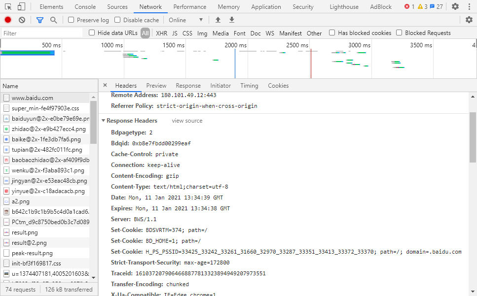

通过这种模式，就可以在一次响应中设置多个cookie了，具体设置多少个cookie，设置什么cookie，根据你的需要自行处理。

其中，每个cookie的格式如下：

```js
// 键=值 必写，其他可选。
键=值; path=?; domain=?; expire=?; max-age=?; secure; httponly
```

每个cookie除了键值对是必须要设置的，其他的属性都是可选的，并且顺序不限

当这样的响应头到达客户端后，**浏览器会自动的将cookie保存到卡包中，如果卡包中已经存在一模一样的卡片（其他key、path、domain相同），则会自动的覆盖之前的设置**。

下面，依次说明每个属性值：

- **path**：设置cookie的路径。如果不设置，浏览器会将其自动设置为当前请求的路径。比如，浏览器请求的地址是`/login`，服务器响应了一个`set-cookie: a=1`，浏览器会将该cookie的path设置为请求的路径`/login`
- **domain**：设置cookie的域。如果不设置，浏览器会自动将其设置为当前的请求域，比如，浏览器请求的地址是`http://www.yuanjin.tech`，服务器响应了一个`set-cookie: a=1`，浏览器会将该cookie的domain设置为请求的域`www.yuanjin.tech`
  - 这里值得注意的是，如果服务器响应了一个无效的域，浏览器是不认的
  - 什么是无效的域？就是响应的域连根(基)域都不一样。比如，浏览器请求的域是`yuanjin.tech`，服务器响应的cookie是`set-cookie: a=1; domain=baidu.com`，这样的域浏览器是不认的。
  - 如果浏览器连这样的情况都允许，就意味着张三的服务器，有权利给用户一个cookie，用于访问李四的服务器，这会造成很多安全性的问题
- **expire**：设置cookie的过期时间。这里必须是一个有效的GMT时间，即格林威治标准时间字符串，比如`Fri, 17 Apr 2020 09:35:59 GMT`，表示格林威治时间的`2020-04-17 09:35:59`，即北京时间的`2020-04-17 17:35:59`。当客户端的时间达到这个时间点后，会自动销毁该cookie。
- **max-age**：设置cookie的相对有效期。expire和max-age通常仅设置一个即可。比如设置`max-age`为`1000`，浏览器在添加cookie时，会自动设置它的`expire`为当前时间加上1000秒，作为过期时间。
  - 如果不设置expire，又没有设置max-age，则表示会话结束后过期。
  - 对于大部分浏览器而言，关闭所有浏览器窗口意味着会话结束。
- **secure**：设置cookie是否是安全连接。如果设置了该值，则表示该cookie后续只能随着`https`请求发送。如果不设置，则表示该cookie会随着所有请求发送。
- **httponly**：仅在服务器设置cookie才有。设置cookie是否仅能用于传输。如果设置了该值，表示该cookie仅能用于传输，而不允许在客户端通过JS获取，这对防止跨站脚本攻击（XSS）会很有用。 
  - 关于如何通过JS获取，后续会讲解
  - 关于什么是XSS，不在本文讨论范围

下面来一个例子，客户端通过`post`请求服务器`http://yuanjin.tech/login`，并在消息体中给予了账号和密码，服务器验证登录成功后，在响应头中加入了以下内容：

```
set-cookie: token=123456; path=/; max-age=3600; httponly
```

当该响应到达浏览器后，浏览器会创建下面的cookie：

```yaml
key: token
value: 123456
domain: yuanjin.tech
path: /
expire: 2020-04-17 18:55:00 #假设当前时间是2020-04-17 17:55:00
secure: false  #任何请求都可以附带这个cookie，只要满足其他要求
httponly: true #不允许JS获取该cookie
```

于是，随着浏览器后续对服务器的请求，只要满足要求，这个cookie就会被附带到请求头中传给服务器：

```yaml
cookie: token=123456; 其他cookie...
```

现在，还剩下最后一个问题，就是如何<font color="red">删除</font>浏览器的一个cookie呢？

如果要删除浏览器的cookie，只需要让服务器响应一个同样的域、同样的路径、同样的key，只是时间设置为当前时间或者过去时间的cookie即可。

**所以，删除cookie其实就是修改cookie**

下面的响应会让浏览器删除`token`

```yaml
cookie: token=; domain=yuanjin.tech; path=/; max-age=-1
```

浏览器按照要求修改了cookie后，会发现cookie已经过期，于是自然就会删除了。

> 无论是修改还是删除，都要注意cookie的域和路径，因为完全可能存在域或路径不同，但key相同的cookie
>
> 因此无法仅通过key确定是哪一个cookie

(2) 客户端设置cookie

既然cookie是存放在浏览器端的，所以浏览器向JS公开了接口，让其可以设置cookie

```js
document.cookie = "键=值; path=?; domain=?; expire=?; max-age=?; secure";
```

可以看出，在客户端设置cookie，和服务器设置cookie的格式一样，只是有下面的不同

- 没有httponly。因为httponly本来就是为了限制在客户端访问的，既然你是在客户端配置，自然失去了限制的意义。
- path的默认值。在服务器端设置cookie时，如果没有写path，使用的是请求的path。而在客户端设置cookie时，也许根本没有请求发生。因此，path在客户端设置时的默认值是当前网页的path
- domain的默认值。和path同理，客户端设置时的默认值是当前网页的domain
- 其他：一样
- 删除cookie：和服务器也一样，修改cookie的过期时间即可

4. **总结**

以上，就是cookie原理部分的内容。

如果把它用于登录场景，就是如下的流程：

**登录请求**

1. 浏览器发送请求到服务器，附带账号密码
2. 服务器验证账号密码是否正确，如果不正确，响应错误，如果正确，在响应头中设置cookie，附带登录认证信息（至于登录认证信息是设么样的，如何设计，要考虑哪些问题，就是另一个话题了，可以百度 jwt）
3. 客户端收到cookie，浏览器自动记录下来


**后续请求**

1. 浏览器发送请求到服务器，希望添加一个管理员，并将 cookie 自动附带到请求中
2. 服务器先获取 cookie ，验证 cookie 中的信息是否正确。如果不正确，不予以操作；如果正确，完成正常的业务流程。


## 4-7. 实现登录和认证

0. **前置知识**

一个账号登录成功，服务器会返回一个 token (令牌)。之后该账号进行敏感操作需要认证身份时会用到该 token (令牌)。

如果我们想在用户登录成功后，给予 token (令牌)。由于我们的服务器会给很多终端设备使用，所以有以下几个方式：

- 如果给<font color="red">浏览器</font>使用，我们会通过 `cookie` 给予 token。
- 如果给<font color="red">其他终端</font>使用，我们会通过 `header` 给予 token。

这是因为：只有浏览器才会自动将服务器响应头、响应体中的值设置到 cookie 里。其他设备只能拿到响应头、响应体，需要手动设置到 cookie 里。

```js
  let value = result.id;
   res.cookie("token", value, {             //通过 cookie 给予 token (浏览器端)
                path: "/",
                domain: "localhost",
                maxAge: 7 * 24 * 3600 * 1000,
            });
    res.header("authorization", value);     //通过 header 给予 token (其他终端)
```

1. **cookie-parser**

> https://github.com/expressjs/cookie-parser#readme 

要想设置 cookie， 除了使用 `express` 自带的设置 `cookie` 方法，我们还可以使用 `cookie-parser` 这个中间件。

使用说明：

```js
// 加入cookie-parser 中间件
// 加入之后，会在 req 对象中注入 cookies 属性，用于获取所有请求传递过来的 cookie
// 加入之后，会在 res 对象中注入 cookie() 方法，用于设置 cookie
const cookieParser = require("cookie-parser");  //返回一个函数，调用之后就得到一个中间件
app.use(cookieParser());

// 导入路由
app.use("/api/admin", require("./api/admin"));
```

在路由 `/api/admin.js` 文件中：

```js
router.post(
    "/login",
    asyncHandler(async (req, res) => {
        const result = await adminServ.login(req.body.loginId, req.body.loginPwd);
        if (result) {
            //登录成功，服务器为当前账号设置 token ，之后证明身份会用到。
            let value = result.id;
            res.cookie("token", value, {        //参数1：key; 参数2: value; 参数3：其他配置的对象
                path: "/",
                domain: "localhost",
                maxAge: 7 * 24 * 3600 * 1000,   //由秒数变为毫秒数
            });
            res.header("authorization", value);
        }
        return result;
    })
);
```

2. **对后续请求进行认证的流程**

- 解析 `cookie` 或 `header` 中的 token
- 验证 token ：如果通过，继续后续处理；如果未通过，给予错误。

但是，有个问题：在浏览器我们可以手动添加 cookie ，而不是服务器发给我们。这样伪造出的 cookie 也可以通过认证。所以我们可以给 token 值进行加密来防止这个情况。

3. **给 token 值进行加密**

- 方法1：`cookie-parser` 自带一个对称加密方法。

```js
const cookieParser = require("cookie-parser");
app.use(cookieParser("yuyu"));      //1.服务器，向该库传入一个秘钥。

// 导入路由
app.use("/api/admin", require("./api/admin"));
```

在路由 `/api/admin.js` 文件中：
```js
res.cookie("token", value, {
    path: "/",
    domain: "localhost",
    maxAge: 7 * 24 * 3600 * 1000,
    signed: true            //2.服务器响应的配置中加上该项。
});
```
此时浏览器得到的响应内容中的 token 值就是加密后的字符串。不容易伪造。

当服务器认证时，不再通过 `req.cookies.token` 来获取 token 值了：
```js
// 获取 token 值
let token = req.signedCookies.token;    //会将加密的 token 自动解密
// let token = req.cookies.token
```

但是不推荐该方法，因为 `header` 还要再自己写加密。

- 方法2：手动进行对称加密

```js
// 使用对称加密算法：aes 128。即使用 128 位的秘钥， 也就是16个bit的字符串。
const secret = Buffer.from("mm7h3ck87ugk9l4a");     //秘钥。使用 Buffer 保存
const crypto = require("crypto");   //node 内置库，提供很多加密算法。 crypto.getCiphers() 会返回所有加密算法。

// 准备一个iv，随机向量
const iv = Buffer.from("jxkvxz97409u3m8c");

// 加密
exports.encrypt = function (str) {
    /*
        .createCipheriv(): 创建加密算法。
            - 参数1：加密算法
            - 参数2：秘钥
            - 参数3：随机向量

        .update(): 
            - 参数1：要加密的字符串
            - 参数2：加密前的字符串的类型
            - 参数3：加密后的字符串的类型

        .final(): 
            - 参数1：加密后的字符串的类型

        ===============================================================================
        .createDecipheriv(): 创建解密密算法。
            - 参数1：加密的算法
            - 参数2：秘钥
            - 参数3：随机向量

        .update(): 
            - 参数1：要解密密的字符串
            - 参数2：解密前的字符串的类型
            - 参数3：解密后的字符串的类型

        .final(): 
            - 参数1：解密后的字符串的类型

    */
    const cry = crypto.createCipheriv("aes-128-cbc", secret, iv);
    let result = cry.update(str, "utf-8", "hex");     //使用 .update() 生成加密字符串。
    result += cry.final("hex");   //最后再使用 .final() 生成新的字符串进行拼接形成最终的加密字符串。
    return result;
};

// 解密
exports.decrypt = function (str) {
    const decry = crypto.createDecipheriv("aes-128-cbc", secret, iv);
    let result = decry.update(str, "hex", "utf-8");
    result += decry.final("utf-8");
    return result;
};

```


## 4-8. node 环境的断点调试

1. **使用方法**

- 在浏览器使用 node 环境的断点调试

之前，在<font color="red">浏览器环境</font>进行断点调试，就是打开: 开发者工具 -> source -> 找到对应代码，在行数那里打断点。
现在，在<font color="red">node 环境</font>进行断点调试，先点击开发者工具中的 node 图标，进入node开发者工具界面，然后与浏览器是同样操作。但是在运行node模块时，要加上参数：`--inspect`，不然不会出现 node 图标。

```json
// 在 `package.json`:
"scripts": {
    "start": "nodemon -x npm run server",   
    "server": "node --inspect index",       //使用 `node --inspect 启动模块` 命令
  },
```

- 在 `vscode` 使用 node 环境的断点调试

(1) 点击左侧栏的 运行 图标
(2) 创建配置文件(即：launch.json 文件)，选择 node.js 语言。
(3) 在 `lanuch.json` 中，点击右下角 添加配置，选择 node.js 附加到进程。具体配置见如下 `configurations` 字段:

```json
// 在 `lanuch.json`:
{
    // 使用 IntelliSense 了解相关属性。 
    // 悬停以查看现有属性的描述。
    // 欲了解更多信息，请访问: https://go.microsoft.com/fwlink/?linkid=830387
    "version": "0.2.0",
    "configurations": [
        {
            "name": "调试node",     //名字随便取
            "port": 9229,
            "request": "attach",    //调试的模式改为附加
            "skipFiles": ["<node_internals>/**"],   //调试时需要跳过的文件，此时是跳过 nodejs内部文件，即内部模块这些。
            "type": "node"          //语言环境
        }, 
    ]
}
```

(4) 配置完，在运行左上角选择刚刚配置好的name，点击开始调试。关闭调试就是在调用堆栈中断开连接。
(5) 然后就是在项目文件打断点，运行程序进行断点调试。


2. **原理**

当我们使用 `node --inspect 启动模块` 命令启动 node 进程之后，该进程还会监听 9229 端口。
其他程序可以通过向该端口发送信息，来与此 node 进程进行交互。具体表现为：node 进程可以暂停执行，再恢复执行。然后执行到下一句，再暂停。并且 node 进程会将它的栈信息与变量信息发送给其他程序。从而可以进行断点调试。


## 4-9. 跨域之JSONP

1. **浏览器的同源策略**

当前页面的 URL 与请求资源的 URL：协议、主机名、端口要完全相同，这就叫同源。浏览器不允许使用非同源的数据。

2. **跨域的解决方案**

- JSONP: 以前的方法。
- CORS：新的方法。

3. **JSONP 的解决思路**

(1) 浏览器端生成一个 `<script>` 元素，访问数据接口。

```js
// 使用 jsonp 跨域请求数据。
jsonp("http://localhost:5008/api/student");

function jsonp(url) {
    // 创建 <script> 元素。此时该元素会接收服务器的响应内容，即 callback 函数。
    const script = document.createElement("script");
    script.src = url;
    document.body.appendChild(script);

    // 拿到响应的数据后，删除 <script> 元素
    script.onload = function () {
        script.remove();
    };
}

function callback(data) {
    console.log(data);
}
```

(2) 服务器响应一段JS代码，调用某个函数，并把响应的数据传入。

```js
router.get("/", async (req, res) => {
    const page = req.query.page || 1;
    const limit = req.query.limit || 10;
    const sex = req.query.sex || -1;
    const name = req.query.name || "";
    const result = await stuServ.getStudents(page, limit, sex, name);

    // 1.将服务器返回的json数据变为字符串，作为callback的参数传递给客户端。
    const json = JSON.stringify(result);
    const script = `callback(${json})`;
    // 2.设置响应内容的格式，是js代码。
    res.header("content-type", "application/javascript").send(script);
});
```

4. **JSONP的缺陷**

- 会严重影响服务器的正常响应格式。
- 只能使用 `GET` 请求。因为 `<script>` 元素只能发送 `GET` 请求。


## 4-10. 跨域之CORS

>CORS 是一种规范。

0. **前置知识**

>阅读本文，你需要首先知道：
> 1. 浏览器的同源策略
> 2. 跨域问题
> 3. JSONP原理
> 4. cookie原理

JSONP并不是一个好的跨域解决方案，它至少有着下面两个严重问题：

- **会打乱服务器的消息格式**：JSONP要求服务器响应一段JS代码，但在非跨域的情况下，服务器又需要响应一个正常的JSON格式
- **只能完成GET请求**：JSONP的原理会要求浏览器端生成一个`script`元素，而`script`元素发出的请求只能是`get`请求

所以，CORS 规范是一种更好的跨域解决方案。


1. **概述**

`CORS`是基于`http1.1`的一种跨域解决方案，它的全称是**C**ross-**O**rigin **R**esource **S**haring，跨域资源共享。

它的总体思路是：**如果浏览器要跨域访问服务器的资源，需要获得服务器的允许**


而要知道，一个请求可以附带很多信息，从而会对服务器造成不同程度的影响。比如有的请求只是获取一些新闻，有的请求会改动服务器的数据。针对不同的请求，CORS规定了三种不同的交互模式，分别是：

- **简单请求**
- **需要预检的请求**
- **附带身份凭证的请求**

这三种模式从上到下层层递进，请求可以做的事越来越多，要求也越来越严格。

下面分别说明三种请求模式的具体规范。

2. **简单请求**

当浏览器端运行了一段ajax代码（无论是使用 `XMLHttpRequest` 还是 `fetch api`），浏览器会首先判断它属于哪一种请求模式。

(1) 简单请求的判定

当请求<font color="red">同时满足</font>以下条件时，浏览器会认为它是一个简单请求：

- 请求方法属于下面的一种：
   - get
   - post
   - head
- 请求头仅包含安全的字段，常见的安全字段如下：
   - `Accept`
   - `Accept-Language`
   - `Content-Language`
   - `Content-Type`
   - `DPR`
   - `Downlink`
   - `Save-Data`
   - `Viewport-Width`
   - `Width`

- 请求头如果包含`Content-Type`，仅限下面的值之一：
   - `text/plain`
   - `multipart/form-data`
   - `application/x-www-form-urlencoded`

如果以上三个条件同时满足，浏览器判定为简单请求。下面是一些例子：

```js
// 简单请求
fetch("http://crossdomain.com/api/news");

// 请求方法不满足要求，不是简单请求
fetch("http://crossdomain.com/api/news", {
  method:"PUT"
})

// 加入了额外的请求头，不是简单请求
fetch("http://crossdomain.com/api/news", {
  headers:{
    a: 1
  }
})

// 简单请求
fetch("http://crossdomain.com/api/news", {
  method: "post"
})

// content-type不满足要求，不是简单请求
fetch("http://crossdomain.com/api/news", {
  method: "post",
  headers: {
    "content-type": "application/json"
  }
})
```


(2) 简单请求的交互规范

当浏览器判定某个 **ajax跨域请求** 是**简单请求**时，会发生以下的事情：

- 1. 浏览器端要做的事：

浏览器会自动在请求头中添加 `Origin` 字段。比如，在页面`http://my.com/index.html`中有以下代码造成了跨域：

```js
// 简单请求
fetch("http://crossdomain.com/api/news");
```

请求发出后，请求头会是下面的格式：

```
GET /api/news/ HTTP/1.1
Host: crossdomain.com
Connection: keep-alive
...
Referer: http://my.com/index.html
Origin: http://my.com
```

看到最后一行没，`Origin` 字段会告诉服务器，是哪个源地址在跨域请求。

- 2. 服务器端要做的事：

当服务器收到请求后，如果允许该请求跨域访问，需要在响应头中添加 `Access-Control-Allow-Origin` 字段。

```js
该字段的值可以是：
1. *：表示我很开放，什么人我都允许访问。
2. 具体的源：比如 `http://my.com`，表示我就允许你访问。

/*
实际上，这两个值对于客户端 `http://my.com` 而言，都一样。因为客户端才不会管其他源服务器允不允许，就关心自己是否被允许。
当然，服务器也可以维护一个可被允许的源列表，如果请求的`Origin`命中该列表，才响应 `*`或具体的源。

注意：为了避免后续的麻烦，强烈推荐响应具体的源。
*/
```

服务器做出的响应：

```
HTTP/1.1 200 OK
Date: Tue, 21 Apr 2020 08:03:35 GMT
...
Access-Control-Allow-Origin: http://my.com
...

消息体中的数据
```

当浏览器看到服务器允许自己访问后，它就把响应交给js，以完成后续的操作。

下图简述了整个交互过程：


3. **需要预检的请求**

简单的请求对服务器的威胁不大，所以允许使用上述的简单交互即可完成。但是，如果浏览器不认为这是一种简单请求，就会按照下面的流程进行：

```js
1. 浏览器发送预检请求，询问服务器是否允许
2. 服务器允许
3. 浏览器发送真实请求
4. 服务器完成真实的响应
```

比如，在页面 `http://my.com/index.html` 中有以下代码造成了跨域:

```js
// 需要预检的请求
fetch("http://crossdomain.com/api/user", {
  method:"POST", // post 请求
  headers:{  // 设置请求头
    a: 1,
    b: 2,
    "content-type": "application/json"
  },
  body: JSON.stringify({ name: "袁小进", age: 18 }) // 设置请求体
});
```

浏览器发现它不是一个简单请求，则会按照下面的流程与服务器交互:

(1) **浏览器发送预检请求，询问服务器是否允许**

```
OPTIONS /api/user HTTP/1.1
Host: crossdomain.com
...
Origin: http://my.com
Access-Control-Request-Method: POST
Access-Control-Request-Headers: a, b, content-type
```

可以看出，这并非我们想要发出的真实请求，请求中不包含我们的响应头，也没有消息体。这是一个<font color="red">预检请求</font>，它的目的是询问服务器，是否允许后续的真实请求。

预检请求**没有请求体**，它包含了后续真实请求要做的事情。预检请求有以下特征：

```js
- 请求方法为`OPTIONS`
- 没有请求体
- 请求头中包含
  - `Origin`：请求的源，和简单请求的含义一致
  - `Access-Control-Request-Method`：后续的真实请求将使用的请求方法
  - `Access-Control-Request-Headers`：后续的真实请求会改动的请求头
```
 
(2) **服务器允许**

服务器收到预检请求后，可以检查预检请求中包含的信息。如果允许这样的请求，需要响应下面的消息格式：

```
HTTP/1.1 200 OK
Date: Tue, 21 Apr 2020 08:03:35 GMT
...
Access-Control-Allow-Origin: http://my.com
Access-Control-Allow-Methods: POST
Access-Control-Allow-Headers: a, b, content-type
Access-Control-Max-Age: 86400
...
```

对于预检请求，不需要响应任何的消息体，只需要在响应头中添加：

- `Access-Control-Allow-Origin`：和简单请求一样，表示允许的源
- `Access-Control-Allow-Methods`：表示允许的后续真实的请求方法
- `Access-Control-Allow-Headers`：表示允许改动的请求头
- `Access-Control-Max-Age`：告诉浏览器，多少秒内，对于同样的请求源、方法、头，都不需要再发送预检请求了。可写可不写。

(3) **浏览器发送真实请求**

预检被服务器允许后，浏览器就会发送真实请求了。与简单请求一样，请求头要带上 `Origin` 字段。

```
POST /api/user HTTP/1.1
Host: crossdomain.com
Connection: keep-alive
...
Referer: http://my.com/index.html
Origin: http://my.com

{"name": "袁小进", "age": 18 }  //post 请求的请求体。
```

(4) **服务器响应真实请求**

与简单请求一样，响应头要带上 `Access-Control-Allow-Origin` 字段。

```
HTTP/1.1 200 OK
Date: Tue, 21 Apr 2020 08:03:35 GMT
...
Access-Control-Allow-Origin: http://my.com
...

添加用户成功
```

可以看出，当完成预检之后，后续的处理与简单请求相同。

下图简述了整个交互过程：


4. **附带身份凭证的请求**

默认情况下，ajax 的跨域请求并不会附带 cookie，这样一来，某些需要权限的操作就无法进行。

不过可以通过简单的配置就可以实现附带 cookie：

```js
// 对应传统ajax 的配置：
var xhr = new XMLHttpRequest();
xhr.withCredentials = true;

// 对应 fetch api 的配置：
fetch(url, {
  credentials: "include"
})
```

这样一来，该跨域的 ajax 请求就是一个**附带身份凭证的请求**。

当一个请求需要附带cookie时，无论它是简单请求，还是预检请求，都会在请求头中添加`cookie`字段。

而服务器响应时，需要明确告知客户端：服务器允许这样的凭据。告知的方式也非常的简单，只需要在响应头中添加： `Access-Control-Allow-Credentials: true` 即可。

对于一个附带身份凭证的请求，若服务器没有明确告知，浏览器仍然视为跨域被拒绝。

另外要特别注意的是：**对于附带身份凭证的请求，服务器不得设置 `Access-Control-Allow-Origin 的值为*`**。这就是为什么不推荐使用*的原因

5. **一个额外的补充**

在跨域访问时，JS只能拿到一些最基本的响应头。如：`Cache-Control`、`Content-Language`、`Content-Type`、`Expires`、`Last-Modified`、`Pragma`。如果要访问其他响应头，则需要服务器设置那些响应头。

`Access-Control-Expose-Headers` 响应头让服务器把允许浏览器访问的头放入白名单，例如：

```
Access-Control-Expose-Headers: authorization, a, b
```

这样JS就能够访问指定的响应头了。


## 4-11. CORS中间件

0. **简述**

上节课我们手写了 CORS 的中间件 `corsMiddleware.js `。

实际上，有个第三方库就是 实现 CORS 跨域功能的。
>https://github.com/expressjs/cors#readme

1. **允许任何接口跨域，无配置**

```js
const express = require("express");
const app = express();
const cors = require("cors");   

app.use(cors());    //无配置，默认允许任何 url 跨域访问。但只能是简单请求或预检请求，附带身份凭证的请求不可以跨域。
```

2. **允许某些接口跨域**

```js
const express = require("express");
const app = express();
const cors = require("cors");   

// 应用 cors 中间件。
const whiteList = ["null"];     //允许跨域的接口名单。
app.use(
    cors({
        origin(origin, callback) {
            if (whiteList.includes(origin)) {
                callback(null, origin);
            } else {
                callback(new Error("not allowed"));
            }
        },
        credentials: true,  //通过此配置可以允许附带身份凭证的请求跨域。
    })
);
```


## 4-12. session

0. **前置知识**

服务器端进行身份认证主要有3种方式：

- cookie
- session
- jwt

这3种各有各的好处，不存在谁取代谁。

1. **cookie 简介**

- 存储在客户端
- 优点：存储在客户端，不占用服务器资源

- 缺点：
    - 只能是字符串格式
    - 存储量有限：一般每个网站只有4kb大小。`sessionStorage`、`localStorage` 存得多一点，但也有其他的缺点。
    - 数据容易被获取
    - 数据容易被篡改
    - 容易丢失

2. **session 简介**

- 存储在服务器端
- 优点：
    - 可以是任何格式
    - 存储量理论上是无限的
    - 数据难以被获取
    - 数据难以篡改
    - 不易丢失

- 缺点：占用服务器资源

- 原理：
浏览器访问服务器资源，服务器内部会开一个 session，并且内部还会有一个表格来管理这些 session。这些 session 都会有一个 `uuid` 。
>uuid (universal unique identity：全球唯一id)

这些 session 会存储一些与你有关的信息。然后服务器将这个 uuid 通过 cookie 传给浏览器。

当有的 session 很久没有浏览器传给服务器且该 session 存在内存中，服务器就会将其销毁。当然，session 也可以存在 `redis` 数据库或者文件中。
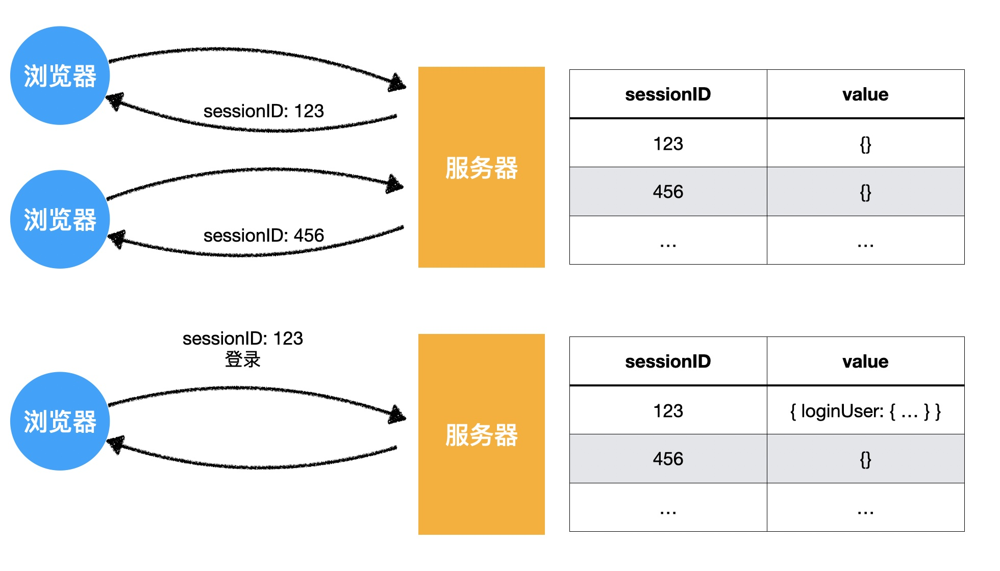

3. **express-session 的使用**
>https://github.com/expressjs/session

```js
const express = require("express");
const app = express();
const session = require("express-session");

// 应用 session 中间件。必须写配置。
app.use(
  session({
    secret: "yuanjin",      //cookie 的加密字符串。与 cookie-parser 中间件用法一致。
    name: "sessionid",      //配置 cookie 的名称。默认 connect.sid。
  })
);
```

与 cookie 一样，遇到敏感操作需要认证。但是比 cookie 简单，只需要登录成功后往 session 记录一个信息，然后认证时判断 req.session 里是否有之前记录的信息即可。

- 在 `admin.js` 文件
```js
router.post(
    "/login",
    asyncHandler(async (req, res) => {
        const result = await adminServ.login(req.body.loginId, req.body.loginPwd);
        if (result) {
            let value = result.id;
            value = cryptor.encrypt(value.toString());

            // //登录成功，服务器通过 cookie 为当前账号设置 token ，之后证明身份会用到。(浏览器端)
            // res.cookie("token", value, {        //参数1：key; 参数2: value; 参数3：其他配置的对象
            //     path: "/",
            //     domain: "localhost",
            //     maxAge: 7 * 24 * 3600 * 1000,   //由秒数变为毫秒数
            // });

            // //登录成功，服务器为当前账号设置 token (其他终端)
            // res.header("authorization", value);

            //登录成功，服务器内自动在表格创建对应 session。
            req.session.loginUser = result;     //将响应结果加入 session 对象。
        }
        return result;
    })
);

module.exports = router;
```

- 在 `tokenMiddleware.js` 文件
```js
const { getErr } = require("./getSendResult");
const { pathToRegexp } = require("path-to-regexp");     //该库将一个路径规则转化为正则表达式
const cryptor = require("../util/crypt");               //导入加密，解密方法

// 需要验证的 url
const needTokenApi = [
    { method: "POST", path: "/api/student" },
    { method: "PUT", path: "/api/student/:id" },
];

//解析 token 的流程：
module.exports = (req, res, next) => {
       // 1.使用 path-to-regexp 库匹配 /api/student/:id 和 /api/student/1771 是否一致。
       const apis = needTokenApi.filter((api) => {
        const reg = pathToRegexp(api.path);
        return api.method === req.method && reg.test(req.path);
    });
    if (apis.length === 0) {
        next();     //没有需要验证的就交给后续中间件处理
        return;
    }

    // // 2.通过 cookie 开始认证
    // let token = req.cookies.token;
    // if (!token) {
    //     // 从header的authorization中获取
    //     token = req.headers.authorization;
    // }
    // if (!token) {
    //     //没有认证
    //     handleNonToken(req, res, next);
    //     return;
    // }

    // 3.通过 session 开始认证
    if (req.session.loginUser) {
        //说明已经登录过了
        next();
    } else {
        handleNonToken(req, res, next);
    }
};

//处理没有认证的情况
function handleNonToken(req, res, next) {
    res
        .status(403)
        .send(getErr("you dont have any token to access the api", 403));
}
```

## 4-13. jwt

- 见课件

## 4-14. 登录和认证-服务器开发

- jsonwebtoken库

	- express-jwt

- 颁发jwt

	- 确定过期时间
	- 确定主体
	- 确定密钥
	- 确定传输方式

		- cookie
		- authorization

- 认证jwt

	- 获取jwt

		- 从cookie中
		- 从authorization中

			- 带bearer
			- 不带bearer

	- 验证jwt

- 添加whoami接口

## 4-15. 登录和认证-客户端开发

- history api fallback

## 4-16. 场景 - 日志记录

## 4-17. 场景 - 文件上传

- 文件上传使用的http报文格式
- 服务器解析处理请求体

	- multer

## 4-18. 场景 - 文件下载

服务器会响应以下响应头：
```js
Content-Dispodition:  attachment; filename=默认名   //表示这是个下载的文件
Accept-Ranges:  bytes           //表示支持断点续传，最小单位为字节

Content-Length: 15423234        //文件大小(字节)
Content-Type: image/jpeg        //文件类型
```

断点续传如何实现：
```js
const express = require("express");
const path = require("path");
const router = express.Router();

router.get("/:filename", (req, res) => {
    const absPath = path.resolve(__dirname, "../../resources", req.params.filename);
    res.download(absPath, req.params.filename); //download() 函数会自动读取请求头中的 Range 字段，并根据它的范围下载文件的对应部分。
});

module.exports = router;
```

访问: localhost:5008/resource/preview.jpg 下载文件

## 4-19. 场景 - 图片水印

- Jimp

## 4-20. 场景 - 图片防盗链

有些网站在自己网站里放其它网站的图片。直接拿连接的那种。

我们可以依托于请求头中的 `referer` 字段，来防止这种盗用。


## 4-21. 重要场景 - 代理

- 原理图，见课件
- http-proxy-middleware

## 4-22. 扩展场景 - 模板引擎

- 概念

	- 见源码中的图片

- 模板引擎

	- 在静态内容中插入动态内容
	- 常见模板引擎

		- mustache
		- ejs

## 4-23. 场景 - 生成二维码

1. **二维码的概念**

>二维码本质只是表示一些有限的信息。通常只是连接或文本。

- 矩阵点：
    - 通常是白色或黑色的小点
    - 深色表示1
    - 白色表示0

- 位置探测组：
    - 三个位于角落的嵌套矩形
    - 用于定位二维码图片的方向

- Version：
    - 是 1~40 的数字。
    - 数字越大，表示整个二维码的矩阵越大
        - 1表示：21*21 (单位：矩阵点)
        - 40表示：177*177

- mode：字符编码方式 (为了不浪费空间。ascall编码一个数字要占8位，显示是不行的。一般使用下面4种编码方式)
    - Numeric (只编码数字)
    - Alphanumeric (编码数字和大写字母)
    - Kanji (编码日文和中文文字)
    - Byte (类似ascall编码，一个字符占8位)

- 纠错等级
    - L
    - M
    - Q
    - H
    - 纠错等级越高，能够表达的字符量越少

2. **生成二维码**

- `node-qrcode` 库
>https://github.com/soldair/node-qrcode

该库既可以在服务器使用，也可以在客户端使用。但在客户端需要自己使用 `webpack` 打包。

```js
const QRCode = require("qrcode");

QRCode.toDataURL("https://duyi.ke.qq.com/?tuin=a5d48d54", (err, url) => {
    if (err) {
        console.log(err);
    } else {
        console.log(url);   //服务器生成一个二维码的base64编码。将它赋给客户端的src即可。
    }
});
```
- 在客户端也可以用 `qrcodejs` 库。
>https://github.com/davidshimjs/qrcodejs

```html
<body>
    <!-- qrcodejs 库 -->
    <div id="divcode"></div>
    <script src="https://cdn.bootcdn.net/ajax/libs/qrcodejs/1.0.0/qrcode.js"></script>
    <script>
        new QRCode(divcode, {
            text: "http://yuanjin.tech",    //要放入的信息
            width: 128,
            height: 128,
            colorDark: "blue",      //深色点颜色
            colorLight: "#fff",     //浅色点颜色
            correctLevel: QRCode.CorrectLevel.H,    //风险等级
        });
    </script>
</body>
```


## 4-24. 场景 - 生成验证码

- 验证码作用

	- 防止机器提交

- 验证码类型

	- 普通验证码
	- 行为验证码

- 流程

	- 获取验证码图片

		- 客户端通过img元素的src地址获取验证码图片
		- 服务器生成随机图片

		- 服务器保存随机图片中的文字

	- 验证

		- 服务器判断是否对验证码进行验证
		- 验证客户端传递的验证码是否和服务器保存的一致

## 4-25. 场景 - 客户端缓存

- 缓存原理：见课件

## 4-26. 场景 - 富文本框

- 富文本框的本质

	- 一个可以被编辑的div
	- 编辑后得到的结果是一个html字符串

- wangEditor

